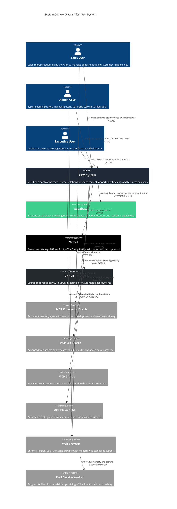

# System Context Diagram - CRM System

## Overview

The CRM System Context diagram shows the high-level view of the system, its users, and external systems it interacts with. This represents the **Level 1** of the C4 Model hierarchy.

## System Context Diagram

## System Boundary

### What's Inside the System
The **CRM System** is a Vue 3 TypeScript single-page application that provides:
- Contact and organization management
- Opportunity pipeline tracking
- Customer interaction logging
- Principal activity analytics
- Dashboard and reporting capabilities
- Progressive Web App functionality

### What's Outside the System
External systems and services that the CRM depends on:
- **Supabase**: Backend services (database, auth, real-time)
- **Vercel**: Hosting and deployment platform
- **GitHub**: Source code management and CI/CD
- **MCP Ecosystem**: AI-assisted development tools
- **Web Browsers**: Client runtime environment
- **PWA Service Worker**: Offline capabilities

## User Personas

### 1. Sales User
- **Primary Role**: Front-line sales representatives
- **Key Activities**:
  - Manage contact and organization records
  - Track opportunities through sales pipeline
  - Log customer interactions and activities
  - Generate quotes and proposals
- **System Usage**: Daily, high-frequency interactions
- **Key Requirements**: Fast data entry, mobile accessibility, real-time updates

### 2. Admin User
- **Primary Role**: System administrators and operations team
- **Key Activities**:
  - Configure system settings and business rules
  - Manage user access and permissions
  - Monitor system performance and data quality
  - Handle data imports and exports
- **System Usage**: Weekly maintenance and configuration
- **Key Requirements**: Administrative controls, audit trails, data management tools

### 3. Executive User
- **Primary Role**: Leadership team and decision makers
- **Key Activities**:
  - Review sales performance dashboards
  - Analyze opportunity pipeline metrics
  - Monitor team productivity and KPIs
  - Generate executive reports
- **System Usage**: Weekly/monthly strategic reviews
- **Key Requirements**: High-level analytics, dashboard views, export capabilities

## External System Interactions

### Supabase (Primary Backend)
- **Purpose**: Backend-as-a-Service providing core data services
- **Integration**: REST API and real-time WebSocket connections
- **Services Used**:
  - PostgreSQL database with 36+ migrations
  - Row Level Security (RLS) for data access control
  - Real-time subscriptions for live updates
  - Authentication and user management
- **Data Flow**: Bidirectional (CRUD operations, real-time updates)

### Vercel (Hosting Platform)
- **Purpose**: Serverless deployment and hosting
- **Integration**: Git-based deployment pipeline
- **Services Used**:
  - Static site hosting with CDN
  - Automatic builds from GitHub
  - Environment variable management
  - Domain and SSL certificate management
- **Data Flow**: Unidirectional (deployment artifacts)

### GitHub (Source Control)
- **Purpose**: Source code management and version control
- **Integration**: Git repository with automated workflows
- **Services Used**:
  - Source code versioning
  - Pull request workflows
  - GitHub Actions for CI/CD
  - Issue tracking and project management
- **Data Flow**: Unidirectional (code commits, deployment triggers)

### MCP Ecosystem (AI-Assisted Development)
Collection of Model Context Protocol servers providing AI capabilities:

#### MCP Knowledge Graph
- **Purpose**: Persistent memory across development sessions
- **Integration**: Local IPC with knowledge persistence
- **Capabilities**: Session continuity, context retention, learning from interactions

#### MCP Exa Search
- **Purpose**: Advanced web search and research
- **Integration**: Local IPC with external API
- **Capabilities**: Web search, company research, academic paper search

#### MCP GitHub Integration
- **Purpose**: Repository management through AI
- **Integration**: Local IPC with GitHub API
- **Capabilities**: Code analysis, PR management, issue tracking

#### MCP Playwright
- **Purpose**: Automated testing and browser automation
- **Integration**: Local IPC with Playwright framework
- **Capabilities**: E2E testing, UI validation, performance testing

### Web Browser (Client Runtime)
- **Purpose**: Client-side application runtime environment
- **Integration**: Standard web technologies (HTML, CSS, JavaScript)
- **Requirements**:
  - Modern ES2020+ JavaScript support
  - WebSocket support for real-time features
  - Service Worker support for PWA functionality
  - Local Storage for offline capabilities

### PWA Service Worker (Offline Support)
- **Purpose**: Progressive Web App capabilities
- **Integration**: Service Worker API
- **Capabilities**:
  - Offline functionality
  - Background sync
  - Push notifications
  - Application caching

## System Characteristics

### Scale and Performance
- **Users**: Designed for small to medium teams (10-100 users)
- **Data Volume**: Thousands of contacts, organizations, and opportunities
- **Response Time**: < 2 seconds for typical operations
- **Availability**: 99.9% uptime target through Vercel/Supabase infrastructure

### Security Boundaries
- **Authentication**: Supabase Auth with session management
- **Authorization**: Row Level Security (RLS) policies in PostgreSQL
- **Data Protection**: HTTPS for all communications, encrypted data at rest
- **Access Control**: Role-based permissions with organizational boundaries

### Technology Constraints
- **Browser Support**: Modern browsers with ES2020+ support
- **Mobile Support**: Responsive design with PWA capabilities
- **Network**: Requires internet connectivity for full functionality
- **Offline**: Limited offline capabilities through service worker caching

## Business Context

### Business Capabilities
1. **Customer Relationship Management**: Centralized contact and organization data
2. **Sales Pipeline Management**: Opportunity tracking through 7-stage pipeline
3. **Activity Tracking**: Customer interaction logging and history
4. **Business Intelligence**: Analytics and reporting for decision making
5. **Workflow Automation**: Automated processes for efficiency

### Success Metrics
- **User Adoption**: Active daily users and session duration
- **Data Quality**: Completeness and accuracy of customer records
- **Sales Velocity**: Time from lead to close, conversion rates
- **System Performance**: Page load times, error rates, uptime
- **Business Impact**: Revenue attribution, pipeline value, forecast accuracy

### Compliance Requirements
- **Data Protection**: GDPR compliance for customer data handling
- **Accessibility**: WCAG 2.1 AA compliance for inclusive access
- **Security**: Industry standard security practices and audit trails
- **Retention**: Data retention policies and backup procedures

---

*This diagram represents the current state of the CRM system as deployed to production at crm.kjrcloud.com*

**Next**: [Container Architecture](./02-container-architecture.md) - Detailed view of application containers and their interactions