# Database Schema Architecture

## Overview

The CRM system uses PostgreSQL 15+ as the primary database with Supabase providing the managed database service. The schema has evolved through 36+ migrations to support comprehensive customer relationship management functionality.

## Database Schema Diagram

```mermaid
erDiagram
    user_submissions ||--o{ contacts : "historical"
    contacts }o--|| organizations : "belongs_to"
    organizations ||--o{ contacts : "has_many"
    organizations ||--o{ opportunities : "has_many"
    organizations ||--o{ interactions : "has_many"
    organizations ||--o{ organizations : "parent_child"
    organizations }o--|| organizations : "distributor_relationship"
    
    opportunities }o--|| contacts : "contact_id"
    opportunities }o--|| organizations : "organization_id"
    opportunities }o--|| principals : "principal_id"
    opportunities }o--|| products : "product_id"
    
    interactions }o--|| contacts : "contact_id"
    interactions }o--|| organizations : "organization_id"
    interactions }o--|| opportunities : "opportunity_id"
    
    principals ||--o{ principal_activities : "has_many"
    principals ||--o{ product_principals : "has_many"
    products ||--o{ product_principals : "has_many"
    product_principals }o--|| principals : "principal_id"
    product_principals }o--|| products : "product_id"
    
    principal_activities }o--|| principals : "principal_id"
    principal_activities }o--|| organizations : "organization_id"
    principal_activities }o--|| contacts : "contact_id"

    user_submissions {
        bigserial id PK
        varchar first_name
        varchar last_name
        integer age
        varchar favorite_color
        timestamptz created_at
        timestamptz updated_at
    }

    contacts {
        uuid id PK
        varchar first_name
        varchar last_name
        varchar organization
        varchar email UK
        varchar title
        varchar phone
        text notes
        uuid organization_id FK
        timestamptz created_at
        timestamptz updated_at
        timestamptz deleted_at
    }

    organizations {
        uuid id PK
        varchar name
        varchar legal_name
        text description
        varchar industry
        organization_type type
        organization_size size
        organization_status status
        varchar website
        varchar email
        varchar primary_phone
        varchar secondary_phone
        varchar address_line_1
        varchar address_line_2
        varchar city
        varchar state_province
        varchar postal_code
        varchar country
        integer founded_year
        integer employees_count
        decimal annual_revenue
        varchar currency_code
        varchar lead_source
        integer lead_score
        jsonb tags
        jsonb custom_fields
        uuid parent_org_id FK
        uuid assigned_user_id FK
        boolean is_principal
        boolean is_distributor
        uuid distributor_id FK
        uuid account_manager_id FK
        timestamptz last_contact_date
        timestamptz next_follow_up_date
        timestamptz created_at
        timestamptz updated_at
        timestamptz deleted_at
    }

    opportunities {
        uuid id PK
        varchar name
        opportunity_stage stage
        integer probability_percent
        date expected_close_date
        uuid organization_id FK
        uuid principal_id FK
        uuid product_id FK
        varchar deal_owner
        text notes
        varchar name_template
        opportunity_context context
        varchar custom_context
        boolean is_won
        timestamptz created_at
        timestamptz updated_at
        timestamptz deleted_at
    }

    interactions {
        uuid id PK
        interaction_type type
        varchar subject
        text description
        uuid contact_id FK
        uuid organization_id FK
        uuid opportunity_id FK
        interaction_direction direction
        interaction_outcome outcome
        timestamptz interaction_date
        text follow_up_notes
        timestamptz next_follow_up_date
        jsonb metadata
        timestamptz created_at
        timestamptz updated_at
        timestamptz deleted_at
    }

    principals {
        uuid id PK
        varchar name
        varchar description
        varchar contact_email
        varchar contact_phone
        varchar website
        boolean is_active
        jsonb metadata
        timestamptz created_at
        timestamptz updated_at
        timestamptz deleted_at
    }

    products {
        uuid id PK
        varchar name
        text description
        varchar category
        boolean is_active
        jsonb metadata
        timestamptz created_at
        timestamptz updated_at
        timestamptz deleted_at
    }

    product_principals {
        uuid product_id PK, FK
        uuid principal_id PK, FK
        timestamptz created_at
    }

    principal_activities {
        uuid id PK
        uuid principal_id FK
        uuid organization_id FK
        uuid contact_id FK
        activity_type type
        varchar title
        text description
        decimal value_amount
        varchar currency_code
        date activity_date
        jsonb metadata
        timestamptz created_at
        timestamptz updated_at
        timestamptz deleted_at
    }
```



## Core Entities

### User Submissions (Historical)
- **Purpose**: Original form submission table from MVP phase
- **Status**: Legacy table maintained for historical data
- **Key Fields**:
  - Basic user information (name, age, preferences)
  - Form submission tracking
- **Evolution**: Replaced by contacts table for CRM functionality

### Contacts
- **Purpose**: Individual contact records with comprehensive relationship tracking
- **Key Features**:
  - UUID primary keys for scalability
  - Organization relationships
  - Email uniqueness constraints
  - Soft delete support
  - Audit trail with timestamps
- **Constraints**:
  - Email format validation
  - Non-empty name fields
  - Unique email addresses
- **Relationships**:
  - Belongs to Organization (many-to-one)
  - Has many Interactions
  - Has many Principal Activities

### Organizations
- **Purpose**: Company profiles with hierarchical relationships and business intelligence
- **Key Features**:
  - Comprehensive business information
  - Hierarchical organization structures
  - Principal/Distributor business logic
  - Flexible tagging and custom fields
  - Lead scoring and CRM integration
- **Enums**:
  - `organization_type`: B2B, B2C, B2B2C, Non-Profit, Government, Other
  - `organization_size`: Startup, Small, Medium, Large, Enterprise
  - `organization_status`: Active, Inactive, Prospect, Customer, Partner, Vendor
- **Constraints**:
  - Principal/Distributor mutual exclusivity
  - Self-reference prevention
  - Data validation for URLs, emails, dates
- **Relationships**:
  - Self-referencing parent-child hierarchy
  - Distributor relationships
  - Has many Contacts, Opportunities, Interactions

### Opportunities
- **Purpose**: Sales pipeline management with 7-stage progression
- **Key Features**:
  - 7-stage sales pipeline tracking
  - Auto-naming system with templates
  - Probability and value tracking
  - Integration with contacts, organizations, products
- **Pipeline Stages**:
  - NEW_LEAD → INITIAL_OUTREACH → SAMPLE_VISIT_OFFERED → AWAITING_RESPONSE → FEEDBACK_LOGGED → DEMO_SCHEDULED → CLOSED_WON
- **Context Types**:
  - Sample request, demo request, pricing inquiry, etc.
- **Relationships**:
  - Belongs to Organization, Principal, Product
  - Has many Interactions

### Interactions
- **Purpose**: Customer touchpoint tracking and activity logging
- **Key Features**:
  - Multi-channel interaction support
  - Outcome and follow-up tracking
  - Flexible metadata storage
  - Context linking to contacts/organizations/opportunities
- **Interaction Types**:
  - Email, phone, meeting, demo, etc.
- **Directions**:
  - Inbound, outbound
- **Outcomes**:
  - Successful, no response, follow-up needed, etc.
- **Relationships**:
  - Links to Contacts, Organizations, Opportunities

### Principals
- **Purpose**: Principal business entity management
- **Key Features**:
  - Principal profile management
  - Product portfolio relationships
  - Contact information and metadata
  - Active/inactive status tracking
- **Relationships**:
  - Many-to-many with Products through product_principals
  - Has many Principal Activities

### Products
- **Purpose**: Product catalog with principal relationships
- **Key Features**:
  - Product information and categorization
  - Principal relationship mapping
  - Active/inactive status management
  - Flexible metadata storage
- **Relationships**:
  - Many-to-many with Principals through product_principals
  - Referenced by Opportunities

### Principal Activities
- **Purpose**: Principal performance tracking and analytics
- **Key Features**:
  - Activity tracking and categorization
  - Value and performance metrics
  - Multi-entity relationship support
  - Flexible metadata for analytics
- **Activity Types**:
  - Sales, marketing, support, training, etc.
- **Relationships**:
  - Links to Principals, Organizations, Contacts

## Schema Evolution and Migrations

### Migration History
The database schema has evolved through 36+ migrations, organized by functional areas:

#### Foundation (Migrations 1-3)
- `01_initial_schema.sql` - Basic user submissions table
- `02_rls_policies.sql` - Row Level Security foundation
- `03_indexes.sql` - Performance optimization indexes

#### Contacts System (Migrations 4-6)
- `04_contacts_schema.sql` - Contact management tables
- `05_contacts_rls.sql` - Contact-specific security policies
- `06_contacts_indexes.sql` - Contact query optimization

#### Dashboard Analytics (Migrations 7-9)
- `07_dashboard_analytics_schema.sql` - Analytics and reporting
- `08_dashboard_rls.sql` - Dashboard security policies
- `09_dashboard_indexes.sql` - Analytics query optimization

#### Organizations System (Migrations 10-29)
- `10_organizations_schema.sql` - Organization entity and relationships
- `11_organization_interactions_schema.sql` - Interaction tracking
- `12_organization_analytics_schema.sql` - Business intelligence
- `13-29_*` - Organization feature enhancements and refinements

#### Opportunities System (Migrations 30-31)
- `30_opportunities_schema.sql` - Sales pipeline management
- `31_opportunities_views.sql` - Analytics views and reporting

#### Interactions System (Migrations 32-35)
- `32_interactions_schema.sql` - Customer interaction tracking
- `33_interactions_rls_policies.sql` - Interaction security
- `34_interactions_indexes.sql` - Performance optimization
- `35_interactions_verification.sql` - Data integrity validation

#### Principal Activities (Migration 36)
- `36_principal_activity_schema.sql` - Principal performance tracking

### Migration Management Strategy
- **Sequential Numbering**: Clear migration order with numeric prefixes
- **Functional Grouping**: Related migrations grouped by business domain
- **Rollback Support**: Each migration includes rollback procedures
- **Testing Integration**: Validation scripts for each major migration
- **Documentation**: Comprehensive README files for complex migrations

## Data Types and Enums

### Custom Enums
```sql
-- Organization classification
CREATE TYPE organization_type AS ENUM ('B2B', 'B2C', 'B2B2C', 'Non-Profit', 'Government', 'Other');
CREATE TYPE organization_size AS ENUM ('Startup', 'Small', 'Medium', 'Large', 'Enterprise');
CREATE TYPE organization_status AS ENUM ('Active', 'Inactive', 'Prospect', 'Customer', 'Partner', 'Vendor');

-- Opportunity management
CREATE TYPE opportunity_stage AS ENUM (
    'NEW_LEAD', 'INITIAL_OUTREACH', 'SAMPLE_VISIT_OFFERED', 
    'AWAITING_RESPONSE', 'FEEDBACK_LOGGED', 'DEMO_SCHEDULED', 'CLOSED_WON'
);
CREATE TYPE opportunity_context AS ENUM (
    'sample_request', 'demo_request', 'pricing_inquiry', 'referral', 'other'
);

-- Interaction tracking
CREATE TYPE interaction_type AS ENUM ('email', 'phone', 'meeting', 'demo', 'presentation', 'other');
CREATE TYPE interaction_direction AS ENUM ('inbound', 'outbound');
CREATE TYPE interaction_outcome AS ENUM ('successful', 'no_response', 'follow_up_needed', 'closed', 'other');

-- Principal activities
CREATE TYPE activity_type AS ENUM ('sales', 'marketing', 'support', 'training', 'other');
```

### JSONB Usage
Strategic use of JSONB for flexible, semi-structured data:

#### Organizations
```sql
-- Flexible tagging system
tags JSONB DEFAULT '[]'::jsonb
-- Example: ["enterprise", "technology", "priority"]

-- Extensible custom fields
custom_fields JSONB DEFAULT '{}'::jsonb
-- Example: {"contract_value": 50000, "decision_maker": "John Doe"}
```

#### Interactions
```sql
-- Interaction metadata
metadata JSONB
-- Example: {"duration_minutes": 45, "attendees": ["john@example.com"], "recording_url": "..."}
```

#### Principal Activities
```sql
-- Activity-specific data
metadata JSONB
-- Example: {"performance_score": 85, "quarter": "Q1-2024", "targets_met": true}
```

## Security Architecture

### Row Level Security (RLS)
Comprehensive security policies implemented across all tables:

#### Policy Types
1. **SELECT Policies**: Control data visibility based on user context
2. **INSERT Policies**: Validate new record creation permissions
3. **UPDATE Policies**: Restrict modification rights
4. **DELETE Policies**: Control deletion permissions (soft delete preferred)

#### Policy Examples
```sql
-- Contact access control
CREATE POLICY "Users can view contacts they have access to" ON contacts
    FOR SELECT USING (auth.uid() IS NOT NULL);

-- Organization hierarchy access
CREATE POLICY "Organization hierarchy access" ON organizations
    FOR SELECT USING (
        auth.uid() IS NOT NULL AND 
        (assigned_user_id = auth.uid() OR parent_org_id IN (SELECT id FROM accessible_orgs))
    );
```

### Data Protection
- **Encryption at Rest**: Automatic with Supabase/PostgreSQL
- **Encryption in Transit**: All connections over SSL/TLS
- **Audit Logging**: Comprehensive audit trails with timestamps
- **Soft Deletes**: Preserve data integrity with deleted_at columns
- **Data Validation**: Extensive CHECK constraints and format validation

## Performance Optimization

### Indexing Strategy
Comprehensive indexing for common query patterns:

#### Single Column Indexes
```sql
-- Primary lookup indexes
CREATE INDEX idx_contacts_email ON contacts(email);
CREATE INDEX idx_organizations_name ON organizations(name);
CREATE INDEX idx_opportunities_stage ON opportunities(stage);
```

#### Composite Indexes
```sql
-- Multi-column query optimization
CREATE INDEX idx_contacts_org_created ON contacts(organization_id, created_at);
CREATE INDEX idx_opportunities_stage_org ON opportunities(stage, organization_id);
CREATE INDEX idx_interactions_contact_date ON interactions(contact_id, interaction_date);
```

#### Partial Indexes
```sql
-- Active records only
CREATE INDEX idx_organizations_active ON organizations(name) WHERE deleted_at IS NULL;
CREATE INDEX idx_opportunities_active_stage ON opportunities(stage, created_at) 
    WHERE deleted_at IS NULL;
```

#### JSONB Indexes
```sql
-- Flexible data search
CREATE INDEX idx_organizations_tags ON organizations USING GIN(tags);
CREATE INDEX idx_interactions_metadata ON interactions USING GIN(metadata);
```

### Query Optimization
- **Materialized Views**: Pre-computed analytics and reports
- **Partial Indexes**: Optimize for active records only
- **Query Analysis**: Regular EXPLAIN ANALYZE for performance monitoring
- **Connection Pooling**: Supabase managed connection optimization

## Data Integrity and Constraints

### Foreign Key Relationships
```sql
-- Referential integrity
ALTER TABLE contacts ADD CONSTRAINT fk_contacts_organization 
    FOREIGN KEY (organization_id) REFERENCES organizations(id);

ALTER TABLE opportunities ADD CONSTRAINT fk_opportunities_organization 
    FOREIGN KEY (organization_id) REFERENCES organizations(id);

ALTER TABLE interactions ADD CONSTRAINT fk_interactions_contact 
    FOREIGN KEY (contact_id) REFERENCES contacts(id);
```

### Check Constraints
```sql
-- Data validation
ALTER TABLE organizations ADD CONSTRAINT organizations_lead_score_range 
    CHECK (lead_score >= 0 AND lead_score <= 100);

ALTER TABLE opportunities ADD CONSTRAINT opportunities_probability_range 
    CHECK (probability_percent >= 0 AND probability_percent <= 100);

ALTER TABLE organizations ADD CONSTRAINT organizations_principal_distributor_exclusive 
    CHECK (NOT (is_principal = TRUE AND is_distributor = TRUE));
```

### Unique Constraints
```sql
-- Business rule enforcement
ALTER TABLE contacts ADD CONSTRAINT contacts_email_unique UNIQUE (email);
ALTER TABLE organizations ADD CONSTRAINT organizations_name_unique UNIQUE (name) 
    WHERE deleted_at IS NULL;
```

## Analytics and Reporting

### View Definitions
Strategic views for common reporting needs:

#### Opportunity Pipeline View
```sql
CREATE VIEW opportunity_pipeline_summary AS
SELECT 
    stage,
    COUNT(*) as opportunity_count,
    SUM(probability_percent * COALESCE(expected_value, 0) / 100) as weighted_value,
    AVG(probability_percent) as avg_probability
FROM opportunities 
WHERE deleted_at IS NULL
GROUP BY stage
ORDER BY 
    CASE stage
        WHEN 'NEW_LEAD' THEN 1
        WHEN 'INITIAL_OUTREACH' THEN 2
        WHEN 'SAMPLE_VISIT_OFFERED' THEN 3
        WHEN 'AWAITING_RESPONSE' THEN 4
        WHEN 'FEEDBACK_LOGGED' THEN 5
        WHEN 'DEMO_SCHEDULED' THEN 6
        WHEN 'CLOSED_WON' THEN 7
    END;
```

#### Organization Analytics View
```sql
CREATE VIEW organization_analytics AS
SELECT 
    o.id,
    o.name,
    COUNT(DISTINCT c.id) as contact_count,
    COUNT(DISTINCT op.id) as opportunity_count,
    COUNT(DISTINCT i.id) as interaction_count,
    MAX(i.interaction_date) as last_interaction_date
FROM organizations o
LEFT JOIN contacts c ON c.organization_id = o.id AND c.deleted_at IS NULL
LEFT JOIN opportunities op ON op.organization_id = o.id AND op.deleted_at IS NULL
LEFT JOIN interactions i ON i.organization_id = o.id AND i.deleted_at IS NULL
WHERE o.deleted_at IS NULL
GROUP BY o.id, o.name;
```

### Materialized Views
For expensive calculations with periodic refresh:

```sql
-- Daily KPI aggregations
CREATE MATERIALIZED VIEW daily_kpi_summary AS
SELECT 
    DATE(created_at) as date,
    'contacts' as entity_type,
    COUNT(*) as daily_count,
    COUNT(*) OVER (ORDER BY DATE(created_at)) as cumulative_count
FROM contacts
WHERE deleted_at IS NULL
GROUP BY DATE(created_at)
UNION ALL
SELECT 
    DATE(created_at) as date,
    'opportunities' as entity_type,
    COUNT(*) as daily_count,
    COUNT(*) OVER (ORDER BY DATE(created_at)) as cumulative_count
FROM opportunities
WHERE deleted_at IS NULL
GROUP BY DATE(created_at);

-- Refresh strategy (run daily)
REFRESH MATERIALIZED VIEW daily_kpi_summary;
```

## Data Quality and Validation

### Data Validation Rules
Comprehensive validation ensures data quality:

#### Format Validation
```sql
-- Email format validation
CHECK (email ~* '^[A-Za-z0-9._%+-]+@[A-Za-z0-9.-]+\.[A-Za-z]{2,}$')

-- Phone number format (flexible international)
CHECK (primary_phone ~* '^[\+]?[1-9][\d\s\-\(\)]{7,15}$')

-- Website URL validation
CHECK (website ~* '^https?://[^\s]+$')
```

#### Business Rule Validation
```sql
-- Principal/Distributor mutual exclusivity
CHECK (NOT (is_principal = TRUE AND is_distributor = TRUE))

-- Self-reference prevention
CHECK (id != parent_org_id)
CHECK (id != distributor_id)

-- Date range validation
CHECK (founded_year >= 1800 AND founded_year <= EXTRACT(YEAR FROM NOW()) + 1)
```

### Data Cleansing Functions
```sql
-- Name standardization
CREATE OR REPLACE FUNCTION standardize_name(input_name TEXT) 
RETURNS TEXT AS $$
BEGIN
    RETURN TRIM(REGEXP_REPLACE(INITCAP(input_name), '\s+', ' ', 'g'));
END;
$$ LANGUAGE plpgsql IMMUTABLE;

-- Email normalization
CREATE OR REPLACE FUNCTION normalize_email(input_email TEXT) 
RETURNS TEXT AS $$
BEGIN
    RETURN LOWER(TRIM(input_email));
END;
$$ LANGUAGE plpgsql IMMUTABLE;
```

---

**Next**: [Migration History](./02-migration-history.md) - Detailed database evolution and migration management