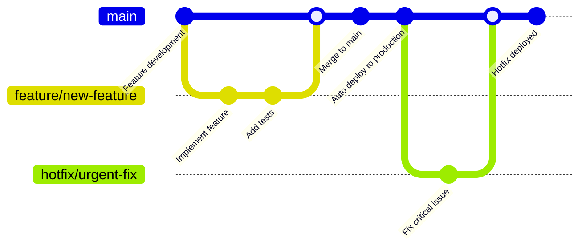

# Deployment Architecture Overview

## Deployment Architecture Diagram

```mermaid
C4Deployment
    title Deployment Diagram for CRM System

    Deployment_Node(user_device, "User Device", "Windows/Mac/Linux/Mobile") {
        Container(browser, "Web Browser", "Chrome, Firefox, Safari, Edge", "Runs the Vue 3 SPA")
        Container(pwa_cache, "PWA Cache", "Service Worker", "Local caching and offline support")
    }

    Deployment_Node(vercel_global, "Vercel Global Network", "Global CDN and Edge Computing") {
        Deployment_Node(vercel_edge, "Edge Locations", "100+ Global Edge Nodes") {
            Container(cdn, "CDN Cache", "Static Assets", "Cached HTML, CSS, JS, images")
            Container(edge_functions, "Edge Functions", "Serverless Compute", "Request routing and optimization")
        }
        
        Deployment_Node(vercel_compute, "Vercel Compute", "US-East-1 Primary") {
            Container(build_system, "Build System", "Node.js, Vite", "CI/CD pipeline and deployment")
            Container(functions, "Serverless Functions", "Node.js Runtime", "API endpoints and middleware")
        }
    }

    Deployment_Node(supabase_cloud, "Supabase Cloud", "AWS Multi-Region") {
        Deployment_Node(supabase_primary, "Primary Region", "US-East-1") {
            ContainerDb(postgres_primary, "PostgreSQL Primary", "v15+", "Primary database with read/write")
            Container(api_gateway, "API Gateway", "Kong/PostgREST", "Auto-generated REST API")
            Container(auth_service, "Auth Service", "GoTrue", "Authentication and session management")
            Container(realtime_service, "Realtime Service", "Phoenix/Elixir", "WebSocket connections and subscriptions")
            Container(storage_service, "Storage Service", "S3-compatible", "File and document storage")
        }
        
        Deployment_Node(supabase_replica, "Replica Region", "US-West-2") {
            ContainerDb(postgres_replica, "PostgreSQL Replica", "v15+", "Read-only replica for disaster recovery")
        }
    }

    Deployment_Node(external_services, "External Services", "Third-party Integrations") {
        Container(github_actions, "GitHub Actions", "CI/CD", "Automated testing and deployment")
        Container(monitoring, "Monitoring", "Vercel Analytics", "Performance and error monitoring")
        Container(mcp_services, "MCP Services", "Local Development", "AI-assisted development tools")
    }

    ' User to Vercel
    Rel(browser, cdn, "HTTPS requests", "443")
    Rel(browser, edge_functions, "API requests", "443")
    Rel(pwa_cache, browser, "Offline content", "Cache API")

    ' Vercel internal
    Rel(cdn, build_system, "Deploy assets", "Internal")
    Rel(edge_functions, functions, "Function routing", "HTTP")

    ' Vercel to Supabase
    Rel(functions, api_gateway, "Database API", "HTTPS/443")
    Rel(browser, auth_service, "Authentication", "HTTPS/443")
    Rel(browser, realtime_service, "WebSocket", "WSS/443")
    Rel(functions, storage_service, "File operations", "HTTPS/443")

    ' Supabase internal
    Rel(api_gateway, postgres_primary, "SQL queries", "5432")
    Rel(auth_service, postgres_primary, "User data", "5432")
    Rel(realtime_service, postgres_primary, "Change streams", "5432")
    Rel(postgres_primary, postgres_replica, "Replication", "5432")

    ' External integrations
    Rel(github_actions, build_system, "Deploy trigger", "HTTPS")
    Rel(monitoring, vercel_compute, "Metrics collection", "HTTPS")
    Rel(mcp_services, browser, "Development tools", "Local IPC")

    UpdateElementStyle(postgres_primary, $bgColor="#336791", $fontColor="#ffffff")
    UpdateElementStyle(vercel_compute, $bgColor="#000000", $fontColor="#ffffff")
    UpdateElementStyle(supabase_primary, $bgColor="#3ecf8e", $fontColor="#ffffff")
```

## Deployment Strategy

### Multi-Tier Architecture
The CRM system uses a modern serverless architecture with global distribution:

1. **Client Tier**: PWA-enabled Vue 3 SPA with offline capabilities
2. **Edge Tier**: Global CDN with edge computing for performance
3. **Compute Tier**: Serverless functions for custom business logic
4. **Data Tier**: Managed PostgreSQL with real-time capabilities
5. **Integration Tier**: External services and monitoring

### Deployment Environments

#### Production Environment
- **URL**: [crm.kjrcloud.com](https://crm.kjrcloud.com)
- **Hosting**: Vercel Pro with global CDN
- **Database**: Supabase Pro with read replicas
- **Monitoring**: Full observability and alerting
- **Security**: Complete security headers and policies

#### Staging Environment
- **URL**: [crm-staging.kjrcloud.com](https://crm-staging.kjrcloud.com)
- **Hosting**: Vercel Preview deployments
- **Database**: Supabase staging project
- **Purpose**: QA testing and stakeholder preview

#### Development Environment
- **URL**: Local development (localhost:3000)
- **Hosting**: Vite dev server
- **Database**: Supabase development project
- **Purpose**: Local development and testing

## Infrastructure Components

### Vercel Hosting Platform

#### Global Edge Network
- **Edge Locations**: 100+ global points of presence
- **Performance**: Sub-100ms response times globally
- **Caching**: Intelligent static asset caching
- **Compression**: Automatic Brotli/Gzip compression

#### Build and Deployment System
```yaml
# vercel.json configuration
{
  "buildCommand": "npm run build",
  "outputDirectory": "dist",
  "framework": "vite",
  "regions": ["iad1", "sfo1"],
  "functions": {
    "src/api/**/*.ts": {
      "runtime": "nodejs18.x",
      "memory": 1024
    }
  }
}
```

#### Environment Variables
```bash
# Production environment variables
VITE_SUPABASE_URL=https://jzxxwptgsyzhdtulrdjy.supabase.co
VITE_SUPABASE_ANON_KEY=eyJhbGciOiJIUzI1NiIsInR5cCI6IkpXVCJ9...
NODE_ENV=production
VITE_APP_ENV=production
```

### Supabase Backend Infrastructure

#### Database Architecture
- **Primary Database**: PostgreSQL 15+ in US-East-1
- **Read Replicas**: Automatic failover replicas
- **Connection Pooling**: PgBouncer for connection management
- **Backup Strategy**: Continuous backup with point-in-time recovery

#### API Layer
```typescript
// Supabase configuration
const supabaseConfig = {
  url: process.env.VITE_SUPABASE_URL,
  anonKey: process.env.VITE_SUPABASE_ANON_KEY,
  options: {
    auth: {
      autoRefreshToken: true,
      persistSession: true,
      detectSessionInUrl: true
    },
    realtime: {
      params: {
        eventsPerSecond: 10
      }
    }
  }
}
```

#### Real-time Infrastructure
- **Phoenix Framework**: Elixir-based real-time server
- **WebSocket Connections**: Scalable WebSocket handling
- **Channel Management**: Organized by business domain
- **Subscription Filtering**: Row-level subscription filtering

### Content Delivery Network (CDN)

#### Caching Strategy
```http
# Cache headers for different asset types
Cache-Control: public, max-age=31536000, immutable  # JS/CSS with hashes
Cache-Control: public, max-age=3600                 # HTML files
Cache-Control: public, max-age=86400               # Images
Cache-Control: no-cache                            # API responses
```

#### Performance Optimizations
- **Image Optimization**: Automatic WebP conversion and resizing
- **Code Splitting**: Route-based and component-based splitting
- **Preloading**: Critical resource preloading
- **Compression**: Brotli compression for all text assets

## Deployment Pipeline

### CI/CD Workflow



### GitHub Actions Workflow
```yaml
# .github/workflows/deploy.yml
name: Deploy to Production
on:
  push:
    branches: [main]
  pull_request:
    branches: [main]

jobs:
  test:
    runs-on: ubuntu-latest
    steps:
      - uses: actions/checkout@v4
      - uses: actions/setup-node@v4
        with:
          node-version: '18'
          cache: 'npm'
      
      - run: npm ci
      - run: npm run type-check
      - run: npm run lint
      - run: npm run test:unit
      - run: npm run build
      
      # Run E2E tests
      - run: npx playwright install
      - run: npm run test:e2e
        env:
          VITE_SUPABASE_URL: ${{ secrets.SUPABASE_URL }}
          VITE_SUPABASE_ANON_KEY: ${{ secrets.SUPABASE_ANON_KEY }}

  deploy:
    if: github.ref == 'refs/heads/main'
    needs: test
    runs-on: ubuntu-latest
    steps:
      - uses: actions/checkout@v4
      - uses: amondnet/vercel-action@v25
        with:
          vercel-token: ${{ secrets.VERCEL_TOKEN }}
          vercel-org-id: ${{ secrets.VERCEL_ORG_ID }}
          vercel-project-id: ${{ secrets.VERCEL_PROJECT_ID }}
          vercel-args: '--prod'
```

### Deployment Process
1. **Code Push**: Developer pushes to main branch
2. **Automated Testing**: Unit tests, type checking, linting
3. **Build Process**: Vite build with optimization
4. **E2E Testing**: Playwright tests against staging
5. **Production Deploy**: Vercel deployment with health checks
6. **Rollback**: Automatic rollback on deployment failure

## Security in Deployment

### HTTPS and SSL
- **Certificate Management**: Automatic Let's Encrypt certificates
- **TLS Version**: TLS 1.3 with modern cipher suites
- **HSTS**: HTTP Strict Transport Security enabled
- **Certificate Transparency**: CT logging for transparency

### Security Headers
```http
# Security headers configuration
Strict-Transport-Security: max-age=31536000; includeSubDomains; preload
X-Content-Type-Options: nosniff
X-Frame-Options: DENY
X-XSS-Protection: 1; mode=block
Referrer-Policy: strict-origin-when-cross-origin
Content-Security-Policy: default-src 'self'; script-src 'self' 'unsafe-inline'
```

### Environment Security
- **Secret Management**: Vercel environment variables with encryption
- **API Key Rotation**: Regular rotation of service credentials
- **Access Control**: Role-based access to deployment infrastructure
- **Audit Logging**: Complete audit trail of deployments

## Monitoring and Observability

### Application Monitoring
```typescript
// Performance monitoring setup
import { getCLS, getFID, getFCP, getLCP, getTTFB } from 'web-vitals'

// Track Core Web Vitals
getCLS(sendToAnalytics)
getFID(sendToAnalytics)
getFCP(sendToAnalytics)
getLCP(sendToAnalytics)
getTTFB(sendToAnalytics)

function sendToAnalytics(metric: any) {
  // Send to Vercel Analytics
  if (window.va) {
    window.va('track', 'Web Vitals', {
      name: metric.name,
      value: metric.value,
    })
  }
}
```

### Infrastructure Monitoring
- **Vercel Analytics**: Built-in performance and usage monitoring
- **Supabase Monitoring**: Database performance and query analytics
- **Uptime Monitoring**: External uptime monitoring service
- **Error Tracking**: Application error tracking and alerting

### Alerting Configuration
```yaml
# Monitoring alerts
alerts:
  - name: "High Error Rate"
    condition: "error_rate > 5%"
    notification: "email, slack"
    
  - name: "Slow Database Queries"
    condition: "avg_query_time > 1000ms"
    notification: "email"
    
  - name: "High Memory Usage"
    condition: "memory_usage > 80%"
    notification: "slack"
```

## Disaster Recovery

### Backup Strategy
- **Database Backups**: Continuous backup with 7-day retention
- **Code Repository**: Git-based version control with GitHub
- **Configuration Backup**: Environment variables and configuration
- **Asset Backup**: Static assets in CDN with global distribution

### Recovery Procedures
1. **Database Recovery**: Point-in-time recovery from Supabase backups
2. **Application Recovery**: Redeploy from Git repository
3. **Configuration Recovery**: Restore environment variables
4. **DNS Recovery**: Update DNS records if necessary

### Business Continuity
- **RTO (Recovery Time Objective)**: 2 hours maximum
- **RPO (Recovery Point Objective)**: 15 minutes maximum
- **Fallback Strategy**: Read-only mode during major outages
- **Communication Plan**: Status page and user notifications

## Scalability Architecture

### Horizontal Scaling
- **CDN Scaling**: Automatic global distribution
- **Database Scaling**: Read replicas and connection pooling
- **Serverless Functions**: Automatic scaling with demand
- **Real-time Scaling**: WebSocket connection distribution

### Performance Targets
- **Page Load Time**: < 2 seconds initial load
- **API Response Time**: < 200ms for typical operations
- **Real-time Latency**: < 100ms for updates
- **Concurrent Users**: 1000+ simultaneous users supported

### Resource Optimization
```typescript
// Bundle optimization configuration
export default defineConfig({
  build: {
    rollupOptions: {
      output: {
        manualChunks: {
          'vendor': ['vue', 'vue-router', 'pinia'],
          'ui': ['@headlessui/vue', '@heroicons/vue'],
          'utils': ['lodash-es', 'yup']
        }
      }
    },
    chunkSizeWarningLimit: 1000
  }
})
```

## Cost Optimization

### Current Costs (Monthly)
- **Vercel Pro**: $20/month for hosting and functions
- **Supabase Pro**: $25/month for database and services
- **Domain and SSL**: $12/year for domain registration
- **Monitoring**: $0 (included in platform costs)
- **Total**: ~$45/month for production infrastructure

### Cost Monitoring
```typescript
// Usage tracking for cost optimization
const trackUsage = (operation: string, resourceType: string) => {
  // Track API calls for billing
  console.log(`Operation: ${operation}, Resource: ${resourceType}`)
  
  // Send to analytics for cost tracking
  if (import.meta.env.PROD) {
    // analytics.track('resource_usage', {
    //   operation,
    //   resource_type: resourceType,
    //   timestamp: new Date().toISOString()
    // })
  }
}
```

### Optimization Strategies
- **Query Optimization**: Efficient database queries with proper indexing
- **Caching**: Aggressive caching for static and semi-static content
- **Bundle Size**: Code splitting and tree shaking for smaller bundles
- **Resource Compression**: Automatic compression for all assets

---

**Next**: [Infrastructure](./02-infrastructure.md) - Detailed infrastructure components and configuration