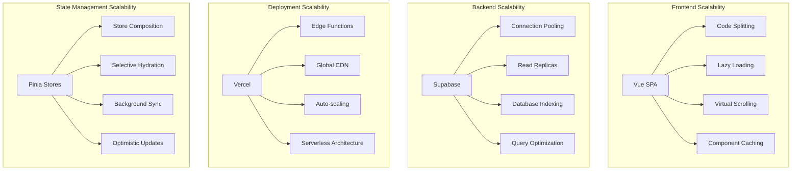

# Scalability Architecture

This document outlines the scalability patterns and capacity planning for the CRM system.

## Scalability Overview



## Horizontal Scaling Patterns

### Frontend Scaling
- **Code Splitting**: Route-based and component-based splitting
- **Lazy Loading**: Dynamic imports for large components
- **Virtual Scrolling**: Handle large datasets (1000+ records)
- **Worker Threads**: Background processing for data transformation

### Backend Scaling
- **Connection Pooling**: Supabase managed connection pooling (default 60 connections)
- **Read Replicas**: Database read scaling for analytics queries  
- **Edge Functions**: Compute scaling at CDN edge locations
- **API Rate Limiting**: Built-in Supabase rate limiting (100 req/sec)

## Vertical Scaling Considerations

### Database Scaling
```sql
-- Current database limits and scaling thresholds
-- Supabase Free Tier: 500MB database, 2GB bandwidth
-- Pro Tier: 8GB database, 250GB bandwidth
-- Team/Enterprise: Custom scaling

-- Performance monitoring queries
SELECT 
    schemaname,
    tablename,
    n_tup_ins + n_tup_upd + n_tup_del as total_writes,
    n_tup_ins,
    n_tup_upd,
    n_tup_del,
    pg_size_pretty(pg_total_relation_size(schemaname||'.'||tablename)) as size
FROM pg_stat_user_tables 
ORDER BY total_writes DESC;
```

### Application Scaling
- **Memory Management**: Reactive data cleanup and garbage collection
- **Bundle Size**: Target <250KB initial bundle, <1MB total
- **Asset Optimization**: Image compression and WebP conversion
- **Cache Strategies**: Browser caching and service worker caching

## Capacity Planning

### Current System Metrics
- **Users**: Designed for 100-500 concurrent users
- **Data**: 10,000+ contacts, 5,000+ opportunities
- **Requests**: 1,000 API calls per minute peak
- **Storage**: 500MB database, 2GB monthly bandwidth

### Growth Projections
```typescript
// Capacity planning calculations
interface CapacityMetrics {
  users: {
    current: 50;
    sixMonths: 200;
    oneYear: 500;
  };
  
  data: {
    contacts: {
      current: 2000;
      growth: 500; // per month
      projected: 8000; // one year
    };
    
    opportunities: {
      current: 1000;
      growth: 300; // per month
      projected: 4600; // one year
    };
  };
  
  traffic: {
    apiCalls: {
      current: 10000; // per day
      growth: 1.2; // 20% monthly growth
      projected: 43000; // one year
    };
  };
}
```

### Scaling Triggers
1. **Database Size > 6GB**: Upgrade to Team tier
2. **Concurrent Users > 400**: Implement connection pooling optimization
3. **API Calls > 50,000/day**: Consider caching layer implementation
4. **Bundle Size > 500KB**: Implement advanced code splitting

## Performance Bottleneck Mitigation

### Client-side Bottlenecks
```typescript
// Virtual scrolling for large datasets
export const useVirtualScrolling = (items: Ref<any[]>, itemHeight = 60) => {
  const containerRef = ref<HTMLElement>();
  const scrollTop = ref(0);
  const containerHeight = ref(600);
  
  const visibleItems = computed(() => {
    const start = Math.floor(scrollTop.value / itemHeight);
    const end = Math.min(
      start + Math.ceil(containerHeight.value / itemHeight) + 1,
      items.value.length
    );
    
    return items.value.slice(start, end).map((item, index) => ({
      ...item,
      index: start + index
    }));
  });
  
  return { containerRef, visibleItems, scrollTop };
};
```

### Database Query Optimization
```sql
-- Index optimization for common queries
CREATE INDEX CONCURRENTLY idx_contacts_search 
ON contacts USING gin(to_tsvector('english', name || ' ' || email));

CREATE INDEX CONCURRENTLY idx_opportunities_active 
ON opportunities (stage, expected_close_date) 
WHERE deleted_at IS NULL;

CREATE INDEX CONCURRENTLY idx_activities_recent 
ON principal_activities (created_at DESC, contact_id) 
WHERE created_at > NOW() - INTERVAL '90 days';
```

## Monitoring and Alerting

### Scaling Metrics
```typescript
// Performance monitoring integration
interface ScalingMetrics {
  frontend: {
    bundleSize: number;
    firstContentfulPaint: number;
    largestContentfulPaint: number;
    cumulativeLayoutShift: number;
  };
  
  backend: {
    databaseConnections: number;
    queryDuration: number;
    errorRate: number;
    throughput: number;
  };
  
  infrastructure: {
    cdnHitRate: number;
    edgeFunctionDuration: number;
    globalLatency: number;
  };
}

// Alert thresholds
const SCALING_THRESHOLDS = {
  BUNDLE_SIZE_WARNING: 400 * 1024, // 400KB
  BUNDLE_SIZE_CRITICAL: 500 * 1024, // 500KB
  LCP_WARNING: 2500, // 2.5s
  LCP_CRITICAL: 4000, // 4s
  DB_CONNECTIONS_WARNING: 50,
  DB_CONNECTIONS_CRITICAL: 55,
  ERROR_RATE_WARNING: 0.05, // 5%
  ERROR_RATE_CRITICAL: 0.10, // 10%
};
```

## Load Testing Strategy

### Performance Test Scenarios
1. **Normal Load**: 100 concurrent users, 30-minute duration
2. **Peak Load**: 300 concurrent users, 15-minute duration  
3. **Stress Test**: 500 concurrent users until failure
4. **Endurance Test**: 150 concurrent users, 4-hour duration

### Critical User Journeys
- **Contact Management**: Search, create, edit, delete operations
- **Opportunity Pipeline**: View dashboard, create opportunities, update stages
- **Data Import**: Bulk contact/opportunity imports
- **Reporting**: Generate and export analytics reports

## Future Scaling Considerations

### Microservices Migration
- **API Gateway**: Centralized routing and rate limiting
- **Service Decomposition**: Contacts, Opportunities, Analytics services
- **Event-Driven Architecture**: Pub/sub for cross-service communication
- **Distributed Caching**: Redis for session and data caching

### Advanced Optimization
- **GraphQL Federation**: Unified API layer with subgraph composition
- **Real-time Scaling**: WebSocket connection pooling and load balancing
- **Edge Computing**: Move compute closer to users globally
- **Database Sharding**: Horizontal database partitioning for large datasets