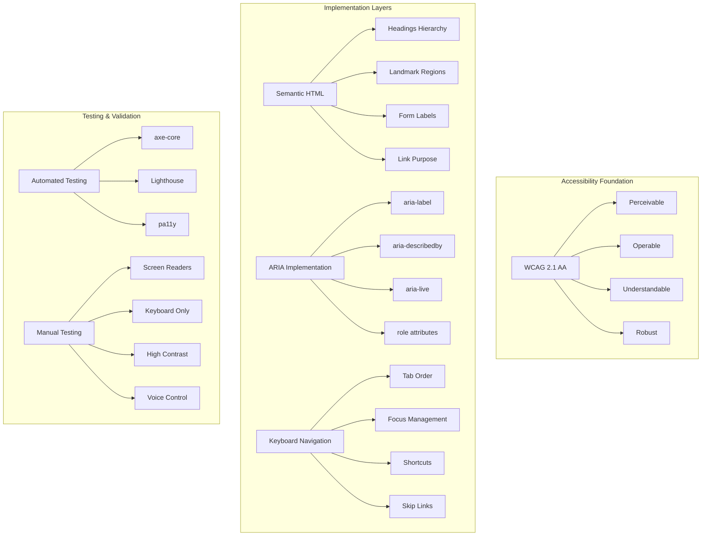

# Accessibility Architecture

This document outlines the accessibility implementation following WCAG 2.1 AA compliance standards.

## Accessibility Overview



## WCAG 2.1 AA Compliance

### Perceivable Guidelines

#### Color and Contrast
```typescript
// Color contrast ratios - WCAG AA compliance
const CONTRAST_RATIOS = {
  NORMAL_TEXT: 4.5, // 4.5:1 minimum
  LARGE_TEXT: 3.0,  // 3:1 minimum (18pt+ or 14pt+ bold)
  UI_COMPONENTS: 3.0, // 3:1 for form controls, focus indicators
  GRAPHICS: 3.0 // 3:1 for meaningful graphics
};

// Design system color tokens with contrast validation
export const colors = {
  primary: {
    50: '#eff6ff',  // Contrast: 1.02 (background only)
    500: '#3b82f6', // Contrast: 4.52 (AA compliant)
    600: '#2563eb', // Contrast: 5.93 (AA compliant)
    900: '#1e3a8a'  // Contrast: 10.31 (AAA compliant)
  },
  
  // Error states with sufficient contrast
  error: {
    500: '#ef4444', // Contrast: 4.74 (AA compliant)
    600: '#dc2626'  // Contrast: 6.12 (AA compliant)
  }
};
```

#### Alternative Text and Media
```vue
<!-- Image alternative text implementation -->
<template>
  
  
  <!-- Decorative images -->
  
  
  <!-- Icon with text alternative -->
  <button type="button" class="btn-primary">
    <PlusIcon class="h-4 w-4" aria-hidden="true" />
    <span>Add Contact</span>
  </button>
</template>
```

### Operable Guidelines

#### Keyboard Navigation
```typescript
// Keyboard navigation management
export const useKeyboardNavigation = () => {
  const focusableSelectors = [
    'button:not([disabled])',
    'input:not([disabled])',
    'select:not([disabled])',
    'textarea:not([disabled])',
    'a[href]',
    '[tabindex]:not([tabindex="-1"])'
  ].join(', ');
  
  const trapFocus = (element: HTMLElement) => {
    const focusableElements = element.querySelectorAll(focusableSelectors);
    const firstElement = focusableElements[0] as HTMLElement;
    const lastElement = focusableElements[focusableElements.length - 1] as HTMLElement;
    
    const handleKeyDown = (e: KeyboardEvent) => {
      if (e.key === 'Tab') {
        if (e.shiftKey && document.activeElement === firstElement) {
          e.preventDefault();
          lastElement.focus();
        } else if (!e.shiftKey && document.activeElement === lastElement) {
          e.preventDefault();
          firstElement.focus();
        }
      }
      
      if (e.key === 'Escape') {
        // Close modal/dialog
        element.dispatchEvent(new CustomEvent('close'));
      }
    };
    
    element.addEventListener('keydown', handleKeyDown);
    firstElement?.focus();
    
    return () => element.removeEventListener('keydown', handleKeyDown);
  };
  
  return { trapFocus };
};
```

#### Focus Management
```vue
<!-- Skip navigation links -->
<template>
  <div id="app">
    <a 
      href="#main-content" 
      class="skip-link"
      @click="skipToMain"
    >
      Skip to main content
    </a>
    
    <nav aria-label="Main navigation">
      <!-- navigation content -->
    </nav>
    
    <main id="main-content" tabindex="-1">
      <!-- main content -->
    </main>
  </div>
</template>

<style>
.skip-link {
  position: absolute;
  top: -40px;
  left: 6px;
  background: #000;
  color: #fff;
  padding: 8px;
  text-decoration: none;
  border-radius: 4px;
  z-index: 1000;
  transition: top 0.3s;
}

.skip-link:focus {
  top: 6px;
}
</style>
```

### Understandable Guidelines

#### Form Labels and Instructions
```vue
<!-- Accessible form implementation -->
<template>
  <div class="form-field">
    <label 
      :for="`input-${name}`"
      class="form-label"
      :class="{ 'required': required }"
    >
      {{ label }}
      <span v-if="required" aria-label="required">*</span>
    </label>
    
    <input
      :id="`input-${name}`"
      v-model="modelValue"
      :type="type"
      :required="required"
      :aria-invalid="error ? 'true' : 'false'"
      :aria-describedby="error ? `error-${name}` : `help-${name}`"
      class="form-input"
      :class="{ 'error': error }"
    />
    
    <div 
      v-if="helpText"
      :id="`help-${name}`"
      class="form-help"
    >
      {{ helpText }}
    </div>
    
    <div 
      v-if="error"
      :id="`error-${name}`"
      class="form-error"
      role="alert"
      aria-live="polite"
    >
      {{ error }}
    </div>
  </div>
</template>
```

#### Error Handling and Feedback
```typescript
// Accessible error handling
export const useAccessibleErrors = () => {
  const announceError = (message: string, severity: 'error' | 'warning' | 'info' = 'error') => {
    const announcement = document.createElement('div');
    announcement.setAttribute('aria-live', 'assertive');
    announcement.setAttribute('aria-atomic', 'true');
    announcement.setAttribute('role', 'alert');
    announcement.className = 'sr-only';
    announcement.textContent = message;
    
    document.body.appendChild(announcement);
    
    // Remove after announcement
    setTimeout(() => {
      document.body.removeChild(announcement);
    }, 1000);
  };
  
  const announceSuccess = (message: string) => {
    const announcement = document.createElement('div');
    announcement.setAttribute('aria-live', 'polite');
    announcement.setAttribute('aria-atomic', 'true');
    announcement.className = 'sr-only';
    announcement.textContent = message;
    
    document.body.appendChild(announcement);
    
    setTimeout(() => {
      document.body.removeChild(announcement);
    }, 1000);
  };
  
  return { announceError, announceSuccess };
};
```

### Robust Guidelines

#### Semantic HTML Structure
```vue
<!-- Proper heading hierarchy -->
<template>
  <div class="page">
    <header>
      <h1>Contact Management</h1>
    </header>
    
    <nav aria-label="Contact actions">
      <!-- navigation items -->
    </nav>
    
    <main>
      <section aria-labelledby="contact-list-heading">
        <h2 id="contact-list-heading">Contact List</h2>
        
        <div role="region" aria-live="polite" aria-label="Search results">
          <p>{{ contactCount }} contacts found</p>
          
          <table 
            role="table" 
            aria-label="Contacts table"
            aria-describedby="contact-list-description"
          >
            <caption id="contact-list-description" class="sr-only">
              A list of contacts with their names, emails, and organizations. 
              Use arrow keys to navigate between cells, Enter to activate buttons.
            </caption>
            
            <thead>
              <tr role="row">
                <th role="columnheader" scope="col" aria-sort="ascending">
                  <button @click="sortBy('name')" class="sort-button">
                    Name
                    <span aria-hidden="true">↑</span>
                  </button>
                </th>
                <th role="columnheader" scope="col">Email</th>
                <th role="columnheader" scope="col">Organization</th>
                <th role="columnheader" scope="col">Actions</th>
              </tr>
            </thead>
            
            <tbody>
              <tr 
                v-for="contact in contacts" 
                :key="contact.id"
                role="row"
              >
                <td role="gridcell">{{ contact.name }}</td>
                <td role="gridcell">{{ contact.email }}</td>
                <td role="gridcell">{{ contact.organization }}</td>
                <td role="gridcell">
                  <button 
                    @click="editContact(contact.id)"
                    :aria-label="`Edit ${contact.name}`"
                    class="btn-sm"
                  >
                    Edit
                  </button>
                </td>
              </tr>
            </tbody>
          </table>
        </div>
      </section>
    </main>
  </div>
</template>
```

## Assistive Technology Support

### Screen Reader Testing
```typescript
// Screen reader testing checklist
interface ScreenReaderTest {
  navigation: {
    skipLinks: boolean;
    headingNavigation: boolean;
    landmarkNavigation: boolean;
    tableNavigation: boolean;
  };
  
  content: {
    imageAltText: boolean;
    formLabels: boolean;
    errorMessages: boolean;
    dynamicContent: boolean;
  };
  
  interaction: {
    buttonPurpose: boolean;
    linkPurpose: boolean;
    formInstructions: boolean;
    statusUpdates: boolean;
  };
}

// NVDA, JAWS, VoiceOver compatibility
const SCREEN_READER_PATTERNS = {
  NVDA: {
    announcement: 'aria-live="polite"',
    navigation: 'role="navigation"',
    main: 'role="main"'
  },
  
  JAWS: {
    forms: 'aria-describedby for help text',
    tables: 'scope and headers attributes',
    regions: 'aria-labelledby or aria-label'
  },
  
  VOICEOVER: {
    rotor: 'proper heading hierarchy',
    forms: 'label association',
    controls: 'accessible name computation'
  }
};
```

### Voice Control Support
```typescript
// Voice control optimization
export const useVoiceControl = () => {
  const optimizeForVoiceControl = (element: HTMLElement) => {
    // Ensure clickable elements have accessible names
    const clickableElements = element.querySelectorAll('button, a, [role="button"]');
    
    clickableElements.forEach((el) => {
      const accessibleName = getAccessibleName(el);
      if (!accessibleName || accessibleName.length < 2) {
        console.warn('Element lacks sufficient accessible name for voice control:', el);
      }
    });
  };
  
  const getAccessibleName = (element: Element): string => {
    // Check aria-label first
    const ariaLabel = element.getAttribute('aria-label');
    if (ariaLabel) return ariaLabel;
    
    // Check aria-labelledby
    const labelledBy = element.getAttribute('aria-labelledby');
    if (labelledBy) {
      const labelElement = document.getElementById(labelledBy);
      if (labelElement) return labelElement.textContent || '';
    }
    
    // Check text content
    const textContent = element.textContent?.trim();
    if (textContent) return textContent;
    
    // Check title attribute
    const title = element.getAttribute('title');
    if (title) return title;
    
    return '';
  };
  
  return { optimizeForVoiceControl };
};
```

## Testing and Validation

### Automated Testing Integration
```typescript
// Accessibility testing with Playwright and axe-core
import { test, expect } from '@playwright/test';
import AxeBuilder from '@axe-core/playwright';

test.describe('Accessibility Tests', () => {
  test('should not have any automatically detectable WCAG violations', async ({ page }) => {
    await page.goto('/contacts');
    
    const accessibilityScanResults = await new AxeBuilder({ page })
      .withTags(['wcag2a', 'wcag2aa', 'wcag21aa'])
      .analyze();
    
    expect(accessibilityScanResults.violations).toEqual([]);
  });
  
  test('should support keyboard navigation', async ({ page }) => {
    await page.goto('/contacts');
    
    // Test tab navigation
    await page.keyboard.press('Tab');
    await expect(page.locator('[data-testid="skip-link"]')).toBeFocused();
    
    await page.keyboard.press('Tab');
    await expect(page.locator('[data-testid="add-contact-btn"]')).toBeFocused();
    
    // Test Enter activation
    await page.keyboard.press('Enter');
    await expect(page).toHaveURL('/contacts/new');
  });
  
  test('should announce dynamic content changes', async ({ page }) => {
    await page.goto('/contacts');
    
    const liveRegion = page.locator('[aria-live="polite"]');
    
    await page.fill('[data-testid="search-input"]', 'John');
    await expect(liveRegion).toContainText('contacts found');
  });
});
```

### Manual Testing Procedures
```typescript
// Manual accessibility testing checklist
const MANUAL_TESTS = {
  keyboardNavigation: [
    'Tab through all interactive elements',
    'Test Shift+Tab for reverse navigation',
    'Verify Enter and Space activate buttons',
    'Test Escape closes modals/dropdowns',
    'Verify arrow keys work in menus/tables'
  ],
  
  screenReader: [
    'Test with NVDA on Windows',
    'Test with VoiceOver on macOS',
    'Verify heading navigation (H key)',
    'Test landmark navigation (D key)',
    'Verify form navigation (F key)',
    'Test table navigation (T key)'
  ],
  
  visualTesting: [
    'Test with 400% zoom',
    'Test with high contrast mode',
    'Test with dark mode',
    'Test with Windows High Contrast',
    'Verify focus indicators visible'
  ],
  
  cognitiveAccessibility: [
    'Clear error messages',
    'Consistent navigation patterns',
    'Logical reading order',
    'Sufficient time limits',
    'Help text provided where needed'
  ]
};
```

## Performance and Accessibility

### Accessible Performance Optimization
```typescript
// Reduce motion for accessibility
const prefersReducedMotion = window.matchMedia('(prefers-reduced-motion: reduce)');

export const useAccessibleAnimations = () => {
  const shouldAnimate = ref(!prefersReducedMotion.matches);
  
  prefersReducedMotion.addEventListener('change', (e) => {
    shouldAnimate.value = !e.matches;
  });
  
  const fadeIn = (element: HTMLElement) => {
    if (!shouldAnimate.value) {
      element.style.opacity = '1';
      return;
    }
    
    element.style.opacity = '0';
    element.style.transition = 'opacity 0.3s ease-in-out';
    
    requestAnimationFrame(() => {
      element.style.opacity = '1';
    });
  };
  
  return { shouldAnimate: readonly(shouldAnimate), fadeIn };
};
```

## Continuous Accessibility Monitoring

### CI/CD Integration
```yaml
# GitHub Actions accessibility testing
name: Accessibility Testing
on: [push, pull_request]

jobs:
  accessibility:
    runs-on: ubuntu-latest
    steps:
      - uses: actions/checkout@v3
      - name: Setup Node.js
        uses: actions/setup-node@v3
        with:
          node-version: '18'
      
      - name: Install dependencies
        run: npm ci
      
      - name: Build application
        run: npm run build
      
      - name: Run accessibility tests
        run: |
          npm run test:a11y
          npm run lighthouse -- --preset=accessibility
      
      - name: Upload accessibility report
        uses: actions/upload-artifact@v3
        with:
          name: accessibility-report
          path: reports/accessibility/
```

This comprehensive accessibility architecture ensures WCAG 2.1 AA compliance across all application components with automated testing, manual validation procedures, and continuous monitoring integration.