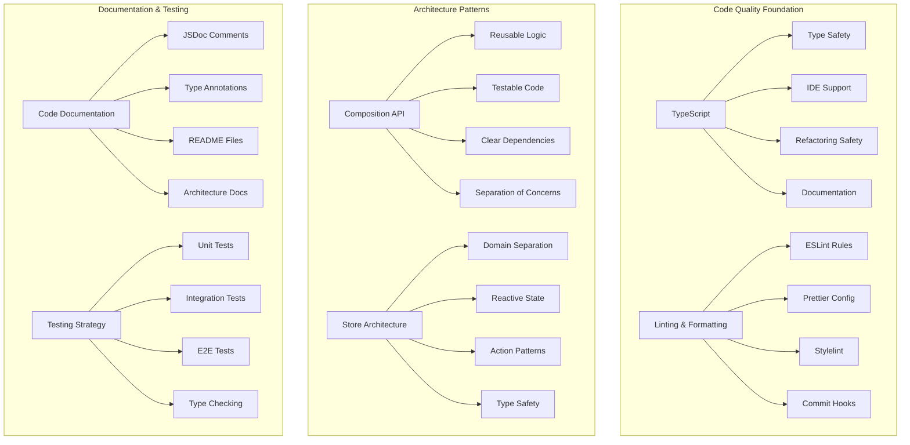

# Maintainability Architecture

This document outlines the code quality, maintenance strategies, and long-term sustainability patterns for the CRM system.

## Maintainability Overview



## Code Quality Standards

### TypeScript Configuration
```json
// tsconfig.json - Strict type checking configuration
{
  "compilerOptions": {
    "strict": true,
    "noImplicitAny": true,
    "noImplicitReturns": true,
    "noImplicitThis": true,
    "noUnusedLocals": true,
    "noUnusedParameters": true,
    "exactOptionalPropertyTypes": true,
    "noUncheckedIndexedAccess": true,
    "verbatimModuleSyntax": true
  },
  "include": ["src/**/*", "tests/**/*"],
  "exclude": ["node_modules", "dist"]
}
```

### ESLint Configuration
```javascript
// .eslintrc.js - Comprehensive linting rules
module.exports = {
  extends: [
    '@vue/eslint-config-typescript',
    '@vue/eslint-config-prettier',
    'plugin:vue/vue3-recommended'
  ],
  rules: {
    // Code quality rules
    'complexity': ['error', 10],
    'max-depth': ['error', 4],
    'max-lines-per-function': ['error', 50],
    'no-magic-numbers': ['error', { ignore: [0, 1] }],
    
    // TypeScript specific
    '@typescript-eslint/explicit-function-return-type': 'error',
    '@typescript-eslint/no-explicit-any': 'error',
    '@typescript-eslint/prefer-readonly': 'error',
    '@typescript-eslint/no-unused-vars': 'error',
    
    // Vue specific
    'vue/component-name-in-template-casing': ['error', 'PascalCase'],
    'vue/require-default-prop': 'error',
    'vue/require-prop-types': 'error',
    'vue/prop-name-casing': ['error', 'camelCase']
  }
};
```

## Component Architecture Patterns

### Composition API Best Practices
```typescript
// Reusable composition pattern
export function useContactForm(initialData?: Partial<Contact>) {
  // Reactive state with proper typing
  const formData = reactive<ContactFormData>({
    name: initialData?.name ?? '',
    email: initialData?.email ?? '',
    phone: initialData?.phone ?? '',
    organization: initialData?.organization ?? ''
  });
  
  // Computed properties with explicit return types
  const isValid = computed((): boolean => {
    return formData.name.length > 0 && 
           formData.email.includes('@') &&
           formData.phone.length >= 10;
  });
  
  // Actions with proper error handling
  const submitForm = async (): Promise<ContactSubmissionResult> => {
    try {
      const validation = await validateContactData(formData);
      if (!validation.isValid) {
        return { success: false, errors: validation.errors };
      }
      
      const result = await contactsApi.create(formData);
      return { success: true, data: result };
    } catch (error) {
      console.error('Contact form submission failed:', error);
      return { 
        success: false, 
        errors: ['Failed to save contact. Please try again.'] 
      };
    }
  };
  
  // Cleanup function
  const cleanup = (): void => {
    // Clear sensitive data
    Object.keys(formData).forEach(key => {
      (formData as any)[key] = '';
    });
  };
  
  // Return interface with proper typing
  return {
    formData: readonly(formData),
    isValid: readonly(isValid),
    submitForm,
    cleanup
  } as const;
}
```

### Store Design Patterns
```typescript
// Domain-driven store architecture
export const useContactsStore = defineStore('contacts', () => {
  // State with explicit typing
  const contacts = ref<Contact[]>([]);
  const loading = ref<boolean>(false);
  const error = ref<string | null>(null);
  const pagination = ref<PaginationState>({
    page: 1,
    limit: 20,
    total: 0
  });
  
  // Getters with memoization
  const contactsByOrganization = computed(() => {
    return contacts.value.reduce((acc, contact) => {
      const org = contact.organization || 'No Organization';
      if (!acc[org]) acc[org] = [];
      acc[org].push(contact);
      return acc;
    }, {} as Record<string, Contact[]>);
  });
  
  const searchContacts = computed(() => {
    return (query: string): Contact[] => {
      if (!query.trim()) return contacts.value;
      
      const searchTerm = query.toLowerCase();
      return contacts.value.filter(contact =>
        contact.name.toLowerCase().includes(searchTerm) ||
        contact.email.toLowerCase().includes(searchTerm) ||
        contact.organization?.toLowerCase().includes(searchTerm)
      );
    };
  });
  
  // Actions with proper error handling and state management
  const fetchContacts = async (params?: FetchContactsParams): Promise<void> => {
    loading.value = true;
    error.value = null;
    
    try {
      const response = await contactsApi.list(params);
      contacts.value = response.data;
      pagination.value = response.pagination;
    } catch (err) {
      error.value = err instanceof Error ? err.message : 'Failed to fetch contacts';
      console.error('Contact fetch failed:', err);
    } finally {
      loading.value = false;
    }
  };
  
  const createContact = async (contactData: ContactFormData): Promise<Contact> => {
    loading.value = true;
    error.value = null;
    
    try {
      const newContact = await contactsApi.create(contactData);
      contacts.value.unshift(newContact);
      return newContact;
    } catch (err) {
      error.value = err instanceof Error ? err.message : 'Failed to create contact';
      throw err;
    } finally {
      loading.value = false;
    }
  };
  
  // Cleanup and reset functions
  const resetStore = (): void => {
    contacts.value = [];
    loading.value = false;
    error.value = null;
    pagination.value = { page: 1, limit: 20, total: 0 };
  };
  
  return {
    // State (readonly to external consumers)
    contacts: readonly(contacts),
    loading: readonly(loading),
    error: readonly(error),
    pagination: readonly(pagination),
    
    // Getters
    contactsByOrganization,
    searchContacts,
    
    // Actions
    fetchContacts,
    createContact,
    resetStore
  };
});
```

## Testing Architecture

### Unit Testing Patterns
```typescript
// Comprehensive unit test example
import { describe, it, expect, vi, beforeEach } from 'vitest';
import { mount } from '@vue/test-utils';
import { createPinia, setActivePinia } from 'pinia';
import ContactForm from '@/components/ContactForm.vue';
import { useContactsStore } from '@/stores/contacts';

describe('ContactForm.vue', () => {
  let wrapper: VueWrapper<any>;
  let store: ReturnType<typeof useContactsStore>;
  
  beforeEach(() => {
    setActivePinia(createPinia());
    store = useContactsStore();
    
    wrapper = mount(ContactForm, {
      global: {
        plugins: [createPinia()]
      }
    });
  });
  
  describe('Form Validation', () => {
    it('should display validation errors for required fields', async () => {
      // Test empty form submission
      await wrapper.find('[data-testid="submit-btn"]').trigger('click');
      
      expect(wrapper.find('[data-testid="name-error"]').text())
        .toBe('Name is required');
      expect(wrapper.find('[data-testid="email-error"]').text())
        .toBe('Email is required');
    });
    
    it('should validate email format', async () => {
      await wrapper.find('[data-testid="email-input"]').setValue('invalid-email');
      await wrapper.find('[data-testid="email-input"]').trigger('blur');
      
      expect(wrapper.find('[data-testid="email-error"]').text())
        .toBe('Please enter a valid email address');
    });
  });
  
  describe('Form Submission', () => {
    it('should call store action on valid form submission', async () => {
      const createContactSpy = vi.spyOn(store, 'createContact')
        .mockResolvedValue({ id: '1', name: 'Test', email: 'test@example.com' });
      
      // Fill form with valid data
      await wrapper.find('[data-testid="name-input"]').setValue('John Doe');
      await wrapper.find('[data-testid="email-input"]').setValue('john@example.com');
      
      // Submit form
      await wrapper.find('[data-testid="submit-btn"]').trigger('click');
      
      expect(createContactSpy).toHaveBeenCalledWith({
        name: 'John Doe',
        email: 'john@example.com',
        phone: '',
        organization: ''
      });
    });
    
    it('should handle submission errors gracefully', async () => {
      vi.spyOn(store, 'createContact')
        .mockRejectedValue(new Error('Server error'));
      
      // Fill and submit form
      await wrapper.find('[data-testid="name-input"]').setValue('John Doe');
      await wrapper.find('[data-testid="email-input"]').setValue('john@example.com');
      await wrapper.find('[data-testid="submit-btn"]').trigger('click');
      
      await wrapper.vm.$nextTick();
      
      expect(wrapper.find('[data-testid="form-error"]').text())
        .toContain('Server error');
    });
  });
});
```

### Integration Testing
```typescript
// API integration tests
import { describe, it, expect, beforeAll, afterAll } from 'vitest';
import { createSupabaseClient } from '@/lib/supabase';
import { contactsApi } from '@/services/contactsApi';

describe('Contacts API Integration', () => {
  let testContactId: string;
  
  beforeAll(async () => {
    // Setup test database connection
    const supabase = createSupabaseClient();
    await supabase.auth.signInAnonymously();
  });
  
  afterAll(async () => {
    // Cleanup test data
    if (testContactId) {
      await contactsApi.delete(testContactId);
    }
  });
  
  it('should create and retrieve contact', async () => {
    const contactData = {
      name: 'Integration Test Contact',
      email: 'integration@test.com',
      phone: '555-0123',
      organization: 'Test Org'
    };
    
    // Create contact
    const createdContact = await contactsApi.create(contactData);
    testContactId = createdContact.id;
    
    expect(createdContact).toMatchObject(contactData);
    expect(createdContact.id).toBeDefined();
    expect(createdContact.created_at).toBeDefined();
    
    // Retrieve contact
    const retrievedContact = await contactsApi.getById(testContactId);
    expect(retrievedContact).toMatchObject(contactData);
  });
  
  it('should handle validation errors', async () => {
    const invalidContactData = {
      name: '', // Empty name should fail validation
      email: 'invalid-email',
      phone: '123', // Too short
      organization: 'Test Org'
    };
    
    await expect(contactsApi.create(invalidContactData))
      .rejects.toThrow('Validation failed');
  });
});
```

## Code Documentation Standards

### JSDoc Documentation
```typescript
/**
 * Manages contact data operations and state management
 * 
 * @example
 * ```typescript
 * const contactsStore = useContactsStore();
 * await contactsStore.fetchContacts({ page: 1, limit: 20 });
 * const newContact = await contactsStore.createContact({
 *   name: 'John Doe',
 *   email: 'john@example.com'
 * });
 * ```
 */
export const useContactsStore = defineStore('contacts', () => {
  /**
   * Creates a new contact with validation and error handling
   * 
   * @param contactData - The contact information to create
   * @returns Promise resolving to the created contact
   * @throws {ValidationError} When contact data fails validation
   * @throws {ApiError} When API request fails
   * 
   * @example
   * ```typescript
   * try {
   *   const contact = await createContact({
   *     name: 'Jane Smith',
   *     email: 'jane@example.com',
   *     phone: '555-0123'
   *   });
   *   console.log('Contact created:', contact.id);
   * } catch (error) {
   *   if (error instanceof ValidationError) {
   *     console.error('Invalid data:', error.errors);
   *   }
   * }
   * ```
   */
  const createContact = async (contactData: ContactFormData): Promise<Contact> => {
    // Implementation...
  };
});
```

### Component Documentation
```vue
<!--
ContactForm.vue - Reusable contact creation/editing form component

Features:
- Real-time validation with Yup schema
- Accessibility compliance (WCAG 2.1 AA)
- TypeScript type safety
- Error handling and user feedback
- Keyboard navigation support

Props:
- initialData: Partial<Contact> - Pre-populate form fields
- mode: 'create' | 'edit' - Form behavior mode
- onSubmit: (data: ContactFormData) => Promise<void> - Submission handler

Events:
- submit: Emitted when form is successfully submitted
- cancel: Emitted when user cancels form
- error: Emitted when validation or submission fails

Usage:
<ContactForm
  :initial-data="existingContact"
  mode="edit"
  @submit="handleContactUpdate"
  @cancel="closeForm"
/>
-->
<template>
  <!-- Template implementation -->
</template>
```

## Refactoring and Migration Strategies

### Safe Refactoring Patterns
```typescript
// Gradual migration pattern example
// Old API (deprecated but maintained for compatibility)
/** @deprecated Use useContactsStore().createContact() instead */
export const createContact = async (data: any): Promise<any> => {
  console.warn('createContact is deprecated, use useContactsStore().createContact()');
  const store = useContactsStore();
  return store.createContact(data);
};

// New API with proper typing
export const useContactsStore = defineStore('contacts', () => {
  const createContact = async (data: ContactFormData): Promise<Contact> => {
    // New implementation with type safety
  };
  
  return { createContact };
});

// Migration guide in comments
/**
 * MIGRATION GUIDE: Legacy Contact API → New Store API
 * 
 * Before:
 * ```typescript
 * import { createContact } from '@/api/contacts';
 * const contact = await createContact({ name: 'John', email: 'john@test.com' });
 * ```
 * 
 * After:
 * ```typescript
 * import { useContactsStore } from '@/stores/contacts';
 * const contactsStore = useContactsStore();
 * const contact = await contactsStore.createContact({ 
 *   name: 'John', 
 *   email: 'john@test.com',
 *   phone: '',
 *   organization: ''
 * });
 * ```
 */
```

### Database Migration Patterns
```sql
-- Safe database migration example
-- 01_add_contact_status_column.sql

-- Step 1: Add new column with default value
ALTER TABLE contacts 
ADD COLUMN status contact_status DEFAULT 'active';

-- Step 2: Create index for performance
CREATE INDEX CONCURRENTLY idx_contacts_status 
ON contacts (status) 
WHERE status != 'active';

-- Step 3: Update existing data (batched for large tables)
DO $$
DECLARE
  batch_size INTEGER := 1000;
  processed INTEGER := 0;
  total_rows INTEGER;
BEGIN
  SELECT COUNT(*) INTO total_rows FROM contacts WHERE status IS NULL;
  
  WHILE processed < total_rows LOOP
    UPDATE contacts 
    SET status = 'active'
    WHERE ctid IN (
      SELECT ctid FROM contacts 
      WHERE status IS NULL 
      LIMIT batch_size
    );
    
    processed := processed + batch_size;
    COMMIT;
    
    -- Progress logging
    RAISE NOTICE 'Processed % of % rows', processed, total_rows;
  END LOOP;
END $$;

-- Step 4: Add constraints after data migration
ALTER TABLE contacts 
ALTER COLUMN status SET NOT NULL;
```

## Performance Monitoring and Optimization

### Code Splitting and Lazy Loading
```typescript
// Route-based code splitting
const routes = [
  {
    path: '/',
    name: 'Dashboard',
    component: () => import('@/views/DashboardView.vue')
  },
  {
    path: '/contacts',
    name: 'Contacts',
    component: () => import('@/views/contacts/ContactsListView.vue')
  },
  {
    path: '/opportunities',
    name: 'Opportunities',
    component: () => import('@/views/opportunities/OpportunitiesListView.vue')
  }
];

// Component-level lazy loading
export default defineComponent({
  components: {
    // Lazy load heavy components
    OpportunityChart: defineAsyncComponent(() => 
      import('@/components/charts/OpportunityChart.vue')
    ),
    
    ContactImporter: defineAsyncComponent({
      loader: () => import('@/components/ContactImporter.vue'),
      loadingComponent: LoadingSpinner,
      errorComponent: ErrorMessage,
      delay: 200,
      timeout: 5000
    })
  }
});
```

### Bundle Analysis and Optimization
```typescript
// Webpack bundle analyzer configuration
// vite.config.ts
import { defineConfig } from 'vite';
import { visualizer } from 'rollup-plugin-visualizer';

export default defineConfig({
  plugins: [
    visualizer({
      filename: 'dist/stats.html',
      open: true,
      gzipSize: true,
      brotliSize: true
    })
  ],
  
  build: {
    rollupOptions: {
      output: {
        manualChunks: {
          vendor: ['vue', 'vue-router', 'pinia'],
          ui: ['@headlessui/vue', '@heroicons/vue'],
          utils: ['lodash-es', 'date-fns']
        }
      }
    }
  }
});
```

## Continuous Improvement Process

### Code Review Guidelines
```typescript
// Code review checklist
interface CodeReviewChecklist {
  functionality: {
    requirementsMet: boolean;
    edgeCasesHandled: boolean;
    errorHandlingImplemented: boolean;
    performanceConsidered: boolean;
  };
  
  codeQuality: {
    typeScriptCompliant: boolean;
    eslintPassing: boolean;
    testsWritten: boolean;
    documentationUpdated: boolean;
  };
  
  architecture: {
    followsPatterns: boolean;
    properAbstraction: boolean;
    maintainableDesign: boolean;
    securityConsidered: boolean;
  };
  
  accessibility: {
    wcagCompliant: boolean;
    keyboardAccessible: boolean;
    screenReaderFriendly: boolean;
    semanticHtml: boolean;
  };
}
```

### Technical Debt Management
```typescript
// Technical debt tracking
interface TechnicalDebtItem {
  id: string;
  title: string;
  description: string;
  impact: 'low' | 'medium' | 'high' | 'critical';
  effort: 'small' | 'medium' | 'large' | 'epic';
  category: 'code-quality' | 'performance' | 'security' | 'maintainability';
  created: Date;
  assignee?: string;
  estimatedHours?: number;
  dependencies?: string[];
}

// Example technical debt items
const TECHNICAL_DEBT_REGISTRY: TechnicalDebtItem[] = [
  {
    id: 'TD-001',
    title: 'Replace legacy contact validation with Yup schemas',
    description: 'Current validation uses manual checks, should use consistent Yup schemas',
    impact: 'medium',
    effort: 'medium',
    category: 'code-quality',
    created: new Date('2024-01-15'),
    estimatedHours: 16
  },
  
  {
    id: 'TD-002', 
    title: 'Optimize contact list virtual scrolling',
    description: 'Large contact lists (>1000) cause performance issues',
    impact: 'high',
    effort: 'large',
    category: 'performance',
    created: new Date('2024-01-20'),
    estimatedHours: 32
  }
];
```

This maintainability architecture ensures long-term code health through comprehensive quality standards, testing strategies, documentation practices, and continuous improvement processes.