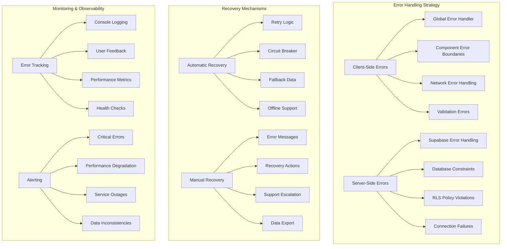

# Reliability Architecture

This document outlines error handling, recovery patterns, and system resilience strategies for the CRM system.

## Reliability Overview



## Error Handling Architecture

### Global Error Handler
```typescript
// Global error handling system
interface ErrorContext {
  component?: string;
  action?: string;
  userId?: string;
  timestamp: Date;
  userAgent: string;
  url: string;
  additionalData?: Record<string, unknown>;
}

interface ErrorReport {
  error: Error;
  context: ErrorContext;
  severity: 'low' | 'medium' | 'high' | 'critical';
  category: 'network' | 'validation' | 'runtime' | 'business-logic';
  recoverable: boolean;
}

class GlobalErrorHandler {
  private errorQueue: ErrorReport[] = [];
  private maxQueueSize = 100;
  
  public captureError(
    error: Error, 
    context: Partial<ErrorContext> = {},
    severity: ErrorReport['severity'] = 'medium'
  ): void {
    const errorReport: ErrorReport = {
      error,
      context: {
        timestamp: new Date(),
        userAgent: navigator.userAgent,
        url: window.location.href,
        ...context
      },
      severity,
      category: this.categorizeError(error),
      recoverable: this.isRecoverableError(error)
    };
    
    this.processError(errorReport);
  }
  
  private processError(report: ErrorReport): void {
    // Log to console in development
    if (import.meta.env.DEV) {
      console.error('Error captured:', {
        message: report.error.message,
        stack: report.error.stack,
        context: report.context,
        severity: report.severity
      });
    }
    
    // Add to queue for batch reporting
    this.errorQueue.push(report);
    if (this.errorQueue.length >= this.maxQueueSize) {
      this.flushErrorQueue();
    }
    
    // Handle critical errors immediately
    if (report.severity === 'critical') {
      this.handleCriticalError(report);
    }
    
    // Show user-friendly error message
    this.showUserError(report);
  }
  
  private categorizeError(error: Error): ErrorReport['category'] {
    if (error.message.includes('fetch') || error.message.includes('network')) {
      return 'network';
    }
    if (error.message.includes('validation') || error.message.includes('required')) {
      return 'validation';
    }
    if (error.message.includes('business') || error.message.includes('constraint')) {
      return 'business-logic';
    }
    return 'runtime';
  }
  
  private isRecoverableError(error: Error): boolean {
    const recoverablePatterns = [
      'network error',
      'timeout',
      'connection lost',
      'validation failed'
    ];
    
    return recoverablePatterns.some(pattern => 
      error.message.toLowerCase().includes(pattern)
    );
  }
  
  private handleCriticalError(report: ErrorReport): void {
    // Critical errors require immediate attention
    console.error('CRITICAL ERROR:', report);
    
    // Could integrate with external services like Sentry
    // Sentry.captureException(report.error, { contexts: { custom: report.context } });
    
    // Show critical error UI
    this.showCriticalErrorDialog(report);
  }
  
  private showUserError(report: ErrorReport): void {
    const userMessage = this.getUserFriendlyMessage(report);
    
    // Show toast notification or modal based on severity
    if (report.severity === 'critical') {
      this.showModal(userMessage, 'error');
    } else {
      this.showToast(userMessage, 'error');
    }
  }
  
  private getUserFriendlyMessage(report: ErrorReport): string {
    switch (report.category) {
      case 'network':
        return 'Unable to connect to the server. Please check your internet connection and try again.';
      case 'validation':
        return 'Please check the information you entered and try again.';
      case 'business-logic':
        return 'This action cannot be completed due to business rules. Please contact support if needed.';
      default:
        return 'An unexpected error occurred. Please try again or contact support if the problem persists.';
    }
  }
}

// Global instance
export const errorHandler = new GlobalErrorHandler();
```

### Vue Error Boundaries
```vue
<!-- ErrorBoundary.vue - Component-level error handling -->
<template>
  <div v-if="hasError" class="error-boundary">
    <div class="error-boundary__content">
      <div class="error-boundary__icon">
        <ExclamationTriangleIcon class="h-12 w-12 text-red-500" />
      </div>
      
      <h2 class="error-boundary__title">
        Something went wrong
      </h2>
      
      <p class="error-boundary__message">
        {{ userFriendlyMessage }}
      </p>
      
      <div class="error-boundary__actions">
        <button 
          @click="retry"
          class="btn btn-primary"
          :disabled="retrying"
        >
          {{ retrying ? 'Retrying...' : 'Try Again' }}
        </button>
        
        <button 
          @click="reportError"
          class="btn btn-secondary"
        >
          Report Issue
        </button>
        
        <button 
          @click="goHome"
          class="btn btn-outline"
        >
          Go to Dashboard
        </button>
      </div>
      
      <details v-if="showDetails" class="error-boundary__details">
        <summary>Technical Details</summary>
        <pre>{{ errorDetails }}</pre>
      </details>
    </div>
  </div>
  
  <slot v-else />
</template>

<script setup lang="ts">
import { ref, onErrorCaptured } from 'vue';
import { useRouter } from 'vue-router';
import { errorHandler } from '@/services/errorHandler';

interface Props {
  fallbackComponent?: Component;
  showDetails?: boolean;
}

const props = withDefaults(defineProps<Props>(), {
  showDetails: false
});

const hasError = ref(false);
const error = ref<Error | null>(null);
const retrying = ref(false);
const router = useRouter();

const userFriendlyMessage = computed(() => {
  if (!error.value) return '';
  
  // Customize messages based on error type
  if (error.value.message.includes('network')) {
    return 'Network connection issue. Please check your internet connection.';
  }
  if (error.value.message.includes('permission')) {
    return 'You don\'t have permission to perform this action.';
  }
  return 'An unexpected error occurred in this section.';
});

const errorDetails = computed(() => {
  if (!error.value) return '';
  return {
    message: error.value.message,
    stack: error.value.stack,
    timestamp: new Date().toISOString()
  };
});

onErrorCaptured((err: Error, instance, info) => {
  console.error('Error captured by boundary:', err, info);
  
  error.value = err;
  hasError.value = true;
  
  // Report to global error handler
  errorHandler.captureError(err, {
    component: instance?.$?.type?.name || 'Unknown',
    action: 'component-error',
    additionalData: { info }
  }, 'medium');
  
  // Prevent error from propagating
  return false;
});

const retry = async (): Promise<void> => {
  retrying.value = true;
  
  try {
    // Reset error state
    hasError.value = false;
    error.value = null;
    
    // Wait a moment for UI to update
    await new Promise(resolve => setTimeout(resolve, 500));
    
    // Force component re-render
    await nextTick();
  } catch (retryError) {
    console.error('Retry failed:', retryError);
    hasError.value = true;
  } finally {
    retrying.value = false;
  }
};

const reportError = (): void => {
  if (error.value) {
    errorHandler.captureError(error.value, {
      action: 'user-reported-error',
      additionalData: { userInitiated: true }
    }, 'high');
    
    // Show confirmation
    showToast('Error report sent. Thank you for helping us improve!', 'success');
  }
};

const goHome = (): void => {
  router.push('/');
};
</script>
```

### Network Error Handling
```typescript
// Robust API client with retry logic and circuit breaker
class ApiClient {
  private baseURL: string;
  private circuitBreaker: CircuitBreaker;
  private retryConfig: RetryConfig;
  
  constructor() {
    this.baseURL = import.meta.env.VITE_API_URL;
    this.circuitBreaker = new CircuitBreaker();
    this.retryConfig = {
      maxRetries: 3,
      backoffFactor: 2,
      initialDelay: 1000
    };
  }
  
  async request<T>(
    endpoint: string, 
    options: RequestOptions = {}
  ): Promise<ApiResponse<T>> {
    const { retry = true, timeout = 30000 } = options;
    
    // Check circuit breaker
    if (this.circuitBreaker.isOpen()) {
      throw new Error('Service temporarily unavailable');
    }
    
    try {
      const response = await this.executeRequest<T>(endpoint, options, timeout);
      this.circuitBreaker.recordSuccess();
      return response;
    } catch (error) {
      this.circuitBreaker.recordFailure();
      
      if (retry && this.shouldRetry(error)) {
        return this.retryRequest<T>(endpoint, options);
      }
      
      throw this.enhanceError(error, endpoint, options);
    }
  }
  
  private async executeRequest<T>(
    endpoint: string,
    options: RequestOptions,
    timeout: number
  ): Promise<ApiResponse<T>> {
    const controller = new AbortController();
    const timeoutId = setTimeout(() => controller.abort(), timeout);
    
    try {
      const response = await fetch(`${this.baseURL}${endpoint}`, {
        ...options,
        signal: controller.signal,
        headers: {
          'Content-Type': 'application/json',
          ...options.headers
        }
      });
      
      clearTimeout(timeoutId);
      
      if (!response.ok) {
        throw new HttpError(response.status, response.statusText, await response.text());
      }
      
      const data = await response.json();
      return { data, status: response.status, headers: response.headers };
    } catch (error) {
      clearTimeout(timeoutId);
      throw error;
    }
  }
  
  private async retryRequest<T>(
    endpoint: string,
    options: RequestOptions
  ): Promise<ApiResponse<T>> {
    let lastError: Error;
    
    for (let attempt = 1; attempt <= this.retryConfig.maxRetries; attempt++) {
      try {
        const delay = this.calculateBackoffDelay(attempt);
        await this.sleep(delay);
        
        return await this.executeRequest<T>(endpoint, options, 30000);
      } catch (error) {
        lastError = error as Error;
        console.warn(`Retry attempt ${attempt} failed:`, error);
      }
    }
    
    throw new Error(`Request failed after ${this.retryConfig.maxRetries} retries: ${lastError.message}`);
  }
  
  private shouldRetry(error: Error): boolean {
    // Retry on network errors, timeouts, and 5xx server errors
    const retryableErrors = [
      'fetch',
      'network',
      'timeout',
      'aborted'
    ];
    
    return retryableErrors.some(pattern => 
      error.message.toLowerCase().includes(pattern)
    ) || (error instanceof HttpError && error.status >= 500);
  }
  
  private calculateBackoffDelay(attempt: number): number {
    return this.retryConfig.initialDelay * Math.pow(this.retryConfig.backoffFactor, attempt - 1);
  }
  
  private enhanceError(error: Error, endpoint: string, options: RequestOptions): Error {
    const enhancedError = new Error(`API request failed: ${error.message}`);
    enhancedError.stack = error.stack;
    
    // Add context
    (enhancedError as any).endpoint = endpoint;
    (enhancedError as any).options = options;
    (enhancedError as any).timestamp = new Date().toISOString();
    
    return enhancedError;
  }
  
  private sleep(ms: number): Promise<void> {
    return new Promise(resolve => setTimeout(resolve, ms));
  }
}

// Circuit breaker implementation
class CircuitBreaker {
  private failures = 0;
  private lastFailure: Date | null = null;
  private state: 'closed' | 'open' | 'half-open' = 'closed';
  
  private readonly failureThreshold = 5;
  private readonly recoveryTimeout = 30000; // 30 seconds
  
  recordSuccess(): void {
    this.failures = 0;
    this.state = 'closed';
    this.lastFailure = null;
  }
  
  recordFailure(): void {
    this.failures++;
    this.lastFailure = new Date();
    
    if (this.failures >= this.failureThreshold) {
      this.state = 'open';
    }
  }
  
  isOpen(): boolean {
    if (this.state === 'closed') return false;
    
    if (this.state === 'open' && this.lastFailure) {
      const now = new Date().getTime();
      const failureTime = this.lastFailure.getTime();
      
      if (now - failureTime >= this.recoveryTimeout) {
        this.state = 'half-open';
        return false;
      }
    }
    
    return this.state === 'open';
  }
}
```

## Data Consistency and Validation

### Client-Side Validation
```typescript
// Comprehensive validation with Yup schemas
import * as yup from 'yup';

export const contactValidationSchema = yup.object({
  name: yup
    .string()
    .required('Name is required')
    .min(2, 'Name must be at least 2 characters')
    .max(100, 'Name cannot exceed 100 characters')
    .matches(/^[a-zA-Z\s'-]+$/, 'Name contains invalid characters'),
    
  email: yup
    .string()
    .required('Email is required')
    .email('Please enter a valid email address')
    .max(255, 'Email cannot exceed 255 characters'),
    
  phone: yup
    .string()
    .optional()
    .matches(/^[\+]?[0-9\s\-\(\)]{10,15}$/, 'Please enter a valid phone number'),
    
  organization: yup
    .string()
    .optional()
    .max(200, 'Organization name cannot exceed 200 characters')
});

// Validation composable with error handling
export const useValidation = <T extends Record<string, any>>(
  schema: yup.ObjectSchema<T>
) => {
  const errors = ref<Record<string, string>>({});
  const isValidating = ref(false);
  
  const validateField = async (
    fieldName: keyof T, 
    value: any
  ): Promise<boolean> => {
    try {
      await schema.validateAt(fieldName as string, { [fieldName]: value });
      delete errors.value[fieldName as string];
      return true;
    } catch (error) {
      if (error instanceof yup.ValidationError) {
        errors.value[fieldName as string] = error.message;
      }
      return false;
    }
  };
  
  const validateAll = async (data: T): Promise<boolean> => {
    isValidating.value = true;
    errors.value = {};
    
    try {
      await schema.validate(data, { abortEarly: false });
      return true;
    } catch (error) {
      if (error instanceof yup.ValidationError) {
        error.inner.forEach(err => {
          if (err.path) {
            errors.value[err.path] = err.message;
          }
        });
      }
      return false;
    } finally {
      isValidating.value = false;
    }
  };
  
  const clearErrors = (): void => {
    errors.value = {};
  };
  
  return {
    errors: readonly(errors),
    isValidating: readonly(isValidating),
    validateField,
    validateAll,
    clearErrors
  };
};
```

### Server-Side Data Integrity
```sql
-- Database constraints and triggers for data integrity
CREATE OR REPLACE FUNCTION validate_contact_data()
RETURNS TRIGGER AS $$
BEGIN
  -- Validate email format
  IF NEW.email IS NOT NULL AND NEW.email !~ '^[A-Za-z0-9._%+-]+@[A-Za-z0-9.-]+\.[A-Za-z]{2,}$' THEN
    RAISE EXCEPTION 'Invalid email format: %', NEW.email;
  END IF;
  
  -- Validate phone format
  IF NEW.phone IS NOT NULL AND NEW.phone !~ '^[\+]?[0-9\s\-\(\)]{10,15}$' THEN
    RAISE EXCEPTION 'Invalid phone format: %', NEW.phone;
  END IF;
  
  -- Ensure name is not empty
  IF NEW.name IS NULL OR TRIM(NEW.name) = '' THEN
    RAISE EXCEPTION 'Contact name cannot be empty';
  END IF;
  
  -- Update timestamp
  NEW.updated_at = NOW();
  
  RETURN NEW;
END;
$$ LANGUAGE plpgsql;

-- Apply trigger to contacts table
CREATE TRIGGER validate_contact_trigger
  BEFORE INSERT OR UPDATE ON contacts
  FOR EACH ROW
  EXECUTE FUNCTION validate_contact_data();

-- Data consistency checks
CREATE OR REPLACE FUNCTION check_data_consistency()
RETURNS TABLE(table_name TEXT, issue_type TEXT, issue_count BIGINT, sample_ids TEXT[]) AS $$
BEGIN
  -- Check for contacts without valid emails
  RETURN QUERY
  SELECT 
    'contacts'::TEXT,
    'invalid_email'::TEXT,
    COUNT(*)::BIGINT,
    ARRAY_AGG(id::TEXT)[:5]
  FROM contacts 
  WHERE email IS NOT NULL 
    AND email !~ '^[A-Za-z0-9._%+-]+@[A-Za-z0-9.-]+\.[A-Za-z]{2,}$';
  
  -- Check for opportunities without valid stages
  RETURN QUERY
  SELECT 
    'opportunities'::TEXT,
    'invalid_stage'::TEXT,
    COUNT(*)::BIGINT,
    ARRAY_AGG(id::TEXT)[:5]
  FROM opportunities 
  WHERE stage NOT IN ('NEW_LEAD', 'INITIAL_OUTREACH', 'SAMPLE_VISIT_OFFERED', 
                      'AWAITING_RESPONSE', 'FEEDBACK_LOGGED', 'DEMO_SCHEDULED', 'CLOSED_WON');
  
  -- Check for orphaned records
  RETURN QUERY
  SELECT 
    'opportunities'::TEXT,
    'orphaned_contact'::TEXT,
    COUNT(*)::BIGINT,
    ARRAY_AGG(id::TEXT)[:5]
  FROM opportunities o
  LEFT JOIN contacts c ON o.principal_id = c.id
  WHERE c.id IS NULL AND o.principal_id IS NOT NULL;
END;
$$ LANGUAGE plpgsql;
```

## Backup and Recovery

### Data Backup Strategy
```typescript
// Client-side data export for recovery
export class DataExportService {
  async exportAllData(): Promise<ExportData> {
    try {
      const [contacts, opportunities, organizations, activities] = await Promise.all([
        this.exportContacts(),
        this.exportOpportunities(),
        this.exportOrganizations(),
        this.exportActivities()
      ]);
      
      const exportData: ExportData = {
        metadata: {
          exportDate: new Date().toISOString(),
          version: '1.0',
          recordCounts: {
            contacts: contacts.length,
            opportunities: opportunities.length,
            organizations: organizations.length,
            activities: activities.length
          }
        },
        data: {
          contacts,
          opportunities,
          organizations,
          activities
        }
      };
      
      return exportData;
    } catch (error) {
      errorHandler.captureError(error as Error, {
        action: 'data-export',
        component: 'DataExportService'
      }, 'high');
      throw error;
    }
  }
  
  async downloadExport(format: 'json' | 'csv' = 'json'): Promise<void> {
    const exportData = await this.exportAllData();
    
    let content: string;
    let mimeType: string;
    let filename: string;
    
    if (format === 'json') {
      content = JSON.stringify(exportData, null, 2);
      mimeType = 'application/json';
      filename = `crm-export-${new Date().toISOString().split('T')[0]}.json`;
    } else {
      content = this.convertToCSV(exportData);
      mimeType = 'text/csv';
      filename = `crm-export-${new Date().toISOString().split('T')[0]}.csv`;
    }
    
    const blob = new Blob([content], { type: mimeType });
    const url = URL.createObjectURL(blob);
    
    const link = document.createElement('a');
    link.href = url;
    link.download = filename;
    link.click();
    
    URL.revokeObjectURL(url);
  }
  
  private async exportContacts(): Promise<Contact[]> {
    const contactsStore = useContactsStore();
    await contactsStore.fetchAllContacts();
    return contactsStore.contacts;
  }
  
  private convertToCSV(exportData: ExportData): string {
    // Convert structured data to CSV format
    const csvSections: string[] = [];
    
    // Contacts CSV
    if (exportData.data.contacts.length > 0) {
      csvSections.push('CONTACTS');
      csvSections.push(this.objectsToCSV(exportData.data.contacts));
      csvSections.push('');
    }
    
    // Opportunities CSV
    if (exportData.data.opportunities.length > 0) {
      csvSections.push('OPPORTUNITIES');
      csvSections.push(this.objectsToCSV(exportData.data.opportunities));
      csvSections.push('');
    }
    
    return csvSections.join('\n');
  }
  
  private objectsToCSV(objects: Record<string, any>[]): string {
    if (objects.length === 0) return '';
    
    const headers = Object.keys(objects[0]);
    const csvHeaders = headers.join(',');
    
    const csvRows = objects.map(obj =>
      headers.map(header => {
        const value = obj[header];
        // Escape CSV values
        if (typeof value === 'string' && (value.includes(',') || value.includes('"'))) {
          return `"${value.replace(/"/g, '""')}"`;
        }
        return value?.toString() || '';
      }).join(',')
    );
    
    return [csvHeaders, ...csvRows].join('\n');
  }
}
```

### Recovery Procedures
```typescript
// Data recovery and restoration service
export class DataRecoveryService {
  async validateImportData(data: ExportData): Promise<ValidationResult> {
    const errors: string[] = [];
    const warnings: string[] = [];
    
    // Validate metadata
    if (!data.metadata || !data.metadata.version) {
      errors.push('Missing or invalid metadata');
    }
    
    // Validate data structure
    if (!data.data) {
      errors.push('Missing data section');
    } else {
      // Validate contacts
      if (data.data.contacts) {
        const contactErrors = await this.validateContacts(data.data.contacts);
        errors.push(...contactErrors);
      }
      
      // Validate opportunities
      if (data.data.opportunities) {
        const opportunityErrors = await this.validateOpportunities(data.data.opportunities);
        errors.push(...opportunityErrors);
      }
    }
    
    return {
      isValid: errors.length === 0,
      errors,
      warnings,
      recordCounts: {
        contacts: data.data.contacts?.length || 0,
        opportunities: data.data.opportunities?.length || 0,
        organizations: data.data.organizations?.length || 0,
        activities: data.data.activities?.length || 0
      }
    };
  }
  
  async restoreData(
    data: ExportData, 
    options: RestoreOptions = {}
  ): Promise<RestoreResult> {
    const { 
      skipValidation = false, 
      overwriteExisting = false,
      dryRun = false 
    } = options;
    
    // Validate data if not skipped
    if (!skipValidation) {
      const validation = await this.validateImportData(data);
      if (!validation.isValid) {
        throw new Error(`Import validation failed: ${validation.errors.join(', ')}`);
      }
    }
    
    const results: RestoreResult = {
      success: true,
      recordsProcessed: {
        contacts: 0,
        opportunities: 0,
        organizations: 0,
        activities: 0
      },
      errors: [],
      warnings: []
    };
    
    try {
      // Restore in dependency order
      if (data.data.organizations) {
        results.recordsProcessed.organizations = await this.restoreOrganizations(
          data.data.organizations, { overwriteExisting, dryRun }
        );
      }
      
      if (data.data.contacts) {
        results.recordsProcessed.contacts = await this.restoreContacts(
          data.data.contacts, { overwriteExisting, dryRun }
        );
      }
      
      if (data.data.opportunities) {
        results.recordsProcessed.opportunities = await this.restoreOpportunities(
          data.data.opportunities, { overwriteExisting, dryRun }
        );
      }
      
      if (data.data.activities) {
        results.recordsProcessed.activities = await this.restoreActivities(
          data.data.activities, { overwriteExisting, dryRun }
        );
      }
      
    } catch (error) {
      results.success = false;
      results.errors.push(`Restore failed: ${error.message}`);
      
      // Log error for monitoring
      errorHandler.captureError(error as Error, {
        action: 'data-restore',
        component: 'DataRecoveryService',
        additionalData: { recordCounts: results.recordsProcessed }
      }, 'critical');
    }
    
    return results;
  }
  
  private async validateContacts(contacts: Contact[]): Promise<string[]> {
    const errors: string[] = [];
    
    for (let i = 0; i < contacts.length; i++) {
      const contact = contacts[i];
      
      try {
        await contactValidationSchema.validate(contact);
      } catch (error) {
        if (error instanceof yup.ValidationError) {
          errors.push(`Contact ${i + 1}: ${error.message}`);
        }
      }
    }
    
    return errors;
  }
}
```

## Health Monitoring and Alerting

### System Health Checks
```typescript
// Comprehensive health monitoring system
export class HealthMonitorService {
  private checks: HealthCheck[] = [];
  private checkInterval: number = 30000; // 30 seconds
  private intervalId: number | null = null;
  
  constructor() {
    this.registerDefaultChecks();
  }
  
  private registerDefaultChecks(): void {
    this.addCheck({
      name: 'database-connection',
      description: 'Supabase database connectivity',
      check: this.checkDatabaseConnection,
      critical: true,
      timeout: 5000
    });
    
    this.addCheck({
      name: 'api-responsiveness',
      description: 'API response times',  
      check: this.checkApiResponsiveness,
      critical: true,
      timeout: 10000
    });
    
    this.addCheck({
      name: 'local-storage',
      description: 'Browser local storage availability',
      check: this.checkLocalStorage,
      critical: false,
      timeout: 1000
    });
    
    this.addCheck({
      name: 'memory-usage',
      description: 'Client-side memory usage',
      check: this.checkMemoryUsage,
      critical: false,
      timeout: 1000
    });
  }
  
  public addCheck(check: HealthCheck): void {
    this.checks.push(check);
  }
  
  public startMonitoring(): void {
    if (this.intervalId) return;
    
    this.intervalId = window.setInterval(() => {
      this.runHealthChecks();
    }, this.checkInterval);
    
    // Run initial check
    this.runHealthChecks();
  }
  
  public stopMonitoring(): void {
    if (this.intervalId) {
      clearInterval(this.intervalId);
      this.intervalId = null;
    }
  }
  
  private async runHealthChecks(): Promise<void> {
    const results: HealthCheckResult[] = [];
    
    for (const check of this.checks) {
      try {
        const startTime = performance.now();
        const result = await Promise.race([
          check.check(),
          this.timeout(check.timeout || 5000)
        ]);
        const duration = performance.now() - startTime;
        
        results.push({
          name: check.name,
          status: result.healthy ? 'healthy' : 'unhealthy',
          message: result.message,
          duration,
          critical: check.critical,
          timestamp: new Date()
        });
        
      } catch (error) {
        results.push({
          name: check.name,
          status: 'error',
          message: error.message,
          duration: check.timeout || 5000,
          critical: check.critical,
          timestamp: new Date()
        });
      }
    }
    
    this.processHealthResults(results);
  }
  
  private async checkDatabaseConnection(): Promise<HealthCheckResponse> {
    try {
      const { data, error } = await supabase
        .from('contacts')
        .select('id')
        .limit(1);
        
      if (error) {
        return { healthy: false, message: `Database error: ${error.message}` };
      }
      
      return { healthy: true, message: 'Database connection active' };
    } catch (error) {
      return { healthy: false, message: `Connection failed: ${error.message}` };
    }
  }
  
  private async checkApiResponsiveness(): Promise<HealthCheckResponse> {
    const startTime = performance.now();
    
    try {
      const response = await fetch('/api/health', { 
        method: 'HEAD',
        cache: 'no-cache'
      });
      
      const responseTime = performance.now() - startTime;
      
      if (!response.ok) {
        return { 
          healthy: false, 
          message: `API returned ${response.status}: ${response.statusText}` 
        };
      }
      
      if (responseTime > 2000) {
        return { 
          healthy: false, 
          message: `API response time too slow: ${responseTime.toFixed(0)}ms` 
        };
      }
      
      return { 
        healthy: true, 
        message: `API responsive (${responseTime.toFixed(0)}ms)` 
      };
    } catch (error) {
      return { healthy: false, message: `API unreachable: ${error.message}` };  
    }
  }
  
  private async checkLocalStorage(): Promise<HealthCheckResponse> {
    try {
      const testKey = '__health_check__';
      const testValue = Date.now().toString();
      
      localStorage.setItem(testKey, testValue);
      const retrieved = localStorage.getItem(testKey);
      localStorage.removeItem(testKey);
      
      if (retrieved !== testValue) {
        return { healthy: false, message: 'Local storage read/write failed' };
      }
      
      return { healthy: true, message: 'Local storage available' };
    } catch (error) {
      return { healthy: false, message: `Local storage error: ${error.message}` };
    }
  }
  
  private async checkMemoryUsage(): Promise<HealthCheckResponse> {
    try {
      // @ts-ignore - Performance memory API may not be available
      const memory = (performance as any).memory;
      
      if (!memory) {
        return { healthy: true, message: 'Memory monitoring not available' };
      }
      
      const usedMB = Math.round(memory.usedJSHeapSize / 1024 / 1024);
      const totalMB = Math.round(memory.totalJSHeapSize / 1024 / 1024);
      const limitMB = Math.round(memory.jsHeapSizeLimit / 1024 / 1024);
      
      const usagePercent = (usedMB / limitMB) * 100;
      
      if (usagePercent > 90) {
        return { 
          healthy: false, 
          message: `High memory usage: ${usedMB}MB (${usagePercent.toFixed(1)}%)` 
        };
      }
      
      return { 
        healthy: true, 
        message: `Memory usage: ${usedMB}MB/${limitMB}MB (${usagePercent.toFixed(1)}%)` 
      };
    } catch (error) {
      return { healthy: false, message: `Memory check failed: ${error.message}` };
    }
  }
  
  private processHealthResults(results: HealthCheckResult[]): void {
    const criticalFailures = results.filter(r => r.critical && r.status !== 'healthy');
    
    if (criticalFailures.length > 0) {
      // Alert on critical failures
      this.handleCriticalFailures(criticalFailures);
    }
    
    // Log all results for monitoring
    console.group('Health Check Results');
    results.forEach(result => {
      const emoji = result.status === 'healthy' ? '✅' : '❌';
      const level = result.critical ? 'error' : 'warn';
      console[level](`${emoji} ${result.name}: ${result.message} (${result.duration.toFixed(0)}ms)`);
    });
    console.groupEnd();
  }
  
  private handleCriticalFailures(failures: HealthCheckResult[]): void {
    const message = `Critical system failures detected: ${failures.map(f => f.name).join(', ')}`;
    
    errorHandler.captureError(new Error(message), {
      action: 'health-check-failure',
      component: 'HealthMonitorService',
      additionalData: { failures }
    }, 'critical');
    
    // Could show user notification for critical failures
    this.showCriticalHealthAlert(failures);
  }
  
  private showCriticalHealthAlert(failures: HealthCheckResult[]): void {
    // Implementation would show user-facing alert
    console.error('Critical health check failures:', failures);
  }
  
  private timeout(ms: number): Promise<never> {
    return new Promise((_, reject) => {
      setTimeout(() => reject(new Error('Health check timeout')), ms);
    });
  }
}

// Global health monitor instance
export const healthMonitor = new HealthMonitorService();
```

This comprehensive reliability architecture ensures system resilience through robust error handling, data consistency validation, backup/recovery procedures, and continuous health monitoring.