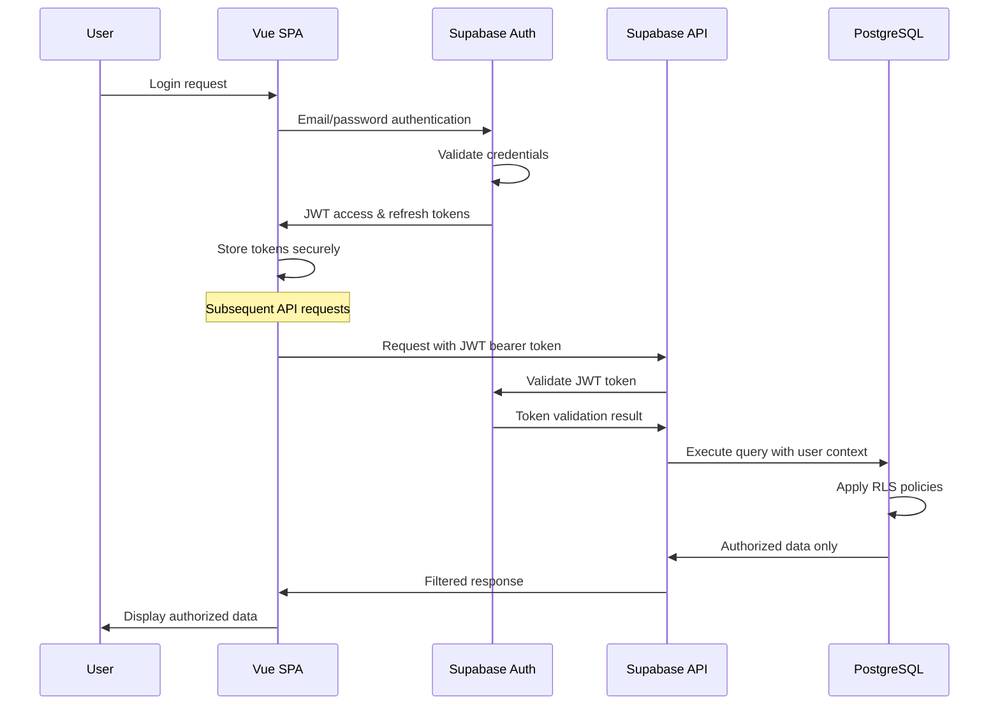

# Security Architecture Overview

## Security Architecture Diagram

```mermaid
C4Container
    title Security Architecture for CRM System

    Person(user, "User", "Authenticated CRM user")
    Person(attacker, "Threat Actor", "Potential security threat")

    System_Boundary(client, "Client-Side Security") {
        Container(browser, "Web Browser", "Modern Browser", "Client-side security controls and validation")
        Container(spa, "Vue 3 SPA", "TypeScript, CSP", "Application with built-in security features")
        Container(sw, "Service Worker", "JavaScript", "Secure caching and offline functionality")
    }

    System_Boundary(network, "Network Security") {
        Container(cdn, "Vercel Edge Network", "Global CDN", "TLS termination and DDoS protection")
        Container(waf, "Web Application Firewall", "Cloud WAF", "Request filtering and rate limiting")
    }

    System_Boundary(backend, "Backend Security") {
        Container(api_gateway, "Supabase API Gateway", "Kong/PostgREST", "API authentication and authorization")
        Container(auth_service, "Supabase Auth", "GoTrue, JWT", "Identity and access management")
        ContainerDb(postgres, "PostgreSQL", "RLS Policies", "Database with row-level security")
    }

    System_Boundary(infrastructure, "Infrastructure Security") {
        Container(secrets, "Environment Secrets", "Key Management", "Secure configuration and secrets")
        Container(monitoring, "Security Monitoring", "Logging & Alerting", "Security event monitoring")
        Container(backup, "Encrypted Backups", "Point-in-time Recovery", "Secure data backup and recovery")
    }

    ' User interactions
    Rel(user, browser, "Accesses via HTTPS", "TLS 1.3")
    Rel(browser, spa, "Executes", "Same-Origin Policy")
    Rel(spa, sw, "Registers", "Secure Context Required")

    ' Network security
    Rel(browser, cdn, "Requests", "HTTPS/TLS")
    Rel(cdn, waf, "Forwards", "HTTP/HTTPS")
    Rel(waf, api_gateway, "Validates", "HTTPS")

    ' Backend security
    Rel(api_gateway, auth_service, "Validates tokens", "Internal")
    Rel(api_gateway, postgres, "Authorized queries", "Encrypted connection")
    Rel(auth_service, postgres, "User management", "Encrypted connection")

    ' Infrastructure security
    Rel(api_gateway, secrets, "Retrieves config", "Encrypted")
    Rel(postgres, backup, "Continuous backup", "Encrypted")
    Rel_Back(monitoring, postgres, "Monitors", "Secure logs")
    Rel_Back(monitoring, api_gateway, "Monitors", "Secure logs")

    ' Threat relationships
    Rel(attacker, waf, "Blocked by", "Security rules")
    Rel(attacker, cdn, "Mitigated by", "DDoS protection")

    UpdateElementStyle(attacker, $bgColor="#dc2626", $fontColor="#ffffff")
    UpdateElementStyle(auth_service, $bgColor="#059669", $fontColor="#ffffff")
    UpdateElementStyle(postgres, $bgColor="#336791", $fontColor="#ffffff")
    UpdateElementStyle(waf, $bgColor="#f59e0b", $fontColor="#ffffff")
```

## Security Principles

### 1. Defense in Depth
Multi-layered security controls at every level:
- **Client Layer**: Content Security Policy, input validation, secure storage
- **Network Layer**: TLS encryption, WAF protection, rate limiting
- **Application Layer**: Authentication, authorization, session management
- **Data Layer**: Row Level Security, encryption at rest, audit logging

### 2. Zero Trust Architecture
No implicit trust, verify everything:
- **Identity Verification**: JWT-based authentication for every request
- **Device Security**: Secure context requirements for PWA features
- **Network Security**: Encrypted connections for all communications
- **Data Access**: Row-level security policies for granular control

### 3. Principle of Least Privilege
Minimal access rights for all entities:
- **User Permissions**: Role-based access with minimal required permissions
- **API Access**: Scoped tokens with limited lifespans
- **Database Access**: Row-level policies restricting data visibility
- **Service Accounts**: Minimal permissions for automated processes

### 4. Security by Design
Security integrated from the beginning:
- **Secure Development**: TypeScript for type safety, validation at all layers
- **Architecture**: Security considerations in every design decision
- **Testing**: Security testing integrated into CI/CD pipeline
- **Monitoring**: Comprehensive security event logging and alerting

## Authentication Architecture

### Supabase Auth Integration
- **Provider**: Supabase Auth (GoTrue) with JWT tokens
- **Token Management**: Automatic refresh with secure storage
- **Session Handling**: Configurable session timeouts
- **Multi-factor**: Ready for MFA implementation

### Authentication Flow


### Token Security
- **JWT Structure**: Standard claims with user metadata
- **Token Storage**: HttpOnly cookies preferred (currently localStorage)
- **Token Rotation**: Automatic refresh with rotation
- **Token Validation**: Server-side validation for every request

## Authorization Architecture

### Row Level Security (RLS)
PostgreSQL RLS policies provide fine-grained access control:

```sql
-- Example: Organization access control
CREATE POLICY "org_access_policy" ON organizations
FOR SELECT USING (
    auth.uid() IS NOT NULL AND (
        assigned_user_id = auth.uid() OR
        id IN (SELECT organization_id FROM user_organization_access WHERE user_id = auth.uid())
    )
);

-- Example: Contact visibility based on organization access
CREATE POLICY "contact_org_access" ON contacts
FOR SELECT USING (
    auth.uid() IS NOT NULL AND
    organization_id IN (SELECT id FROM organizations WHERE assigned_user_id = auth.uid())
);
```

### Role-Based Access Control (RBAC)
Future implementation ready for role-based permissions:

```sql
-- User roles table (future implementation)
CREATE TABLE user_roles (
    user_id UUID REFERENCES auth.users(id),
    role_name VARCHAR(50) NOT NULL,
    granted_at TIMESTAMPTZ DEFAULT NOW(),
    granted_by UUID REFERENCES auth.users(id)
);

-- Role permissions table (future implementation)
CREATE TABLE role_permissions (
    role_name VARCHAR(50) NOT NULL,
    resource VARCHAR(100) NOT NULL,
    action VARCHAR(50) NOT NULL,
    granted BOOLEAN DEFAULT true
);
```

## Data Protection

### Encryption at Rest
- **Database**: Automatic encryption via Supabase/AWS
- **Backups**: Encrypted backups with point-in-time recovery
- **File Storage**: Encrypted object storage for documents
- **Secrets**: Environment variables encrypted in deployment

### Encryption in Transit
- **TLS 1.3**: All connections encrypted with modern TLS
- **Certificate Management**: Automatic certificate renewal
- **HSTS**: HTTP Strict Transport Security headers
- **Perfect Forward Secrecy**: Ephemeral key exchange

### Data Masking and Anonymization
```sql
-- Example: Data masking for non-production environments
CREATE OR REPLACE FUNCTION mask_email(email TEXT) 
RETURNS TEXT AS $$
BEGIN
    IF current_setting('app.environment', true) = 'production' THEN
        RETURN email;
    ELSE
        RETURN REGEXP_REPLACE(email, '^(.{2}).*(@.*)$', '\1***\2');
    END IF;
END;
$$ LANGUAGE plpgsql SECURITY DEFINER;
```

## Input Validation and Sanitization

### Client-Side Validation
- **Yup Schemas**: Type-safe validation with custom rules
- **Real-time Validation**: Immediate feedback on form inputs
- **XSS Prevention**: Automatic escaping in Vue templates
- **CSRF Protection**: SameSite cookies and origin validation

### Server-Side Validation
- **Database Constraints**: CHECK constraints for data integrity
- **API Validation**: PostgREST automatic validation
- **SQL Injection Prevention**: Parameterized queries only
- **Input Sanitization**: Automatic sanitization in Supabase

### Validation Examples
```typescript
// Client-side Yup schema
const contactSchema = yup.object({
  firstName: yup.string()
    .required('First name is required')
    .min(2, 'Must be at least 2 characters')
    .max(255, 'Must be less than 255 characters')
    .matches(/^[A-Za-z\s\-']+$/, 'Only letters, spaces, hyphens, and apostrophes allowed'),
  
  email: yup.string()
    .required('Email is required')
    .email('Must be a valid email address')
    .max(255, 'Must be less than 255 characters'),
  
  phone: yup.string()
    .nullable()
    .matches(/^[\+]?[1-9][\d\s\-\(\)]{7,15}$/, 'Must be a valid phone number')
})
```

```sql
-- Database-level validation
ALTER TABLE contacts 
ADD CONSTRAINT contacts_email_format 
CHECK (email ~* '^[A-Za-z0-9._%+-]+@[A-Za-z0-9.-]+\.[A-Za-z]{2,}$');

ALTER TABLE contacts 
ADD CONSTRAINT contacts_first_name_not_empty 
CHECK (LENGTH(TRIM(first_name)) > 0);
```

## Session Management

### Session Security
- **Secure Cookies**: SameSite=Strict, Secure, HttpOnly flags
- **Session Timeout**: Configurable inactivity timeout
- **Concurrent Sessions**: Control over multiple session handling
- **Session Invalidation**: Immediate logout capability

### Session Monitoring
```typescript
// Session activity tracking
class SessionManager {
  private lastActivity: Date = new Date()
  private timeoutId: NodeJS.Timeout | null = null
  
  updateActivity() {
    this.lastActivity = new Date()
    this.resetTimeout()
  }
  
  private resetTimeout() {
    if (this.timeoutId) clearTimeout(this.timeoutId)
    this.timeoutId = setTimeout(() => {
      this.handleTimeout()
    }, SESSION_TIMEOUT_MS)
  }
  
  private handleTimeout() {
    // Log security event
    console.warn('Session timeout - logging out user')
    // Redirect to login
    this.logout()
  }
}
```

## Content Security Policy (CSP)

### CSP Configuration
Strict Content Security Policy to prevent XSS attacks:

```html
<!-- Production CSP headers -->
<meta http-equiv="Content-Security-Policy" content="
  default-src 'self';
  script-src 'self' 'unsafe-inline' https://unpkg.com https://cdn.jsdelivr.net;
  style-src 'self' 'unsafe-inline' https://fonts.googleapis.com;
  font-src 'self' https://fonts.gstatic.com;
  img-src 'self' data: https:;
  connect-src 'self' https://*.supabase.co wss://*.supabase.co;
  frame-ancestors 'none';
  base-uri 'self';
  form-action 'self';
  upgrade-insecure-requests;
">
```

### CSP Violation Reporting
```typescript
// CSP violation reporting
window.addEventListener('securitypolicyviolation', (event) => {
  console.error('CSP Violation:', {
    blockedURI: event.blockedURI,
    violatedDirective: event.violatedDirective,
    originalPolicy: event.originalPolicy,
    documentURI: event.documentURI
  })
  
  // Report to security monitoring
  reportSecurityEvent('csp_violation', {
    blocked_uri: event.blockedURI,
    directive: event.violatedDirective,
    user_agent: navigator.userAgent,
    timestamp: new Date().toISOString()
  })
})
```

## Security Headers

### Comprehensive Security Headers
```http
# Security headers configuration
Strict-Transport-Security: max-age=31536000; includeSubDomains; preload
X-Content-Type-Options: nosniff
X-Frame-Options: DENY
X-XSS-Protection: 1; mode=block
Referrer-Policy: strict-origin-when-cross-origin
Permissions-Policy: geolocation=(), microphone=(), camera=()
```

### Implementation in Vercel
```json
{
  "headers": [
    {
      "source": "/(.*)",
      "headers": [
        {
          "key": "Strict-Transport-Security",
          "value": "max-age=31536000; includeSubDomains; preload"
        },
        {
          "key": "X-Content-Type-Options",
          "value": "nosniff"
        },
        {
          "key": "X-Frame-Options",
          "value": "DENY"
        },
        {
          "key": "X-XSS-Protection",
          "value": "1; mode=block"
        },
        {
          "key": "Referrer-Policy",
          "value": "strict-origin-when-cross-origin"
        }
      ]
    }
  ]
}
```

## API Security

### Rate Limiting
- **Request Rate Limits**: Prevent abuse and DoS attacks
- **User-based Limits**: Per-user rate limiting
- **IP-based Limits**: Network-level protection
- **Endpoint-specific Limits**: Different limits for different operations

### API Authentication
```typescript
// API client with authentication
class ApiClient {
  private async makeRequest(endpoint: string, options: RequestInit = {}) {
    const token = await this.getValidToken()
    
    const response = await fetch(`${API_BASE_URL}${endpoint}`, {
      ...options,
      headers: {
        'Authorization': `Bearer ${token}`,
        'Content-Type': 'application/json',
        'X-Client-Info': 'crm-spa/1.0',
        ...options.headers
      }
    })
    
    if (response.status === 401) {
      await this.handleUnauthorized()
      throw new Error('Authentication required')
    }
    
    return response
  }
}
```

## Audit Logging

### Security Event Logging
Comprehensive logging for security events:

```sql
-- Security audit log table
CREATE TABLE security_audit_log (
    id UUID PRIMARY KEY DEFAULT gen_random_uuid(),
    event_type VARCHAR(100) NOT NULL,
    user_id UUID REFERENCES auth.users(id),
    session_id UUID,
    ip_address INET,
    user_agent TEXT,
    resource_type VARCHAR(100),
    resource_id UUID,
    action VARCHAR(100),
    outcome VARCHAR(50), -- 'success', 'failure', 'blocked'
    details JSONB,
    created_at TIMESTAMPTZ DEFAULT NOW()
);

-- Index for common queries
CREATE INDEX idx_security_audit_user_time ON security_audit_log(user_id, created_at);
CREATE INDEX idx_security_audit_event_time ON security_audit_log(event_type, created_at);
```

### Log Retention and Analysis
- **Retention Policy**: 2 years for security logs
- **Real-time Monitoring**: Automated alert on suspicious patterns
- **Regular Analysis**: Weekly security log review
- **Compliance Reporting**: Automated compliance reports

## Threat Modeling

### STRIDE Analysis
Systematic threat analysis using STRIDE methodology:

- **Spoofing**: JWT token validation, secure authentication
- **Tampering**: Input validation, integrity checks, CSP
- **Repudiation**: Comprehensive audit logging, digital signatures
- **Information Disclosure**: Encryption, access controls, data masking
- **Denial of Service**: Rate limiting, resource monitoring, WAF
- **Elevation of Privilege**: Principle of least privilege, RLS policies

### Security Controls Matrix
| Threat Category | Technical Controls | Administrative Controls | Physical Controls |
|----------------|-------------------|------------------------|-------------------|
| Authentication | JWT, MFA, Session timeout | Password policy, Account lockout | Secure development environment |
| Authorization | RLS, RBAC, API permissions | Access review process | Secure deployment pipeline |
| Data Protection | Encryption, Masking, Backups | Data classification, Retention policy | Secure infrastructure |
| Input Validation | Client/Server validation, CSP | Secure coding standards | Code review process |
| Session Management | Secure cookies, Timeout | Session monitoring | Development security training |

---

**Next**: [Authentication & Authorization](./02-auth-architecture.md) - Detailed authentication and authorization implementation