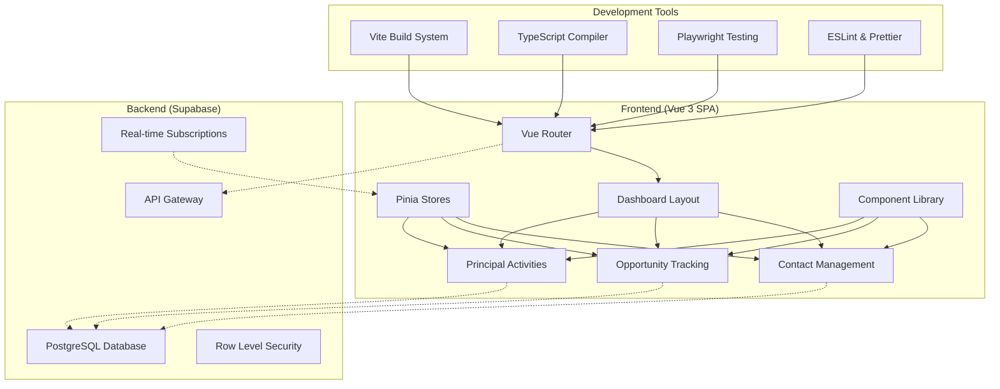
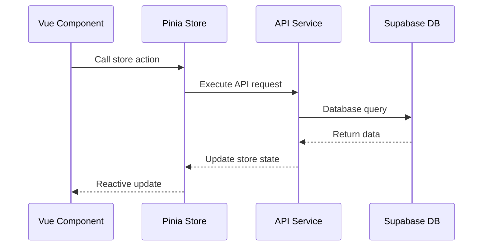
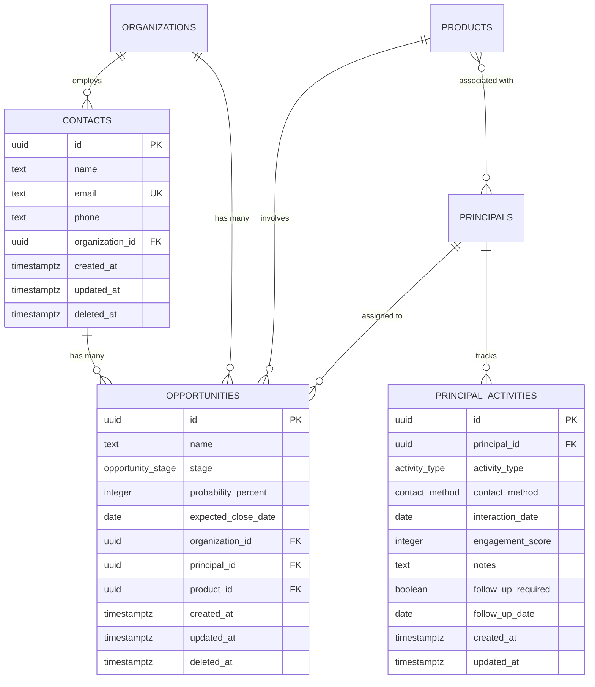

# Codebase Overview Guide

This guide provides a comprehensive overview of the Vue 3 + TypeScript + Supabase CRM system architecture, helping you understand how the codebase is organized and how different components work together.

## 🏗️ High-Level Architecture



## 📁 Directory Structure

```
src/
├── 📁 api/                    # API client configurations
├── 📁 assets/                 # Static assets (images, fonts)
├── 📁 components/             # Reusable Vue components
│   ├── 📁 contacts/           # Contact-specific components
│   ├── 📁 opportunities/      # Opportunity management components
│   ├── 📁 forms/              # Form components and validation
│   ├── 📁 layout/             # Layout and navigation components
│   └── 📁 ui/                 # Base UI components
├── 📁 composables/            # Vue composition functions
├── 📁 config/                 # Application configuration
├── 📁 design-system/          # Design system components
├── 📁 lib/                    # External library configurations
├── 📁 router/                 # Vue Router configuration
├── 📁 services/               # API services and business logic
├── 📁 stores/                 # Pinia state management
├── 📁 types/                  # TypeScript type definitions
├── 📁 utils/                  # Utility functions
├── 📁 validation/             # Form validation schemas
├── 📁 views/                  # Page-level Vue components
│   ├── 📁 contacts/           # Contact management pages
│   ├── 📁 opportunities/      # Opportunity management pages
│   ├── 📁 principals/         # Principal activity pages
│   └── 📁 dashboard/          # Dashboard pages
├── 📄 App.vue                 # Root Vue component
├── 📄 main.ts                 # Application entry point
└── 📄 vite-env.d.ts          # Vite environment types
```

## 🔧 Technology Stack Deep Dive

### Frontend Framework
**Vue 3 with Composition API**
- Modern reactive framework with TypeScript support
- `<script setup>` syntax for cleaner component code
- Composition API for better logic reuse and organization

```typescript
// Example Component Structure
<script setup lang="ts">
import { ref, computed, onMounted } from 'vue'
import { useContactsStore } from '@/stores/contacts'

// Props and emits with TypeScript
interface Props {
  contactId: string
}
const props = defineProps<Props>()

// Reactive state
const loading = ref(false)
const contactsStore = useContactsStore()

// Computed properties
const contact = computed(() => 
  contactsStore.getContactById(props.contactId)
)

// Lifecycle hooks
onMounted(async () => {
  loading.value = true
  await contactsStore.fetchContact(props.contactId)
  loading.value = false
})
</script>
```

### State Management
**Pinia Stores**
- Modern Vuex alternative with TypeScript support
- Modular stores for different business domains
- Real-time integration with Supabase subscriptions

```typescript
// Store Structure Example
export const useContactsStore = defineStore('contacts', () => {
  // State
  const contacts = ref<Contact[]>([])
  const loading = ref(false)
  
  // Getters
  const activeContacts = computed(() => 
    contacts.value.filter(c => !c.deleted_at)
  )
  
  // Actions
  const fetchContacts = async () => {
    loading.value = true
    const { data } = await contactsApi.list()
    contacts.value = data
    loading.value = false
  }
  
  return { contacts, loading, activeContacts, fetchContacts }
})
```

### Backend Integration
**Supabase Platform**
- PostgreSQL database with real-time capabilities
- Built-in authentication and authorization
- Row Level Security (RLS) for data protection

```typescript
// API Service Pattern
class ContactsApiService {
  async list(filters: ContactFilters = {}): Promise<ApiResponse<Contact[]>> {
    const query = supabase
      .from('contacts')
      .select('*')
      .order('created_at', { ascending: false })
    
    if (filters.search) {
      query.ilike('name', `%${filters.search}%`)
    }
    
    const { data, error } = await query
    
    if (error) {
      throw new ApiError(error.message, error.code)
    }
    
    return { data, success: true }
  }
}
```

## 🏛️ Core Business Domains

### 1. Contact Management (`src/stores/contacts.ts`)
**Purpose**: Manage customer and prospect information

**Key Features**:
- CRUD operations for contacts
- Organization relationships
- Activity tracking
- Search and filtering

**Database Tables**:
- `contacts` - Core contact information
- `organizations` - Company information
- `contact_organizations` - Many-to-many relationships

### 2. Opportunity Management (`src/stores/opportunities.ts`)
**Purpose**: Sales pipeline and deal tracking

**Key Features**:
- 7-stage sales pipeline
- Auto-naming system
- Batch opportunity creation
- KPI dashboard and reporting

**Pipeline Stages**:
```typescript
enum OpportunityStage {
  NEW_LEAD = 'NEW_LEAD',
  INITIAL_OUTREACH = 'INITIAL_OUTREACH',
  SAMPLE_VISIT_OFFERED = 'SAMPLE_VISIT_OFFERED',
  AWAITING_RESPONSE = 'AWAITING_RESPONSE',
  FEEDBACK_LOGGED = 'FEEDBACK_LOGGED',
  DEMO_SCHEDULED = 'DEMO_SCHEDULED',
  CLOSED_WON = 'CLOSED_WON'
}
```

### 3. Principal Activity Tracking (`src/stores/principalActivities.ts`)
**Purpose**: Advanced activity analytics and engagement scoring

**Key Features**:
- Activity timeline tracking
- Engagement score calculation
- Product performance analysis
- Distributor relationship mapping

**Activity Types**:
- Email communications
- Phone calls and meetings
- Sample visits and demos
- Follow-up actions

### 4. Product Management (`src/stores/products.ts`)
**Purpose**: Product catalog and principal relationships

**Key Features**:
- Product-principal associations
- Performance analytics
- Category management
- Active/inactive status tracking

## 🔄 Data Flow Architecture

### 1. Component → Store → API → Database


### 2. Real-time Updates
```typescript
// Real-time subscription example
export const useContactsStore = defineStore('contacts', () => {
  const contacts = ref<Contact[]>([])
  
  // Setup real-time subscription
  const setupRealtimeSubscription = () => {
    return supabase
      .channel('contacts')
      .on('postgres_changes', 
        { event: '*', schema: 'public', table: 'contacts' },
        (payload) => {
          handleRealtimeUpdate(payload)
        }
      )
      .subscribe()
  }
  
  const handleRealtimeUpdate = (payload: any) => {
    switch (payload.eventType) {
      case 'INSERT':
        contacts.value.unshift(payload.new)
        break
      case 'UPDATE':
        const index = contacts.value.findIndex(c => c.id === payload.new.id)
        if (index !== -1) contacts.value[index] = payload.new
        break
      case 'DELETE':
        contacts.value = contacts.value.filter(c => c.id !== payload.old.id)
        break
    }
  }
})
```

## 🎨 Component Architecture

### Component Hierarchy

```
App.vue
├── DashboardLayout.vue (Master Layout)
│   ├── NavigationSidebar.vue
│   ├── TopNavigationBar.vue
│   └── <router-view> (Page Content)
│       ├── DashboardView.vue
│       ├── ContactsListView.vue
│       │   ├── ContactTable.vue
│       │   ├── ContactFilters.vue
│       │   └── ContactSearchBox.vue
│       ├── OpportunitiesListView.vue
│       │   ├── OpportunityKPICards.vue
│       │   ├── OpportunityTable.vue
│       │   └── OpportunityFilters.vue
│       └── PrincipalActivitiesView.vue
│           ├── ActivityTimeline.vue
│           ├── EngagementScoreChart.vue
│           └── ProductPerformanceTable.vue
```

### Component Design Patterns

#### 1. Container/Presenter Pattern
```typescript
// Container Component (handles business logic)
<script setup lang="ts">
const contactsStore = useContactsStore()
const { contacts, loading, fetchContacts } = contactsStore

onMounted(() => fetchContacts())
</script>

<template>
  <ContactList 
    :contacts="contacts"
    :loading="loading"
    @edit="handleEdit"
    @delete="handleDelete"
  />
</template>
```

```typescript
// Presenter Component (handles UI rendering)
<script setup lang="ts">
interface Props {
  contacts: Contact[]
  loading: boolean
}
defineProps<Props>()

const emit = defineEmits<{
  edit: [contactId: string]
  delete: [contactId: string]
}>()
</script>
```

#### 2. Composition Pattern
```typescript
// Reusable composition function
export function useContactForm(initialData?: Partial<Contact>) {
  const formData = reactive<ContactFormData>({
    name: initialData?.name ?? '',
    email: initialData?.email ?? '',
    // ... other fields
  })
  
  const { errors, validateField, validateAll } = useValidation(contactSchema)
  
  const submitForm = async () => {
    if (await validateAll(formData)) {
      return await contactsApi.create(formData)
    }
    throw new Error('Validation failed')
  }
  
  return {
    formData,
    errors,
    validateField,
    submitForm
  }
}
```

## 🔐 Security Architecture

### Row Level Security (RLS)
```sql
-- Example RLS policy
CREATE POLICY "Users can view their own contacts" 
ON contacts FOR SELECT 
USING (auth.uid() = user_id);

CREATE POLICY "Users can insert their own contacts"
ON contacts FOR INSERT
WITH CHECK (auth.uid() = user_id);
```

### API Security
```typescript
// API client with authentication
class ApiClient {
  private supabase: SupabaseClient
  
  constructor() {
    this.supabase = createClient(
      import.meta.env.VITE_SUPABASE_URL,
      import.meta.env.VITE_SUPABASE_ANON_KEY
    )
  }
  
  async request<T>(endpoint: string, options: RequestOptions): Promise<T> {
    const session = await this.supabase.auth.getSession()
    
    if (!session.data.session) {
      throw new Error('Authentication required')
    }
    
    // Include auth token in request
    return this.executeRequest(endpoint, {
      ...options,
      headers: {
        ...options.headers,
        'Authorization': `Bearer ${session.data.session.access_token}`
      }
    })
  }
}
```

## 📊 Database Schema Overview

### Core Tables

```sql
-- Contacts table
CREATE TABLE contacts (
  id UUID PRIMARY KEY DEFAULT gen_random_uuid(),
  name TEXT NOT NULL,
  email TEXT UNIQUE,
  phone TEXT,
  organization_id UUID REFERENCES organizations(id),
  user_id UUID REFERENCES auth.users(id),
  created_at TIMESTAMPTZ DEFAULT NOW(),
  updated_at TIMESTAMPTZ DEFAULT NOW(),
  deleted_at TIMESTAMPTZ
);

-- Opportunities table
CREATE TABLE opportunities (
  id UUID PRIMARY KEY DEFAULT gen_random_uuid(),
  name TEXT NOT NULL,
  stage opportunity_stage NOT NULL DEFAULT 'NEW_LEAD',
  probability_percent INTEGER CHECK (probability_percent >= 0 AND probability_percent <= 100),
  expected_close_date DATE,
  organization_id UUID REFERENCES organizations(id),
  principal_id UUID REFERENCES principals(id),
  product_id UUID REFERENCES products(id),
  created_at TIMESTAMPTZ DEFAULT NOW(),
  updated_at TIMESTAMPTZ DEFAULT NOW(),
  deleted_at TIMESTAMPTZ
);

-- Principal Activities table
CREATE TABLE principal_activities (
  id UUID PRIMARY KEY DEFAULT gen_random_uuid(),
  principal_id UUID REFERENCES principals(id),
  activity_type activity_type NOT NULL,
  contact_method contact_method,
  interaction_date DATE NOT NULL,
  engagement_score INTEGER CHECK (engagement_score >= 0 AND engagement_score <= 100),
  notes TEXT,
  follow_up_required BOOLEAN DEFAULT FALSE,
  follow_up_date DATE,
  created_at TIMESTAMPTZ DEFAULT NOW(),
  updated_at TIMESTAMPTZ DEFAULT NOW()
);
```

### Relationships and Constraints



## 🧪 Testing Architecture

### Testing Pyramid

```mermaid
pyramid
    title Testing Strategy
    a[Unit Tests (Vitest)]
    b[Component Tests (Playwright)]
    c[Integration Tests (Playwright)]
    d[E2E Tests (Playwright)]
```

### Test Organization
```
tests/
├── 📁 unit/                  # Vitest unit tests
│   ├── opportunity-naming.spec.ts
│   ├── principal-activity-api.spec.ts
│   └── principal-activity-store.spec.ts
├── 📁 components/            # Component-specific tests
│   ├── opportunity-form-components.spec.ts
│   └── segment-selector.spec.ts
├── 📁 integration/           # Cross-component integration
│   ├── basic-integration-validation.spec.ts
│   └── interaction-integration.spec.ts
├── 📁 accessibility/         # WCAG compliance testing
│   ├── opportunity-accessibility.spec.ts
│   └── interaction-accessibility.spec.ts
└── 📁 performance/           # Performance and load testing
    ├── api-performance-benchmark.spec.ts
    ├── load-testing.spec.ts
    └── performance-test-runner.spec.ts
```

## 🔄 Build and Development Workflow

### Vite Configuration
```typescript
// vite.config.ts highlights
export default defineConfig({
  plugins: [
    vue(),
    // TypeScript checking
    checker({ typescript: true }),
  ],
  
  // Path aliases
  resolve: {
    alias: {
      '@': path.resolve(__dirname, './src'),
    },
  },
  
  // Development server
  server: {
    port: 3000,
    open: true,
  },
  
  // Build optimization
  build: {
    rollupOptions: {
      output: {
        manualChunks: {
          vendor: ['vue', 'vue-router', 'pinia'],
          ui: ['@headlessui/vue', '@heroicons/vue'],
        }
      }
    }
  }
})
```

### Development Commands Reference
```bash
# Development
npm run dev              # Start development server
npm run build           # Production build
npm run preview         # Preview production build

# Code Quality  
npm run lint            # ESLint checking
npm run type-check      # TypeScript compilation check

# Testing
npm run test:unit       # Vitest unit tests
npm run test:e2e        # Playwright E2E tests
npm run test:accessibility  # Accessibility tests
npm run test:performance    # Performance tests
```

## 📚 Key Files to Understand

### Critical Configuration Files
1. **`package.json`** - Dependencies and scripts
2. **`vite.config.ts`** - Build configuration
3. **`tsconfig.json`** - TypeScript configuration
4. **`playwright.config.ts`** - Test configuration
5. **`.env.example`** - Environment variables template

### Important Source Files
1. **`src/main.ts`** - Application bootstrap
2. **`src/App.vue`** - Root component
3. **`src/router/index.ts`** - Route definitions
4. **`src/lib/supabase.ts`** - Database client
5. **`src/stores/contacts.ts`** - Example store implementation

### Documentation Files
1. **`CLAUDE.md`** - Development guide and architecture overview
2. **`docs/architecture/README.md`** - Comprehensive architecture documentation
3. **`README.md`** - Project overview and quick start

## 🎯 Next Steps

Now that you understand the codebase architecture:

1. **[Learn the Development Workflow](./03-development-workflow.md)** - Understand how we develop features
2. **[Practice Feature Development](./04-feature-development.md)** - Build your first component
3. **[Explore Code Examples](./examples/)** - See practical implementation patterns

**Ready to dive deeper?** The next guide will walk you through our development workflow and coding standards.