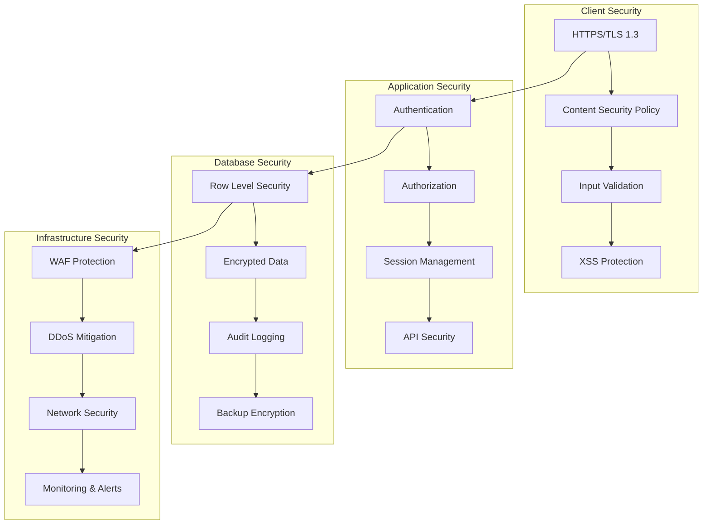

# Security and Compliance Guide

This guide covers security best practices, compliance requirements, and data protection standards for our CRM system development and operations.

## Table of Contents

- [Security Overview](#security-overview)
- [Data Protection and Privacy](#data-protection-and-privacy)
- [Authentication and Authorization](#authentication-and-authorization)
- [Database Security](#database-security)
- [Application Security](#application-security)
- [Development Security Practices](#development-security-practices)
- [Infrastructure Security](#infrastructure-security)
- [Incident Response](#incident-response)
- [Compliance Requirements](#compliance-requirements)
- [Security Checklist](#security-checklist)
- [Regular Security Tasks](#regular-security-tasks)

## Security Overview

### Security Architecture



### Security Principles

**Defense in Depth**: Multiple layers of security controls
**Principle of Least Privilege**: Minimal access rights for users and systems
**Zero Trust Architecture**: Never trust, always verify
**Security by Design**: Built-in security from the start
**Continuous Monitoring**: Real-time threat detection and response

## Data Protection and Privacy

### Personal Data Classification

**Highly Sensitive Data**:
- Authentication credentials
- Payment information
- Personal identification numbers
- Health information

**Sensitive Data**:
- Contact information (names, emails, phones)
- Business relationships and interactions
- Financial data and opportunities
- Internal notes and communications

**Internal Data**:
- System logs and analytics
- Configuration and settings
- Non-personal business data
- Technical documentation

### Data Handling Requirements

```typescript
// Data classification and handling
interface DataClassification {
  level: 'public' | 'internal' | 'sensitive' | 'highly-sensitive';
  encryption: 'none' | 'transit' | 'rest' | 'both';
  retention: string; // e.g., '7 years', '90 days'
  access: 'public' | 'authenticated' | 'authorized' | 'restricted';
}

const dataClassifications: Record<string, DataClassification> = {
  contactInfo: {
    level: 'sensitive',
    encryption: 'both',
    retention: '7 years',
    access: 'authorized'
  },
  financialData: {
    level: 'highly-sensitive',
    encryption: 'both',
    retention: '10 years',
    access: 'restricted'
  },
  systemLogs: {
    level: 'internal',
    encryption: 'transit',
    retention: '90 days',
    access: 'authenticated'
  }
};
```

### Privacy Controls

**Data Minimization**:
```typescript
// Only collect necessary data
interface ContactForm {
  name: string;          // Required for business function
  email: string;         // Required for communication
  phone?: string;        // Optional - only if needed
  notes?: string;        // Optional - business context only
  // Avoid collecting: SSN, DOB, personal details not needed
}
```

**Consent Management**:
```typescript
interface ConsentRecord {
  userId: string;
  consentType: 'data-processing' | 'marketing' | 'analytics';
  granted: boolean;
  timestamp: Date;
  version: string;
  ipAddress: string;
}

// Consent tracking in forms
const trackConsent = async (consent: ConsentRecord): Promise<void> => {
  await supabase.from('consent_records').insert([consent]);
};
```

**Data Subject Rights**:
- Right to access personal data
- Right to rectification (data correction)
- Right to erasure ("right to be forgotten")
- Right to data portability
- Right to restrict processing

## Authentication and Authorization

### Authentication Security

**Password Requirements**:
- Minimum 12 characters
- Mix of uppercase, lowercase, numbers, symbols
- No common passwords or dictionary words
- Regular password rotation (90 days)

**Multi-Factor Authentication (MFA)**:
```typescript
// MFA implementation with Supabase Auth
const enableMFA = async (): Promise<void> => {
  const { data, error } = await supabase.auth.mfa.enroll({
    factorType: 'totp',
    friendlyName: 'CRM Access'
  });
  
  if (error) throw error;
  
  // Show QR code for setup
  displayQRCode(data.totp.qr_code);
};

const verifyMFA = async (code: string): Promise<boolean> => {
  const { data, error } = await supabase.auth.mfa.verify({
    factorId: 'factor-id',
    challengeId: 'challenge-id',
    code
  });
  
  return !error && data.valid;
};
```

**Session Management**:
```typescript
// Secure session handling
const sessionConfig = {
  maxAge: 8 * 60 * 60, // 8 hours
  secure: true,        // HTTPS only
  httpOnly: true,      // Prevent XSS access
  sameSite: 'strict'   // CSRF protection
};

// Automatic session refresh
const refreshSession = async (): Promise<void> => {
  const { data, error } = await supabase.auth.refreshSession();
  if (error) {
    // Redirect to login
    window.location.href = '/login';
  }
};
```

### Authorization Patterns

**Role-Based Access Control (RBAC)**:
```sql
-- User roles and permissions
CREATE TYPE user_role AS ENUM ('admin', 'manager', 'agent', 'readonly');

CREATE TABLE user_permissions (
  id UUID PRIMARY KEY DEFAULT gen_random_uuid(),
  user_id UUID REFERENCES auth.users(id),
  role user_role NOT NULL,
  resource TEXT NOT NULL,
  actions TEXT[] NOT NULL,
  created_at TIMESTAMPTZ DEFAULT NOW()
);

-- Example permissions
INSERT INTO user_permissions (user_id, role, resource, actions) VALUES
  ('user-id', 'agent', 'contacts', ARRAY['read', 'create', 'update']),
  ('user-id', 'agent', 'opportunities', ARRAY['read', 'create', 'update']),
  ('user-id', 'manager', 'contacts', ARRAY['read', 'create', 'update', 'delete']),
  ('user-id', 'admin', '*', ARRAY['*']);
```

**Row Level Security (RLS)**:
```sql
-- Enable RLS on all tables
ALTER TABLE contacts ENABLE ROW LEVEL SECURITY;
ALTER TABLE opportunities ENABLE ROW LEVEL SECURITY;

-- Users can only access their organization's data
CREATE POLICY "Users can access own organization data" ON contacts
  FOR ALL USING (
    organization_id IN (
      SELECT organization_id FROM user_organizations 
      WHERE user_id = auth.uid()
    )
  );

-- Managers can access all data in their organization
CREATE POLICY "Managers can access organization data" ON contacts
  FOR ALL USING (
    EXISTS (
      SELECT 1 FROM user_permissions 
      WHERE user_id = auth.uid() 
      AND role IN ('manager', 'admin')
    )
  );
```

## Database Security

### Encryption

**Data at Rest**:
- Supabase provides automatic encryption for all data
- Additional column-level encryption for sensitive fields
- Encrypted backups and snapshots

**Data in Transit**:
- TLS 1.3 for all connections
- Certificate pinning for API connections
- Encrypted real-time subscriptions

**Application-Level Encryption**:
```typescript
// Encrypt sensitive fields before storage
import { encrypt, decrypt } from '@/utils/encryption';

const storeSensitiveData = async (data: SensitiveData): Promise<void> => {
  const encryptedData = {
    ...data,
    ssn: data.ssn ? encrypt(data.ssn) : null,
    bankAccount: data.bankAccount ? encrypt(data.bankAccount) : null
  };
  
  await supabase.from('sensitive_data').insert([encryptedData]);
};

const retrieveSensitiveData = async (id: string): Promise<SensitiveData> => {
  const { data } = await supabase
    .from('sensitive_data')
    .select('*')
    .eq('id', id)
    .single();
  
  return {
    ...data,
    ssn: data.ssn ? decrypt(data.ssn) : null,
    bankAccount: data.bankAccount ? decrypt(data.bankAccount) : null
  };
};
```

### Database Hardening

**Access Controls**:
```sql
-- Create limited service roles
CREATE ROLE app_readonly;
CREATE ROLE app_readwrite;

-- Grant minimal permissions
GRANT SELECT ON contacts, opportunities TO app_readonly;
GRANT SELECT, INSERT, UPDATE ON contacts, opportunities TO app_readwrite;

-- Revoke unnecessary permissions
REVOKE ALL ON pg_catalog FROM public;
REVOKE ALL ON information_schema FROM public;
```

**Audit Logging**:
```sql
-- Audit trail for sensitive operations
CREATE TABLE audit_log (
  id UUID PRIMARY KEY DEFAULT gen_random_uuid(),
  table_name TEXT NOT NULL,
  operation TEXT NOT NULL,
  old_values JSONB,
  new_values JSONB,
  user_id UUID REFERENCES auth.users(id),
  timestamp TIMESTAMPTZ DEFAULT NOW(),
  ip_address INET
);

-- Audit trigger function
CREATE OR REPLACE FUNCTION audit_trigger()
RETURNS TRIGGER AS $$
BEGIN
  INSERT INTO audit_log (table_name, operation, old_values, new_values, user_id, ip_address)
  VALUES (
    TG_TABLE_NAME,
    TG_OP,
    CASE WHEN TG_OP = 'DELETE' THEN to_jsonb(OLD) ELSE NULL END,
    CASE WHEN TG_OP IN ('INSERT', 'UPDATE') THEN to_jsonb(NEW) ELSE NULL END,
    auth.uid(),
    inet_client_addr()
  );
  
  RETURN COALESCE(NEW, OLD);
END;
$$ LANGUAGE plpgsql;

-- Apply audit triggers
CREATE TRIGGER contacts_audit_trigger
  AFTER INSERT OR UPDATE OR DELETE ON contacts
  FOR EACH ROW EXECUTE FUNCTION audit_trigger();
```

## Application Security

### Input Validation and Sanitization

**Frontend Validation**:
```typescript
// Comprehensive input validation
import * as yup from 'yup';
import DOMPurify from 'dompurify';

const sanitizeInput = (input: string): string => {
  return DOMPurify.sanitize(input.trim());
};

const contactSchema = yup.object({
  name: yup
    .string()
    .required('Name is required')
    .max(100, 'Name too long')
    .matches(/^[a-zA-Z\s\-'\.]+$/, 'Invalid characters in name')
    .transform(sanitizeInput),
    
  email: yup
    .string()
    .required('Email is required')
    .email('Invalid email format')
    .max(255, 'Email too long')
    .transform(sanitizeInput),
    
  phone: yup
    .string()
    .optional()
    .matches(/^[\+]?[0-9\s\-\(\)]{10,15}$/, 'Invalid phone format')
    .transform(sanitizeInput),
    
  notes: yup
    .string()
    .optional()
    .max(5000, 'Notes too long')
    .transform(sanitizeInput)
});
```

**SQL Injection Prevention**:
```typescript
// Always use parameterized queries
const searchContacts = async (query: string): Promise<Contact[]> => {
  // GOOD: Parameterized query
  const { data, error } = await supabase
    .from('contacts')
    .select('*')
    .ilike('name', `%${query}%`);
  
  // NEVER: String concatenation
  // const sql = `SELECT * FROM contacts WHERE name LIKE '%${query}%'`;
  
  if (error) throw error;
  return data || [];
};
```

### Cross-Site Scripting (XSS) Protection

**Content Security Policy**:
```html
<!-- CSP Header configuration -->
<meta http-equiv="Content-Security-Policy" 
      content="default-src 'self'; 
               script-src 'self' 'unsafe-inline' https://cdn.jsdelivr.net; 
               style-src 'self' 'unsafe-inline' https://fonts.googleapis.com; 
               font-src 'self' https://fonts.gstatic.com; 
               img-src 'self' data: https:; 
               connect-src 'self' https://*.supabase.co wss://*.supabase.co;">
```

**Output Encoding**:
```vue
<!-- Safe output rendering -->
<template>
  <div class="contact-card">
    <!-- Vue automatically escapes text content -->
    <h3>{{ contact.name }}</h3>
    <p>{{ contact.email }}</p>
    
    <!-- For HTML content, use v-dompurify-html -->
    <div v-dompurify-html="contact.notes"></div>
    
    <!-- NEVER use v-html with user content -->
    <!-- <div v-html="contact.notes"></div> -->
  </div>
</template>
```

### Cross-Site Request Forgery (CSRF) Protection

**SameSite Cookies**:
```typescript
// Configure secure cookies
const cookieOptions = {
  httpOnly: true,
  secure: true,
  sameSite: 'strict' as const,
  maxAge: 8 * 60 * 60 * 1000 // 8 hours
};
```

**CSRF Tokens** (if using custom API):
```typescript
// Generate and validate CSRF tokens
const generateCSRFToken = (): string => {
  return crypto.randomUUID();
};

const validateCSRFToken = (token: string, sessionToken: string): boolean => {
  return token === sessionToken && token.length === 36;
};
```

## Development Security Practices

### Secure Coding Standards

**Environment Variables**:
```bash
# .env.example - Safe to commit
VITE_SUPABASE_URL=your-supabase-url
VITE_SUPABASE_ANON_KEY=your-anon-key
VITE_API_BASE_URL=http://localhost:3000

# .env.local - NEVER commit
VITE_SUPABASE_URL=https://xyz.supabase.co
VITE_SUPABASE_ANON_KEY=eyJ0eXAiOiJKV1QiLCJhbGciOiJIUzI1NiJ9...
SUPABASE_SERVICE_ROLE_KEY=eyJ0eXAiOiJKV1QiLCJhbGciOiJIUzI1NiJ9...
```

**Secrets Management**:
```typescript
// Environment variable validation
const validateEnvVars = (): void => {
  const required = [
    'VITE_SUPABASE_URL',
    'VITE_SUPABASE_ANON_KEY'
  ];
  
  const missing = required.filter(key => !import.meta.env[key]);
  
  if (missing.length > 0) {
    throw new Error(`Missing required environment variables: ${missing.join(', ')}`);
  }
  
  // Validate URL format
  try {
    new URL(import.meta.env.VITE_SUPABASE_URL);
  } catch {
    throw new Error('Invalid VITE_SUPABASE_URL format');
  }
};
```

**Error Handling**:
```typescript
// Secure error handling - don't leak sensitive information
const handleError = (error: Error, context: string): void => {
  // Log full error details server-side
  console.error(`[${context}]`, {
    message: error.message,
    stack: error.stack,
    timestamp: new Date().toISOString()
  });
  
  // Return sanitized error to client
  const publicError = sanitizeError(error);
  showErrorToUser(publicError.message);
};

const sanitizeError = (error: Error): { message: string } => {
  // Map internal errors to user-friendly messages
  const errorMap: Record<string, string> = {
    'PGRST301': 'You do not have permission to perform this action',
    'PGRST116': 'The requested item was not found',
    'PGRST204': 'Connection timeout - please try again',
    'duplicate key': 'This item already exists'
  };
  
  const message = errorMap[error.message] || 'An unexpected error occurred';
  return { message };
};
```

### Code Review Security Checklist

**Authentication & Authorization**:
- [ ] Proper authentication checks on all protected routes
- [ ] Authorization validates user permissions for actions
- [ ] Session management follows security best practices
- [ ] No hardcoded credentials or tokens

**Input Validation**:
- [ ] All user inputs validated and sanitized
- [ ] SQL injection prevention (parameterized queries)
- [ ] XSS protection (proper output encoding)
- [ ] File upload restrictions and validation

**Error Handling**:
- [ ] Errors don't leak sensitive information
- [ ] Proper logging without exposing secrets
- [ ] Graceful handling of edge cases
- [ ] User-friendly error messages

**Data Protection**:
- [ ] Sensitive data encrypted in transit and at rest
- [ ] Proper data classification and handling
- [ ] No logging of sensitive information
- [ ] Secure data disposal practices

## Infrastructure Security

### Network Security

**HTTPS Enforcement**:
```typescript
// Force HTTPS in production
if (import.meta.env.PROD && window.location.protocol !== 'https:') {
  window.location.href = window.location.href.replace('http:', 'https:');
}
```

**API Security**:
```typescript
// Rate limiting and request validation
const rateLimiter = new Map<string, { count: number; resetTime: number }>();

const checkRateLimit = (clientId: string, limit: number = 100): boolean => {
  const now = Date.now();
  const client = rateLimiter.get(clientId);
  
  if (!client || now > client.resetTime) {
    rateLimiter.set(clientId, { count: 1, resetTime: now + 60000 }); // 1 minute window
    return true;
  }
  
  if (client.count >= limit) {
    return false;
  }
  
  client.count++;
  return true;
};
```

### Monitoring and Alerting

**Security Event Monitoring**:
```typescript
// Security event logging
interface SecurityEvent {
  type: 'auth_failure' | 'permission_denied' | 'suspicious_activity';
  userId?: string;
  ipAddress: string;
  userAgent: string;
  details: Record<string, any>;
  timestamp: Date;
}

const logSecurityEvent = async (event: SecurityEvent): Promise<void> => {
  // Log to secure audit system
  await supabase.from('security_events').insert([event]);
  
  // Alert on critical events
  if (event.type === 'suspicious_activity') {
    await sendSecurityAlert(event);
  }
};

// Monitor failed login attempts
const monitorAuthFailures = (): void => {
  supabase.auth.onAuthStateChange((event, session) => {
    if (event === 'SIGNED_OUT' && !session) {
      logSecurityEvent({
        type: 'auth_failure',
        ipAddress: getClientIP(),
        userAgent: navigator.userAgent,
        details: { reason: 'session_expired' },
        timestamp: new Date()
      });
    }
  });
};
```

## Incident Response

### Security Incident Types

**High Severity**:
- Data breach or unauthorized access
- System compromise or malware
- DDoS attacks affecting availability
- Critical vulnerability exploitation

**Medium Severity**:
- Failed authentication attempts (brute force)
- Unauthorized access attempts
- Data integrity issues
- Performance degradation from attacks

**Low Severity**:
- Policy violations
- Suspicious but unconfirmed activity
- Configuration issues
- Non-critical vulnerabilities

### Incident Response Procedures

**Immediate Response (0-1 hour)**:
1. **Identify and Contain**:
   - Isolate affected systems
   - Preserve evidence
   - Document initial findings
   - Notify security team

2. **Assess Impact**:
   - Determine data affected
   - Identify affected users
   - Assess business impact
   - Estimate recovery time

**Short-term Response (1-24 hours)**:
1. **Investigate**:
   - Analyze logs and evidence
   - Determine root cause
   - Identify attack vectors
   - Document timeline

2. **Communicate**:
   - Notify stakeholders
   - Prepare customer communications
   - Coordinate with legal/compliance
   - Update incident tracking

**Recovery and Follow-up (24+ hours)**:
1. **Remediate**:
   - Apply security patches
   - Update configurations
   - Strengthen defenses
   - Monitor for recurrence

2. **Learn and Improve**:
   - Conduct post-incident review
   - Update security procedures
   - Provide team training
   - Implement preventive measures

### Emergency Contacts

**Internal Team**:
- Security Lead: [Contact Information]
- Development Manager: [Contact Information]
- Infrastructure Team: [Contact Information]
- Legal/Compliance: [Contact Information]

**External Partners**:
- Supabase Support: [Emergency Contact]
- Vercel Support: [Emergency Contact]
- Security Consultant: [Contact Information]
- Legal Counsel: [Contact Information]

## Compliance Requirements

### Data Protection Regulations

**GDPR (General Data Protection Regulation)**:
- Lawful basis for processing personal data
- Data subject rights implementation
- Privacy by design and default
- Data breach notification (72 hours)
- Data Protection Impact Assessments (DPIA)

**CCPA (California Consumer Privacy Act)**:
- Consumer rights to know, delete, opt-out
- Non-discrimination provisions
- Third-party data sharing disclosures
- Verification procedures for requests

### Industry Standards

**SOC 2 Type II**:
- Security controls framework
- Availability and processing integrity
- Confidentiality of information
- Regular audits and assessments

**ISO 27001**:
- Information security management system
- Risk assessment and treatment
- Continuous improvement process
- Management commitment and responsibility

### Compliance Implementation

**Privacy Policy Requirements**:
```typescript
// Privacy consent tracking
interface PrivacyConsent {
  userId: string;
  version: string;
  consentTypes: string[];
  grantedAt: Date;
  ipAddress: string;
  userAgent: string;
}

const recordPrivacyConsent = async (consent: PrivacyConsent): Promise<void> => {
  await supabase.from('privacy_consents').insert([consent]);
};

// Data retention policies
const applyDataRetention = async (): Promise<void> => {
  // Delete data older than retention period
  const retentionPeriod = new Date();
  retentionPeriod.setFullYear(retentionPeriod.getFullYear() - 7);
  
  await supabase
    .from('contacts')
    .delete()
    .lt('created_at', retentionPeriod.toISOString())
    .eq('retention_eligible', true);
};
```

## Security Checklist

### Development Security
- [ ] **Code Security**
  - [ ] All user inputs validated and sanitized
  - [ ] No hardcoded secrets or credentials
  - [ ] Proper error handling without information leakage
  - [ ] SQL injection prevention implemented
  - [ ] XSS protection mechanisms in place

- [ ] **Authentication & Authorization**
  - [ ] Strong password requirements enforced
  - [ ] Multi-factor authentication enabled
  - [ ] Session management follows best practices
  - [ ] Role-based access control implemented
  - [ ] Regular access reviews conducted

- [ ] **Data Protection**
  - [ ] Encryption in transit and at rest
  - [ ] Proper data classification applied
  - [ ] Privacy controls implemented
  - [ ] Data retention policies enforced
  - [ ] Secure data disposal procedures

### Infrastructure Security
- [ ] **Network Security**
  - [ ] HTTPS/TLS encryption enforced
  - [ ] Web Application Firewall configured
  - [ ] DDoS protection enabled
  - [ ] Network segmentation implemented
  - [ ] Regular security scans performed

- [ ] **Monitoring & Logging**
  - [ ] Security event monitoring active
  - [ ] Audit logging implemented
  - [ ] Intrusion detection systems deployed
  - [ ] Regular log analysis performed
  - [ ] Incident response procedures tested

- [ ] **Compliance**
  - [ ] Privacy policy updated and compliant
  - [ ] Data subject rights procedures implemented
  - [ ] Regular compliance assessments conducted
  - [ ] Staff training on security and privacy
  - [ ] Vendor security assessments completed

## Regular Security Tasks

### Daily Tasks
- Monitor security alerts and logs
- Review failed authentication attempts
- Check system health and performance
- Verify backup completion and integrity

### Weekly Tasks
- Review user access and permissions
- Analyze security metrics and trends
- Update security documentation
- Test incident response procedures

### Monthly Tasks
- Conduct security assessments
- Review and update security policies
- Perform vulnerability scans
- Update security training materials

### Quarterly Tasks
- Complete compliance audits
- Review and test disaster recovery plans
- Conduct penetration testing
- Update risk assessments

### Annual Tasks
- Comprehensive security review
- Update incident response procedures
- Review and update compliance documentation
- Conduct third-party security assessments

This comprehensive security and compliance guide ensures our CRM system maintains the highest standards of data protection and security throughout its development and operation lifecycle.