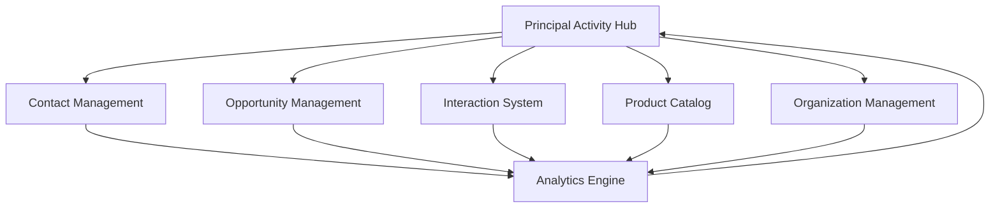

# Principal Activity Integration Patterns

## Overview

This document outlines the integration patterns, workflows, and best practices for incorporating the Principal Activity Tracking system into existing CRM workflows. It provides detailed guidance for developers, system integrators, and business analysts on how to leverage the principal system effectively.

## Core Integration Patterns

### 1. Data Flow Integration Pattern

The Principal Activity system follows a hub-and-spoke integration model, where principal data acts as the central hub connecting various CRM modules:



#### Implementation Details

**Centralized Data Collection:**
```typescript
// Principal data aggregation from multiple sources
interface PrincipalDataSource {
  contacts: ContactMetrics;
  opportunities: OpportunityMetrics;
  interactions: InteractionMetrics;
  products: ProductAssociations;
}

class PrincipalDataAggregator {
  async aggregateMetrics(principalId: string): Promise<PrincipalMetrics> {
    const [contacts, opportunities, interactions, products] = await Promise.all([
      this.getContactMetrics(principalId),
      this.getOpportunityMetrics(principalId),
      this.getInteractionMetrics(principalId),
      this.getProductMetrics(principalId)
    ]);
    
    return this.calculatePrincipalMetrics({
      contacts, opportunities, interactions, products
    });
  }
}
```

**Real-time Data Synchronization:**
```sql
-- Automatic triggers ensure data consistency
CREATE TRIGGER update_principal_metrics
  AFTER INSERT OR UPDATE OR DELETE ON interactions
  FOR EACH STATEMENT
  EXECUTE FUNCTION refresh_principal_activity_metrics();
```

### 2. Navigation Integration Pattern

The navigation pattern ensures seamless flow between different CRM modules while maintaining context:

#### Contextual Navigation

**From Contact to Principal:**
```typescript
// Contact detail view integration
const navigateToPrincipal = (organizationId: string) => {
  // Check if organization is a principal
  if (organization.is_principal) {
    router.push(`/principals/${organizationId}`);
  } else {
    // Show related principal if available
    router.push(`/principals?distributor=${organizationId}`);
  }
};
```

**From Opportunity to Principal:**
```typescript
// Opportunity integration pattern
const showPrincipalContext = (opportunity: Opportunity) => {
  return {
    principalId: opportunity.principal_id,
    contextType: 'opportunity',
    contextData: {
      opportunityId: opportunity.id,
      stage: opportunity.stage,
      value: opportunity.value
    }
  };
};
```

#### Breadcrumb Context Preservation

```typescript
// Navigation breadcrumb system
interface NavigationContext {
  source: 'contact' | 'opportunity' | 'interaction' | 'direct';
  sourceId?: string;
  sourceName?: string;
  returnPath?: string;
}

const buildBreadcrumb = (context: NavigationContext, principal: Principal) => {
  const breadcrumbs = [
    { name: 'Dashboard', path: '/' },
    { name: 'Principals', path: '/principals' }
  ];
  
  if (context.source && context.sourceName) {
    breadcrumbs.splice(-1, 0, {
      name: context.sourceName,
      path: context.returnPath || '#'
    });
  }
  
  breadcrumbs.push({
    name: principal.name,
    path: `/principals/${principal.id}`
  });
  
  return breadcrumbs;
};
```

### 3. Action Integration Pattern

Actions can be triggered from various contexts while maintaining principal-specific context:

#### Cross-Module Action Triggers

**Create Opportunity from Principal:**
```typescript
// Principal dashboard action
const createOpportunityFromPrincipal = (principal: Principal) => {
  router.push({
    name: 'OpportunityCreate',
    query: {
      principal_id: principal.id,
      organization_id: principal.id,
      context: 'principal_dashboard'
    }
  });
};
```

**Log Interaction from Principal:**
```typescript
// Principal timeline action
const logInteractionFromPrincipal = (principal: Principal, context?: string) => {
  router.push({
    name: 'InteractionCreate',
    query: {
      principal_id: principal.id,
      context: context || 'principal_detail',
      return_to: `/principals/${principal.id}`
    }
  });
};
```

#### Bulk Actions Pattern

```typescript
// Multiple principal operations
class BulkPrincipalActions {
  async updateEngagementStatus(
    principalIds: string[], 
    status: EngagementStatus
  ): Promise<ActionResult[]> {
    const results = await Promise.allSettled(
      principalIds.map(id => this.updatePrincipalStatus(id, status))
    );
    
    return results.map((result, index) => ({
      principalId: principalIds[index],
      success: result.status === 'fulfilled',
      error: result.status === 'rejected' ? result.reason : null
    }));
  }
  
  async exportPrincipalData(
    principalIds: string[],
    format: 'csv' | 'xlsx' | 'json'
  ): Promise<ExportResult> {
    const data = await this.fetchPrincipalData(principalIds);
    return this.formatExport(data, format);
  }
}
```

### 4. Event-Driven Integration Pattern

The system uses event-driven architecture for loose coupling between modules:

#### Event Publishers

```typescript
// Principal event system
interface PrincipalEvent {
  type: 'principal.updated' | 'principal.engagement.changed' | 'principal.activity.logged';
  principalId: string;
  data: any;
  timestamp: Date;
  source: string;
}

class PrincipalEventPublisher {
  private eventBus = new EventTarget();
  
  publishPrincipalUpdate(principalId: string, changes: Partial<Principal>) {
    const event = new CustomEvent('principal.updated', {
      detail: {
        principalId,
        changes,
        timestamp: new Date(),
        source: 'principal_system'
      }
    });
    
    this.eventBus.dispatchEvent(event);
  }
  
  publishEngagementChange(principalId: string, oldScore: number, newScore: number) {
    const event = new CustomEvent('principal.engagement.changed', {
      detail: {
        principalId,
        oldScore,
        newScore,
        timestamp: new Date(),
        source: 'engagement_calculator'
      }
    });
    
    this.eventBus.dispatchEvent(event);
  }
}
```

#### Event Subscribers

```typescript
// Subscribing modules
class OpportunityModule {
  constructor(private eventPublisher: PrincipalEventPublisher) {
    this.setupEventListeners();
  }
  
  private setupEventListeners() {
    this.eventPublisher.addEventListener('principal.updated', (event) => {
      const { principalId, changes } = event.detail;
      this.updateRelatedOpportunities(principalId, changes);
    });
  }
  
  private async updateRelatedOpportunities(principalId: string, changes: any) {
    if (changes.lead_score || changes.status) {
      await this.recalculateOpportunityProbabilities(principalId);
    }
  }
}
```

## Workflow Integration Patterns

### 1. Sales Workflow Integration

#### Lead to Principal Conversion

```typescript
// Lead qualification workflow
class LeadToPrincipalWorkflow {
  async qualifyLead(lead: Lead): Promise<QualificationResult> {
    const qualification = await this.assessLeadQuality(lead);
    
    if (qualification.score >= 70) {
      const principal = await this.convertToPrincipal(lead);
      await this.initializePrincipalMetrics(principal);
      return { success: true, principal };
    }
    
    return { success: false, reason: qualification.reasons };
  }
  
  private async convertToPrincipal(lead: Lead): Promise<Principal> {
    const organization = await this.createOrganization({
      name: lead.company_name,
      is_principal: true,
      lead_score: lead.qualification_score,
      industry: lead.industry,
      size: lead.company_size
    });
    
    await this.createInitialContact(organization.id, lead);
    return organization;
  }
}
```

#### Opportunity Pipeline Integration

```typescript
// Principal-aware opportunity management
class PrincipalOpportunityPipeline {
  async createOpportunityWithPrincipalContext(
    principalId: string,
    opportunityData: OpportunityData
  ): Promise<Opportunity> {
    const principal = await this.getPrincipalContext(principalId);
    
    const enhancedOpportunity = {
      ...opportunityData,
      principal_id: principalId,
      probability_percent: this.calculateInitialProbability(principal),
      expected_close_date: this.calculateExpectedClose(principal, opportunityData),
      deal_owner: principal.primary_contact_email
    };
    
    const opportunity = await this.createOpportunity(enhancedOpportunity);
    await this.updatePrincipalEngagement(principalId, 'opportunity_created');
    
    return opportunity;
  }
  
  private calculateInitialProbability(principal: Principal): number {
    const baseScore = principal.lead_score || 50;
    const engagementBonus = principal.engagement_score * 0.3;
    const activityBonus = principal.activity_status === 'ACTIVE' ? 10 : 0;
    
    return Math.min(95, Math.max(5, baseScore + engagementBonus + activityBonus));
  }
}
```

### 2. Customer Success Integration

#### Engagement Monitoring Workflow

```typescript
// Proactive customer success management
class PrincipalEngagementMonitor {
  async monitorEngagementLevels(): Promise<EngagementAlert[]> {
    const principals = await this.getActivePrincipals();
    const alerts: EngagementAlert[] = [];
    
    for (const principal of principals) {
      const riskLevel = await this.assessEngagementRisk(principal);
      
      if (riskLevel.level === 'high') {
        alerts.push({
          principalId: principal.id,
          type: 'engagement_decline',
          severity: 'high',
          recommendations: riskLevel.recommendations,
          dueDate: new Date(Date.now() + 7 * 24 * 60 * 60 * 1000) // 7 days
        });
      }
    }
    
    return alerts;
  }
  
  private async assessEngagementRisk(principal: Principal): Promise<RiskAssessment> {
    const recentActivity = await this.getRecentActivity(principal.id, 30);
    const interactionTrend = await this.getInteractionTrend(principal.id, 90);
    
    const riskFactors = [
      this.evaluateActivityRecency(recentActivity),
      this.evaluateInteractionTrend(interactionTrend),
      this.evaluateResponseRate(principal),
      this.evaluateOpportunityStagnation(principal)
    ];
    
    return this.calculateOverallRisk(riskFactors);
  }
}
```

#### Success Milestone Tracking

```typescript
// Principal success milestone system
interface SuccessMilestone {
  id: string;
  name: string;
  description: string;
  criteria: MilestoneCriteria;
  achieved: boolean;
  achievedDate?: Date;
}

class PrincipalSuccessTracker {
  private milestones: SuccessMilestone[] = [
    {
      id: 'first_interaction',
      name: 'First Interaction',
      description: 'Initial contact established',
      criteria: { interaction_count: { min: 1 } },
      achieved: false
    },
    {
      id: 'product_evaluation',
      name: 'Product Evaluation',
      description: 'Principal is evaluating products',
      criteria: { 
        product_associations: { min: 1 },
        interaction_types: ['PRODUCT_DEMO', 'TECHNICAL_DISCUSSION']
      },
      achieved: false
    },
    {
      id: 'first_opportunity',
      name: 'Sales Opportunity',
      description: 'First opportunity created',
      criteria: { opportunity_count: { min: 1 } },
      achieved: false
    }
  ];
  
  async trackMilestones(principalId: string): Promise<SuccessMilestone[]> {
    const principal = await this.getPrincipalMetrics(principalId);
    
    return this.milestones.map(milestone => ({
      ...milestone,
      achieved: this.evaluateMilestoneCriteria(milestone.criteria, principal),
      achievedDate: milestone.achieved ? this.getMilestoneAchievedDate(milestone.id, principalId) : undefined
    }));
  }
}
```

### 3. Marketing Integration

#### Campaign Effectiveness Tracking

```typescript
// Marketing campaign integration with principal tracking
class PrincipalMarketingIntegration {
  async trackCampaignEngagement(
    campaignId: string,
    principalId: string,
    engagementType: EngagementType
  ): Promise<void> {
    const engagement = {
      campaign_id: campaignId,
      principal_id: principalId,
      engagement_type: engagementType,
      timestamp: new Date(),
      attribution_score: this.calculateAttributionScore(engagementType)
    };
    
    await this.recordCampaignEngagement(engagement);
    await this.updatePrincipalEngagementScore(principalId, engagement.attribution_score);
  }
  
  async analyzeCampaignROI(campaignId: string): Promise<CampaignROIAnalysis> {
    const engagements = await this.getCampaignEngagements(campaignId);
    const principalIds = engagements.map(e => e.principal_id);
    
    const opportunities = await this.getOpportunitiesFromPrincipals(principalIds);
    const conversions = opportunities.filter(o => 
      o.created_at > this.getCampaignStartDate(campaignId)
    );
    
    return {
      total_engagement: engagements.length,
      unique_principals: new Set(principalIds).size,
      opportunities_generated: conversions.length,
      pipeline_value: conversions.reduce((sum, opp) => sum + (opp.value || 0), 0),
      conversion_rate: conversions.length / engagements.length
    };
  }
}
```

#### Lead Scoring Integration

```typescript
// Marketing qualified lead to principal scoring
class PrincipalLeadScoring {
  async scorePrincipalFromMQL(mql: MarketingQualifiedLead): Promise<number> {
    const baseScore = mql.qualification_score || 50;
    
    const scoringFactors = [
      this.scoreDemographics(mql.demographics),
      this.scoreBehavior(mql.behavior_data),
      this.scoreEngagement(mql.engagement_history),
      this.scoreFitness(mql.company_profile)
    ];
    
    const weightedScore = scoringFactors.reduce((sum, factor) => 
      sum + (factor.score * factor.weight), 0
    );
    
    return Math.min(100, Math.max(0, baseScore + weightedScore));
  }
  
  private scoreDemographics(demographics: Demographics): ScoringFactor {
    let score = 0;
    
    // Industry match
    if (this.isTargetIndustry(demographics.industry)) score += 15;
    
    // Company size
    if (demographics.company_size === 'enterprise') score += 10;
    else if (demographics.company_size === 'mid-market') score += 5;
    
    // Geographic factors
    if (this.isTargetGeography(demographics.location)) score += 5;
    
    return { score, weight: 0.3, category: 'demographics' };
  }
}
```

## API Integration Patterns

### 1. RESTful API Integration

#### Standardized API Responses

```typescript
// Consistent API response format across all principal endpoints
interface ApiResponse<T> {
  success: boolean;
  data?: T;
  error?: string;
  metadata?: {
    total_count?: number;
    page?: number;
    page_size?: number;
    has_more?: boolean;
  };
}

// Principal API client
class PrincipalApiClient {
  private baseUrl: string;
  private headers: Record<string, string>;
  
  async getPrincipals(filters?: PrincipalFilters): Promise<ApiResponse<Principal[]>> {
    const url = this.buildUrl('/principals', filters);
    const response = await this.makeRequest('GET', url);
    
    return {
      success: response.ok,
      data: response.ok ? await response.json() : undefined,
      error: response.ok ? undefined : await response.text(),
      metadata: this.extractMetadata(response.headers)
    };
  }
  
  async getPrincipalMetrics(principalId: string): Promise<ApiResponse<PrincipalMetrics>> {
    const url = `/principals/${principalId}/metrics`;
    return this.makeRequest('GET', url);
  }
  
  async updatePrincipalEngagement(
    principalId: string, 
    engagement: EngagementUpdate
  ): Promise<ApiResponse<Principal>> {
    const url = `/principals/${principalId}/engagement`;
    return this.makeRequest('PATCH', url, engagement);
  }
}
```

#### Batch Operations Support

```typescript
// Efficient batch operations for bulk data processing
class PrincipalBatchOperations {
  async batchUpdatePrincipals(
    updates: PrincipalUpdate[]
  ): Promise<BatchOperationResult<Principal>> {
    const batchSize = 50; // Process in chunks to avoid timeout
    const results: BatchOperationResult<Principal> = {
      successful: [],
      failed: [],
      total: updates.length
    };
    
    for (let i = 0; i < updates.length; i += batchSize) {
      const batch = updates.slice(i, i + batchSize);
      const batchResults = await this.processBatch(batch);
      
      results.successful.push(...batchResults.successful);
      results.failed.push(...batchResults.failed);
    }
    
    return results;
  }
  
  async batchCalculateEngagement(
    principalIds: string[]
  ): Promise<BatchOperationResult<EngagementScore>> {
    // Use database function for efficient batch calculation
    const { data, error } = await supabase
      .rpc('calculate_batch_engagement_scores', { 
        principal_ids: principalIds 
      });
    
    if (error) {
      return {
        successful: [],
        failed: principalIds.map(id => ({ id, error: error.message })),
        total: principalIds.length
      };
    }
    
    return {
      successful: data,
      failed: [],
      total: principalIds.length
    };
  }
}
```

### 2. Real-time Integration with WebSockets

#### Live Data Updates

```typescript
// Real-time principal data synchronization
class PrincipalRealtimeClient {
  private supabase = createClient(supabaseUrl, supabaseKey);
  private subscriptions = new Map<string, RealtimeChannel>();
  
  subscribeToPrincipalUpdates(
    principalId: string,
    callback: (update: PrincipalUpdate) => void
  ): () => void {
    const channel = this.supabase
      .channel(`principal_${principalId}`)
      .on(
        'postgres_changes',
        {
          event: '*',
          schema: 'public',
          table: 'principal_activity_summary',
          filter: `principal_id=eq.${principalId}`
        },
        (payload) => {
          callback({
            type: payload.eventType,
            data: payload.new,
            old: payload.old,
            timestamp: new Date()
          });
        }
      )
      .subscribe();
    
    this.subscriptions.set(principalId, channel);
    
    return () => {
      channel.unsubscribe();
      this.subscriptions.delete(principalId);
    };
  }
  
  subscribeToGlobalPrincipalEvents(
    callback: (event: GlobalPrincipalEvent) => void
  ): () => void {
    const channel = this.supabase
      .channel('global_principal_events')
      .on('broadcast', { event: 'principal_event' }, callback)
      .subscribe();
    
    return () => channel.unsubscribe();
  }
}
```

#### Activity Stream Integration

```typescript
// Real-time activity stream for principal timelines
class PrincipalActivityStream {
  private eventSource: EventTarget;
  
  constructor() {
    this.eventSource = new EventTarget();
    this.setupRealtimeListeners();
  }
  
  private setupRealtimeListeners() {
    // Listen for interaction events
    this.supabase
      .channel('interactions')
      .on('postgres_changes', { 
        event: 'INSERT', 
        schema: 'public', 
        table: 'interactions' 
      }, (payload) => {
        this.broadcastActivityEvent({
          type: 'interaction_created',
          data: payload.new,
          timestamp: new Date()
        });
      })
      .subscribe();
    
    // Listen for opportunity events
    this.supabase
      .channel('opportunities')
      .on('postgres_changes', { 
        event: '*', 
        schema: 'public', 
        table: 'opportunities' 
      }, (payload) => {
        this.broadcastActivityEvent({
          type: `opportunity_${payload.eventType.toLowerCase()}`,
          data: payload.new,
          old: payload.old,
          timestamp: new Date()
        });
      })
      .subscribe();
  }
  
  onActivity(
    callback: (event: ActivityEvent) => void
  ): () => void {
    this.eventSource.addEventListener('activity', callback as EventListener);
    return () => this.eventSource.removeEventListener('activity', callback as EventListener);
  }
}
```

### 3. Webhook Integration

#### Outbound Webhooks

```typescript
// Webhook system for external integrations
class PrincipalWebhookManager {
  private webhooks = new Map<string, WebhookConfig>();
  
  async registerWebhook(config: WebhookConfig): Promise<string> {
    const webhookId = this.generateWebhookId();
    this.webhooks.set(webhookId, config);
    
    await this.persistWebhookConfig(webhookId, config);
    return webhookId;
  }
  
  async triggerWebhook(event: PrincipalEvent): Promise<void> {
    const relevantWebhooks = Array.from(this.webhooks.values())
      .filter(webhook => webhook.events.includes(event.type));
    
    const webhookPromises = relevantWebhooks.map(webhook => 
      this.sendWebhook(webhook, event)
    );
    
    await Promise.allSettled(webhookPromises);
  }
  
  private async sendWebhook(webhook: WebhookConfig, event: PrincipalEvent): Promise<void> {
    const payload = {
      event_type: event.type,
      principal_id: event.principalId,
      data: event.data,
      timestamp: event.timestamp.toISOString(),
      webhook_id: webhook.id
    };
    
    const signature = this.generateSignature(payload, webhook.secret);
    
    try {
      const response = await fetch(webhook.url, {
        method: 'POST',
        headers: {
          'Content-Type': 'application/json',
          'X-Webhook-Signature': signature,
          'X-Webhook-Event': event.type
        },
        body: JSON.stringify(payload)
      });
      
      if (!response.ok) {
        throw new Error(`Webhook failed: ${response.status} ${response.statusText}`);
      }
      
      await this.logWebhookSuccess(webhook.id, event);
    } catch (error) {
      await this.logWebhookFailure(webhook.id, event, error);
      await this.scheduleRetry(webhook, event);
    }
  }
}
```

#### Inbound Webhook Processing

```typescript
// Process incoming webhooks from external systems
class InboundWebhookProcessor {
  async processExternalUpdate(
    source: string,
    payload: ExternalWebhookPayload
  ): Promise<ProcessingResult> {
    const validator = this.getValidator(source);
    
    if (!validator.isValid(payload)) {
      return { success: false, error: 'Invalid payload format' };
    }
    
    try {
      const principalUpdate = await this.mapExternalData(source, payload);
      await this.updatePrincipal(principalUpdate.principalId, principalUpdate.data);
      
      return { success: true, principalId: principalUpdate.principalId };
    } catch (error) {
      return { 
        success: false, 
        error: error instanceof Error ? error.message : 'Unknown error' 
      };
    }
  }
  
  private async mapExternalData(
    source: string, 
    payload: ExternalWebhookPayload
  ): Promise<PrincipalUpdate> {
    const mapper = this.getMapper(source);
    return mapper.mapToPrincipalUpdate(payload);
  }
}
```

## Data Integration Patterns

### 1. ETL Integration

#### Extract-Transform-Load Pipeline

```typescript
// ETL pipeline for principal data synchronization
class PrincipalETLPipeline {
  async syncExternalData(source: DataSource): Promise<ETLResult> {
    const startTime = Date.now();
    const result: ETLResult = {
      extracted: 0,
      transformed: 0,
      loaded: 0,
      errors: [],
      duration: 0
    };
    
    try {
      // Extract
      const rawData = await this.extractData(source);
      result.extracted = rawData.length;
      
      // Transform
      const transformedData = await this.transformData(rawData, source);
      result.transformed = transformedData.length;
      
      // Load
      const loadResults = await this.loadData(transformedData);
      result.loaded = loadResults.successful.length;
      result.errors = loadResults.failed;
      
    } catch (error) {
      result.errors.push({
        stage: 'pipeline',
        error: error instanceof Error ? error.message : 'Unknown error'
      });
    } finally {
      result.duration = Date.now() - startTime;
    }
    
    return result;
  }
  
  private async transformData(
    rawData: ExternalDataRecord[],
    source: DataSource
  ): Promise<PrincipalData[]> {
    const transformer = this.getTransformer(source.type);
    
    return Promise.all(
      rawData.map(async record => {
        try {
          return await transformer.transform(record);
        } catch (error) {
          throw new TransformationError(`Failed to transform record ${record.id}`, error);
        }
      })
    );
  }
}
```

#### Data Validation and Cleansing

```typescript
// Data quality validation for principal records
class PrincipalDataValidator {
  private validationRules: ValidationRule[] = [
    {
      field: 'principal_name',
      required: true,
      minLength: 2,
      maxLength: 100,
      pattern: /^[a-zA-Z0-9\s\-\.,&]+$/
    },
    {
      field: 'engagement_score',
      required: false,
      type: 'number',
      min: 0,
      max: 100
    },
    {
      field: 'lead_score',
      required: false,
      type: 'number',
      min: 0,
      max: 100
    }
  ];
  
  async validateAndCleanse(data: PrincipalData[]): Promise<ValidationResult> {
    const results = await Promise.all(
      data.map(record => this.validateRecord(record))
    );
    
    const valid = results.filter(r => r.isValid).map(r => r.data);
    const invalid = results.filter(r => !r.isValid);
    
    return {
      valid,
      invalid,
      totalProcessed: data.length,
      validCount: valid.length,
      invalidCount: invalid.length
    };
  }
  
  private async validateRecord(record: PrincipalData): Promise<RecordValidationResult> {
    const errors: ValidationError[] = [];
    const cleansedData = { ...record };
    
    for (const rule of this.validationRules) {
      const fieldValue = record[rule.field];
      
      // Required field validation
      if (rule.required && (!fieldValue || fieldValue === '')) {
        errors.push({
          field: rule.field,
          error: 'Required field is missing'
        });
        continue;
      }
      
      // Skip validation if field is optional and empty
      if (!fieldValue && !rule.required) continue;
      
      // Type validation
      if (rule.type && typeof fieldValue !== rule.type) {
        errors.push({
          field: rule.field,
          error: `Expected ${rule.type}, got ${typeof fieldValue}`
        });
        continue;
      }
      
      // String validations
      if (rule.type === 'string' || typeof fieldValue === 'string') {
        if (rule.minLength && fieldValue.length < rule.minLength) {
          errors.push({
            field: rule.field,
            error: `Minimum length is ${rule.minLength}`
          });
        }
        
        if (rule.maxLength && fieldValue.length > rule.maxLength) {
          // Truncate and cleanse
          cleansedData[rule.field] = fieldValue.substring(0, rule.maxLength);
        }
        
        if (rule.pattern && !rule.pattern.test(fieldValue)) {
          // Attempt to cleanse
          cleansedData[rule.field] = this.cleanseString(fieldValue);
        }
      }
      
      // Number validations
      if (rule.type === 'number' || typeof fieldValue === 'number') {
        if (rule.min !== undefined && fieldValue < rule.min) {
          cleansedData[rule.field] = rule.min;
        }
        
        if (rule.max !== undefined && fieldValue > rule.max) {
          cleansedData[rule.field] = rule.max;
        }
      }
    }
    
    return {
      isValid: errors.length === 0,
      data: cleansedData,
      errors,
      originalData: record
    };
  }
  
  private cleanseString(value: string): string {
    return value
      .replace(/[^\w\s\-\.,&]/g, '') // Remove special characters
      .replace(/\s+/g, ' ') // Normalize whitespace
      .trim();
  }
}
```

### 2. Data Synchronization Patterns

#### Bidirectional Sync

```typescript
// Two-way synchronization with external CRM systems
class PrincipalSyncManager {
  private syncState = new Map<string, SyncState>();
  
  async performBidirectionalSync(
    principalId: string,
    externalSystem: ExternalSystem
  ): Promise<SyncResult> {
    const lastSync = this.syncState.get(principalId)?.lastSync || new Date(0);
    
    // Get changes from both sides since last sync
    const [localChanges, externalChanges] = await Promise.all([
      this.getLocalChanges(principalId, lastSync),
      this.getExternalChanges(principalId, lastSync, externalSystem)
    ]);
    
    // Detect conflicts
    const conflicts = this.detectConflicts(localChanges, externalChanges);
    
    if (conflicts.length > 0) {
      return await this.resolveConflicts(conflicts);
    }
    
    // Apply changes
    const [localResult, externalResult] = await Promise.all([
      this.applyExternalChanges(principalId, externalChanges),
      this.pushLocalChanges(principalId, localChanges, externalSystem)
    ]);
    
    // Update sync state
    this.syncState.set(principalId, {
      lastSync: new Date(),
      lastLocalHash: this.calculateHash(localResult.data),
      lastExternalHash: this.calculateHash(externalResult.data)
    });
    
    return {
      success: localResult.success && externalResult.success,
      conflictsResolved: conflicts.length,
      localChangesApplied: localResult.changesApplied,
      externalChangesApplied: externalResult.changesApplied
    };
  }
  
  private detectConflicts(
    localChanges: Change[],
    externalChanges: Change[]
  ): Conflict[] {
    const conflicts: Conflict[] = [];
    
    for (const localChange of localChanges) {
      const conflictingExternal = externalChanges.find(
        external => external.field === localChange.field &&
                   external.timestamp > localChange.timestamp - 60000 // 1 minute tolerance
      );
      
      if (conflictingExternal && conflictingExternal.value !== localChange.value) {
        conflicts.push({
          field: localChange.field,
          localValue: localChange.value,
          externalValue: conflictingExternal.value,
          localTimestamp: localChange.timestamp,
          externalTimestamp: conflictingExternal.timestamp
        });
      }
    }
    
    return conflicts;
  }
  
  private async resolveConflicts(conflicts: Conflict[]): Promise<SyncResult> {
    const resolutions = await Promise.all(
      conflicts.map(conflict => this.resolveConflict(conflict))
    );
    
    const successful = resolutions.filter(r => r.success);
    const failed = resolutions.filter(r => !r.success);
    
    return {
      success: failed.length === 0,
      conflictsResolved: successful.length,
      unresolvedConflicts: failed.length,
      resolutionStrategy: 'timestamp_based'
    };
  }
  
  private async resolveConflict(conflict: Conflict): Promise<ConflictResolution> {
    // Default strategy: most recent timestamp wins
    const useExternal = conflict.externalTimestamp > conflict.localTimestamp;
    
    try {
      if (useExternal) {
        await this.updateLocalValue(conflict.field, conflict.externalValue);
      } else {
        await this.updateExternalValue(conflict.field, conflict.localValue);
      }
      
      return {
        success: true,
        field: conflict.field,
        resolvedValue: useExternal ? conflict.externalValue : conflict.localValue,
        strategy: 'latest_timestamp'
      };
    } catch (error) {
      return {
        success: false,
        field: conflict.field,
        error: error instanceof Error ? error.message : 'Unknown error'
      };
    }
  }
}
```

## Security Integration Patterns

### 1. Authentication and Authorization

#### Role-Based Access Control

```typescript
// Principal-specific access control
class PrincipalAccessControl {
  private userRoles = new Map<string, UserRole[]>();
  
  async checkPrincipalAccess(
    userId: string,
    principalId: string,
    action: PrincipalAction
  ): Promise<AccessResult> {
    const userRoles = await this.getUserRoles(userId);
    const principal = await this.getPrincipal(principalId);
    
    // Check system-level permissions
    const systemAccess = this.checkSystemPermissions(userRoles, action);
    if (!systemAccess.allowed) {
      return systemAccess;
    }
    
    // Check principal-specific permissions
    const principalAccess = await this.checkPrincipalPermissions(
      userId,
      principal,
      action
    );
    
    return principalAccess;
  }
  
  private checkSystemPermissions(
    roles: UserRole[],
    action: PrincipalAction
  ): AccessResult {
    const requiredPermissions = this.getRequiredPermissions(action);
    
    const hasPermission = roles.some(role =>
      requiredPermissions.every(permission =>
        role.permissions.includes(permission)
      )
    );
    
    return {
      allowed: hasPermission,
      reason: hasPermission ? undefined : 'Insufficient system permissions'
    };
  }
  
  private async checkPrincipalPermissions(
    userId: string,
    principal: Principal,
    action: PrincipalAction
  ): Promise<AccessResult> {
    // Territory-based access control
    if (action === 'view' && principal.territory_restrictions) {
      const userTerritories = await this.getUserTerritories(userId);
      const hasTerritory = userTerritories.some(territory =>
        principal.territory_restrictions.includes(territory)
      );
      
      if (!hasTerritory) {
        return {
          allowed: false,
          reason: 'Principal not in user territory'
        };
      }
    }
    
    // Distributor hierarchy access control
    if (principal.distributor_id) {
      const distributorAccess = await this.checkDistributorAccess(
        userId,
        principal.distributor_id
      );
      
      if (!distributorAccess.allowed) {
        return distributorAccess;
      }
    }
    
    return { allowed: true };
  }
}
```

#### Data Encryption and Privacy

```typescript
// Principal data encryption and privacy management
class PrincipalPrivacyManager {
  private encryptionKey: CryptoKey;
  
  async encryptSensitiveData(data: PrincipalData): Promise<EncryptedPrincipalData> {
    const sensitiveFields = [
      'primary_contact_email',
      'phone_number',
      'financial_data',
      'notes'
    ];
    
    const encrypted = { ...data };
    
    for (const field of sensitiveFields) {
      if (data[field]) {
        encrypted[field] = await this.encrypt(data[field]);
      }
    }
    
    return encrypted;
  }
  
  async decryptSensitiveData(
    encryptedData: EncryptedPrincipalData,
    userPermissions: UserPermissions
  ): Promise<PrincipalData> {
    const decrypted = { ...encryptedData };
    
    // Only decrypt fields user has permission to view
    for (const field of Object.keys(encryptedData)) {
      if (this.isSensitiveField(field) && userPermissions.canView(field)) {
        decrypted[field] = await this.decrypt(encryptedData[field]);
      }
    }
    
    return decrypted;
  }
  
  async anonymizeData(data: PrincipalData): Promise<AnonymizedPrincipalData> {
    return {
      ...data,
      principal_name: this.anonymizeName(data.principal_name),
      primary_contact_email: this.anonymizeEmail(data.primary_contact_email),
      phone_number: null,
      notes: '[REDACTED]',
      financial_data: null
    };
  }
  
  private anonymizeName(name: string): string {
    const words = name.split(' ');
    return words.map(word => 
      word.charAt(0) + '*'.repeat(Math.max(0, word.length - 1))
    ).join(' ');
  }
  
  private anonymizeEmail(email: string): string {
    const [local, domain] = email.split('@');
    const anonymizedLocal = local.charAt(0) + '*'.repeat(local.length - 1);
    return `${anonymizedLocal}@${domain}`;
  }
}
```

## Performance Optimization Patterns

### 1. Caching Strategies

#### Multi-Level Caching

```typescript
// Hierarchical caching for principal data
class PrincipalCacheManager {
  private memoryCache = new Map<string, CacheEntry>();
  private redisClient: RedisClient;
  
  async getPrincipal(principalId: string): Promise<Principal | null> {
    // Level 1: Memory cache
    const memoryEntry = this.memoryCache.get(principalId);
    if (memoryEntry && !this.isExpired(memoryEntry)) {
      return memoryEntry.data;
    }
    
    // Level 2: Redis cache
    const redisData = await this.redisClient.get(`principal:${principalId}`);
    if (redisData) {
      const principal = JSON.parse(redisData);
      this.setMemoryCache(principalId, principal);
      return principal;
    }
    
    // Level 3: Database
    const principal = await this.fetchFromDatabase(principalId);
    if (principal) {
      await this.setCaches(principalId, principal);
    }
    
    return principal;
  }
  
  async invalidateCache(principalId: string): Promise<void> {
    // Clear all cache levels
    this.memoryCache.delete(principalId);
    await this.redisClient.del(`principal:${principalId}`);
    
    // Invalidate related caches
    await this.invalidateRelatedCaches(principalId);
  }
  
  private async setCaches(principalId: string, data: Principal): Promise<void> {
    // Set memory cache (5 minutes)
    this.setMemoryCache(principalId, data, 5 * 60 * 1000);
    
    // Set Redis cache (30 minutes)
    await this.redisClient.setex(
      `principal:${principalId}`,
      30 * 60,
      JSON.stringify(data)
    );
  }
  
  private async invalidateRelatedCaches(principalId: string): Promise<void> {
    const patterns = [
      `principal_metrics:${principalId}:*`,
      `principal_timeline:${principalId}:*`,
      `principal_products:${principalId}:*`
    ];
    
    for (const pattern of patterns) {
      const keys = await this.redisClient.keys(pattern);
      if (keys.length > 0) {
        await this.redisClient.del(...keys);
      }
    }
  }
}
```

#### Query Result Caching

```typescript
// Intelligent query result caching
class PrincipalQueryCache {
  private cache = new Map<string, QueryCacheEntry>();
  
  async getCachedQuery<T>(
    query: string,
    params: any[],
    ttl: number = 300000 // 5 minutes
  ): Promise<T | null> {
    const cacheKey = this.generateCacheKey(query, params);
    const entry = this.cache.get(cacheKey);
    
    if (entry && Date.now() - entry.timestamp < ttl) {
      return entry.result;
    }
    
    return null;
  }
  
  async setCachedQuery<T>(
    query: string,
    params: any[],
    result: T
  ): Promise<void> {
    const cacheKey = this.generateCacheKey(query, params);
    
    this.cache.set(cacheKey, {
      result,
      timestamp: Date.now(),
      query,
      params
    });
    
    // Cleanup old entries
    this.cleanupExpiredEntries();
  }
  
  invalidateQueryPattern(pattern: string): void {
    const keysToDelete = Array.from(this.cache.keys())
      .filter(key => key.includes(pattern));
    
    keysToDelete.forEach(key => this.cache.delete(key));
  }
  
  private generateCacheKey(query: string, params: any[]): string {
    const paramString = JSON.stringify(params);
    return `${this.hashString(query)}_${this.hashString(paramString)}`;
  }
  
  private hashString(str: string): string {
    let hash = 0;
    for (let i = 0; i < str.length; i++) {
      const char = str.charCodeAt(i);
      hash = ((hash << 5) - hash) + char;
      hash = hash & hash; // Convert to 32-bit integer
    }
    return hash.toString(36);
  }
}
```

### 2. Database Optimization

#### Connection Pooling and Query Optimization

```typescript
// Optimized database connection management
class PrincipalDatabaseManager {
  private connectionPool: ConnectionPool;
  private queryAnalyzer: QueryAnalyzer;
  
  constructor() {
    this.connectionPool = new ConnectionPool({
      min: 5,
      max: 50,
      acquireTimeoutMillis: 30000,
      createTimeoutMillis: 30000,
      destroyTimeoutMillis: 5000,
      idleTimeoutMillis: 30000,
      reapIntervalMillis: 1000,
      createRetryIntervalMillis: 100
    });
    
    this.queryAnalyzer = new QueryAnalyzer();
  }
  
  async executeOptimizedQuery<T>(
    query: string,
    params: any[] = []
  ): Promise<T[]> {
    // Analyze query for optimization opportunities
    const analysis = await this.queryAnalyzer.analyze(query, params);
    
    if (analysis.needsOptimization) {
      query = this.optimizeQuery(query, analysis.suggestions);
    }
    
    const connection = await this.connectionPool.acquire();
    
    try {
      const startTime = Date.now();
      const result = await connection.query(query, params);
      const duration = Date.now() - startTime;
      
      // Log slow queries for analysis
      if (duration > 1000) {
        await this.logSlowQuery(query, params, duration);
      }
      
      return result.rows;
    } finally {
      this.connectionPool.release(connection);
    }
  }
  
  private optimizeQuery(query: string, suggestions: OptimizationSuggestion[]): string {
    let optimizedQuery = query;
    
    for (const suggestion of suggestions) {
      switch (suggestion.type) {
        case 'add_index_hint':
          optimizedQuery = this.addIndexHint(optimizedQuery, suggestion.indexName);
          break;
        case 'rewrite_subquery':
          optimizedQuery = this.rewriteSubquery(optimizedQuery, suggestion.newQuery);
          break;
        case 'add_limit':
          if (!optimizedQuery.toLowerCase().includes('limit')) {
            optimizedQuery += ' LIMIT 1000';
          }
          break;
      }
    }
    
    return optimizedQuery;
  }
}
```

This comprehensive integration patterns document provides detailed guidance for developers and system integrators working with the Principal Activity Tracking system. The patterns cover all major integration scenarios and provide practical, production-ready code examples for implementing robust integrations.